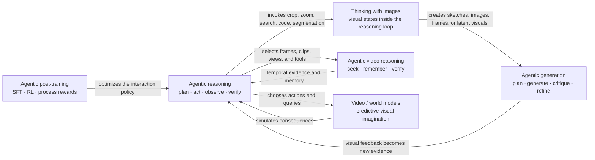

# Awesome MLLM Agentic Reasoning, Thinking with Images, and Agentic Generation

> A curated, time-bounded reading list on multimodal agents that **reason with actions**, **learn agentic policies**, **actively inspect video and images**, **use or create visual thoughts**, and **plan–generate–evaluate–refine visual content**.

**Coverage window:** 2025-07-20 to 2026-07-20 (inclusive, based on the first public arXiv version unless noted)

**Last updated:** 2026-07-20 · **402 papers**

## Contents

- [Scope](#scope)
- [How the areas relate](#how-the-areas-relate)
- [Research threads at a glance](#research-threads-at-a-glance)
- [Agentic visual generation](#agentic-visual-generation)
- [Agentic post-training and inference](#agentic-post-training-and-inference)
- [Agentic video reasoning](#agentic-video-reasoning)
- [Reliable reasoning](#reliable-reasoning)
- [Tag legend](#tag-legend)
- [Paper timeline](#paper-timeline)
- [Selection notes](#selection-notes)
- [Contributing](#contributing)

## Scope

This list tracks five tightly connected research directions:

1. **MLLM agentic reasoning** — a multimodal model actively plans, searches, uses tools, gathers evidence, verifies, or acts in an environment as part of reasoning.
2. **Thinking with images** — visual information is an intermediate reasoning state rather than only a fixed input. The visual state may come from external tools, code-based manipulation, generated pixels/video, retrieval, or an internal visual latent.
3. **Agentic visual generation** — an agent plans, orchestrates, evaluates, repairs, or learns from feedback around image/video generation; this also includes video/world models used as an agent's simulator or imagination module.
4. **Agentic post-training** — SFT, RL, preference optimization, process rewards, or verifier training explicitly optimize a multimodal model's multi-turn policy for tool use, search, active perception, memory, reflection, or action.
5. **Agentic video reasoning** — an agent decides which frames, clips, views, modalities, memories, or external sources to inspect and iteratively gathers or verifies temporal evidence.

The list excludes ordinary multimodal chain-of-thought, single-pass text-to-image/video generation, and papers where “multi-agent” only describes the generated scene rather than the generation or reasoning process.

## How the areas relate

An autonomy-oriented view of **thinking with images** is useful for reading the timeline:

`external visual tools → programmatic visual manipulation → generated visual thoughts → latent/internal visual thoughts`

## Research threads at a glance

These are representative paths through the timeline, not separate rankings:

- **Tool-integrated reasoning:** WebWatcher → DeepEyesV2 → VISTA-R1 → Vision-DeepResearch → OpenSearch-VL → AXPO / MetaForge → Visual-Seeker → IQA-T1 / TopoAgent → ToolSciVer / SciForge.
- **Agentic post-training:** WebWatcher / VISTA-R1 → Agent0-VL / VITAL → AdaTooler-V / InSight-o3 → VSearcher / ToolsRL → TAPO / ReGRPO → ToolAnchor / SPyCE / AdaTurn / RoboTTT → VideoTreeSearch / MoD-VLLM.
- **Inference-time agency:** Simple o3 → Octopus / ToolScope → TTSP / SpecEyes / SPARC → CVSearch / Pixel-Searcher → PixelEyes → Multi-Head Latent Control / AdaTurn → DAFS / SkillNav / SeerGuard.
- **Agentic video reasoning:** StreamAgent / VITAL → CAViAR / AVI → AVP / VideoARM → EGAgent / Weaver → VideoHV-Agent / LensWalk → InternVideo3 / VideoSearcher / VSeek → FOLIO / EgoProceAgent / MEMORA → VideoTreeSearch / MoD-VLLM.
- **Computer use and embodied action:** CoAct-1 → OpenCUA → ComputerRL → UI-TARS-2 → UltraCUA → Kimi K2.5 / Tactile / SeerGuard; ThinkAct → PhysicalAgent → VLA-Thinker → AgentVLN → ReflectVLN / REAL / RoboTTT → SkillNav / IMBench / AEGIS.
- **Thinking-with-images autonomy:** SIFThinker / Simple o3 → Thyme / CodePlot-CoT → MathCanvas / V-Thinker → CoVT / Monet → LanteRn / DeepLatent → Beyond the Eye → DynTrace / UniVR / HDR / RxBrain → ActiveVision / ToolSciVer / SkillNav.
- **Agentic image generation:** Talk2Image / CountLoop → Maestro / GenPilot → ImAgent / MIRA → GenAgent / ComfySearch → VisionCreator / CAMEO → SCOPE / GenEvolve / RationalRewards → COMFYCLAW / ThinkBLOX / SciDiagramEdit / SC-CMJP → Knowledge-Centric Agents.
- **Agentic video generation and production:** Preacher / AniME → EditDuet / Code2Video → AutoMV / CoAgent → VQQA / CutClaw → DIRECT / Co-Director → NEWTON / DirectorBench → GEST-Engine / HDR / RxBrain → TANGO.
- **Generative world models for agents:** PhysicalAgent → WMPO / STORM → World-VLA-Loop / WoVR → SPIRAL / DreamPlan → WAM-RL / Qwen-RobotWorld → FlowWAM / DriftWorld / BadWAM → SeerGuard.

## Agentic visual generation

`AG-I` and `AG-V` identify systems in which an agent **changes the generation trajectory**: it plans or searches, selects and sequences tools, observes an evolving canvas or timeline, critiques or verifies intermediate results, repairs failures, learns an interaction policy, or evaluates the agentic process itself. Merely calling a generator once, using a generic reward model without a feedback loop, or depicting multiple agents inside generated content does not qualify. This snapshot contains **76 `AG-I` papers and 79 `AG-V` papers; 83 of the 154 distinct generation papers are also tagged `REL`**.

| Generation mechanism | Representative papers | Reliability signal |
|---|---|---|
| Knowledge-aware image planning and search | [GenPilot](https://arxiv.org/abs/2510.07217) · [Mind-Brush](https://arxiv.org/abs/2602.01756) · [Gen-Searcher](https://arxiv.org/abs/2603.28767) · [RS-Gen](https://arxiv.org/abs/2606.23221) · [Qwen-Image-Agent](https://arxiv.org/abs/2606.26907) · [Search Beyond What Can Be Taught](https://arxiv.org/abs/2607.05382) | Search is invoked only for genuine knowledge gaps, and retrieved evidence remains traceable into the output. |
| Canvas, layer, and editing-tool orchestration | [MIRA](https://arxiv.org/abs/2511.21087) · [ComfySearch](https://arxiv.org/abs/2601.04060) · [CAMEO](https://arxiv.org/abs/2604.03156) · [CanvasAgent](https://arxiv.org/abs/2607.05465) · [COMFYCLAW](https://arxiv.org/abs/2607.01709) · [SciDiagramEdit](https://arxiv.org/abs/2607.15272) · [Knowledge-Centric Agents](https://arxiv.org/abs/2607.15845) | Every action is grounded in the current visual state; invalid edits can be localized, reverted, or selectively retried. |
| Structured diagrams and rendered worlds | [FormalAnalyticGeo](https://arxiv.org/abs/2607.12982) · [ThinkBLOX](https://arxiv.org/abs/2607.13539) · [GEST-Engine](https://arxiv.org/abs/2607.12231) · [Hallo4D](https://arxiv.org/abs/2607.12752) | Formal constraints, editable primitives, rendered views, and temporal states expose whether each intermediate scene remains executable and consistent. |
| Critics, verifiers, and iterative repair | [Maestro](https://arxiv.org/abs/2509.10704) · [CRAFT](https://arxiv.org/abs/2512.20362) · [RationalRewards](https://arxiv.org/abs/2604.11626) · [EditRefiner](https://arxiv.org/abs/2605.07457) · [SEAR](https://arxiv.org/abs/2606.28971) · [SC-CMJP](https://arxiv.org/abs/2607.13188) · [TANGO](https://arxiv.org/abs/2607.15849) | Critiques identify actionable defects, avoid evaluator collapse or reward hacking, and support an explicit stopping or rollback rule. |
| Learned and self-evolving generation policies | [JarvisEvo](https://arxiv.org/abs/2511.23002) · [GenAgent](https://arxiv.org/abs/2601.18543) · [VisionCreator-R1](https://arxiv.org/abs/2603.08812) · [GenEvolve](https://arxiv.org/abs/2605.21605) · [APE](https://arxiv.org/abs/2606.00204) · [Ask, Solve, Generate](https://arxiv.org/abs/2606.27376) · [ThinkBLOX](https://arxiv.org/abs/2607.13539) | Training credit is attached to useful plans, tool actions, reflection, and verified visual outcomes rather than only the final sample. |
| Narrative, storyboard, and shot planning | [MAViS](https://arxiv.org/abs/2508.08487) · [CoAgent](https://arxiv.org/abs/2512.22536) · [The Script is All You Need](https://arxiv.org/abs/2601.17737) · [CineAGI](https://arxiv.org/abs/2604.23579) · [Co-Director](https://arxiv.org/abs/2604.24842) · [GEST-Engine](https://arxiv.org/abs/2607.12231) | Long-range entity, intent, and cinematic constraints survive across shots, modalities, and regeneration rounds. |
| Video editing and production tools | [EditDuet](https://arxiv.org/abs/2509.10761) · [UniVA](https://arxiv.org/abs/2511.08521) · [CutClaw](https://arxiv.org/abs/2603.29664) · [DIRECT](https://arxiv.org/abs/2604.04875) · [Crayotter](https://arxiv.org/abs/2606.07636) · [VideoAgent](https://arxiv.org/abs/2606.23327) | Plans, assets, tool calls, intermediate renders, and reviewer decisions remain inspectable and replayable. |
| Video/world models as agent imagination | [STORM](https://arxiv.org/abs/2512.18477) · [World-VLA-Loop](https://arxiv.org/abs/2602.06508) · [SPIRAL](https://arxiv.org/abs/2603.08403) · [WAM-RL](https://arxiv.org/abs/2606.17906) · [FlowWAM](https://arxiv.org/abs/2607.13017) · [RxBrain](https://arxiv.org/abs/2607.14187) · [DriftWorld](https://arxiv.org/abs/2607.15065) · [BadWAM](https://arxiv.org/abs/2607.15207) | Predicted futures remain feasible under action dynamics and cannot be exploited by the downstream policy. |
| Process evaluation, safety, and red-teaming | [EdiVal-Agent](https://arxiv.org/abs/2509.13399) · [AgenticVBench](https://arxiv.org/abs/2605.27705) · [OrchJail](https://arxiv.org/abs/2605.07414) · [RedEdit](https://arxiv.org/abs/2606.06140) · [VideoWeaver](https://arxiv.org/abs/2606.08091) · [Automatic Hard Example Synthesis](https://arxiv.org/abs/2607.14256) · [ARMOR++](https://arxiv.org/abs/2607.15246) · [BadWAM](https://arxiv.org/abs/2607.15207) | Evaluation checks the trace as well as the final artifact and exposes unsafe compositions of individually benign actions. |

## Agentic post-training and inference

`POST` and `INF` separate **how an agentic capability is acquired** from papers whose **main contribution is test-time control**. They may overlap when a work both trains the policy and introduces a substantive inference loop; routine execution of an otherwise standard learned policy does not qualify by itself.

| Track | Inclusion rule | Representative papers |
|---|---|---|
| Agentic post-training | The training target is a multi-turn interaction policy, tool/search decision, process reward, verifier, or reflective correction—not ordinary answer-only multimodal RL. | [VITAL](https://arxiv.org/abs/2508.04416) · [Agent0-VL](https://arxiv.org/abs/2511.19900) · [ReGRPO](https://arxiv.org/abs/2606.31392) · [ToolAnchor](https://arxiv.org/abs/2607.14145) · [SPyCE](https://arxiv.org/abs/2607.13854) · [RoboTTT](https://arxiv.org/abs/2607.15275) · [ToolSciVer](https://arxiv.org/abs/2607.16131) · [VideoTreeSearch](https://arxiv.org/abs/2607.16189) · [MoD-VLLM](https://arxiv.org/abs/2607.15778) |
| Agentic inference | The main method introduces active evidence seeking, tool orchestration, generation search, test-time scaling, speculative execution, adaptive compute allocation, uncertainty control, verification, or stopping; merely running a standard learned policy is insufficient. | [Simple o3](https://arxiv.org/abs/2508.12109) · [ToolScope](https://arxiv.org/abs/2510.27363) · [SPARC](https://arxiv.org/abs/2602.06566) · [PixelEyes](https://arxiv.org/abs/2607.00115) · [Multi-Head Latent Control](https://arxiv.org/abs/2607.14277) · [TopoAgent](https://arxiv.org/abs/2607.14658) · [DAFS](https://arxiv.org/abs/2607.15689) · [SkillNav](https://arxiv.org/abs/2607.15758) · [SeerGuard](https://arxiv.org/abs/2607.15550) |
| Process and reward reliability | Rewards or critics judge intermediate evidence, tool inputs/outputs, action utility, efficiency, or correction quality rather than only the final answer. | [Deep But Reliable](https://arxiv.org/abs/2512.17306) · [CodeV](https://arxiv.org/abs/2511.19661) · [Diversity Over Frequency](https://arxiv.org/abs/2606.00096) · [ToolAnchor](https://arxiv.org/abs/2607.14145) · [Learning Robust Execution](https://arxiv.org/abs/2607.13818) · [ToolSciVer](https://arxiv.org/abs/2607.16131) · [VideoTreeSearch](https://arxiv.org/abs/2607.16189) |
| Agentic-process evaluation | The benchmark or diagnostic tests whether tools, visual evidence, search, and stopping decisions causally help rather than merely appearing in a trace. | [VisualToolBench](https://arxiv.org/abs/2510.12712) · [Agentic-MME](https://arxiv.org/abs/2604.03016) · [MM-ToolSandBox](https://arxiv.org/abs/2607.11818) · [SafeRelBench](https://arxiv.org/abs/2607.14543) · [ActiveVision](https://arxiv.org/abs/2607.16165) · [IMBench](https://arxiv.org/abs/2607.15641) · [Lucid](https://arxiv.org/abs/2607.15657) |

## Agentic video reasoning

`VID-R` is reserved for **video understanding and reasoning**. It is deliberately separate from `AG-V`, which denotes agentic video generation or production. The table highlights mechanisms; the complete set is the `VID-R`-tagged timeline.

| Video-agent mechanism | Representative papers | Reliability question |
|---|---|---|
| Learned temporal search and tool policies | [Thinking With Videos](https://arxiv.org/abs/2508.04416) · [LongVT](https://arxiv.org/abs/2511.20785) · [Weaver](https://arxiv.org/abs/2602.05829) · [InternVideo3](https://arxiv.org/abs/2606.12195) · [VSeek](https://arxiv.org/abs/2607.02959) · [VideoTreeSearch](https://arxiv.org/abs/2607.16189) · [MoD-VLLM](https://arxiv.org/abs/2607.15778) | Does the policy retrieve decisive clips rather than exploit sampling or tool priors? |
| Memory and long-horizon retrieval | [M3-Agent](https://arxiv.org/abs/2508.09736) · [VideoLucy](https://arxiv.org/abs/2510.12422) · [VideoARM](https://arxiv.org/abs/2512.12360) · [EGAgent](https://arxiv.org/abs/2601.18157) · [Visual Agentic Memory](https://arxiv.org/abs/2605.16481) · [FOLIO](https://arxiv.org/abs/2607.13298) · [MEMORA](https://arxiv.org/abs/2607.14252) | Is the answer traceable to retained temporal evidence rather than lossy summaries? |
| Active perception and adaptive viewing | [Agentic Video Intelligence](https://arxiv.org/abs/2511.14446) · [Active Video Perception](https://arxiv.org/abs/2512.05774) · [LensWalk](https://arxiv.org/abs/2603.24558) · [Native Active Perception](https://arxiv.org/abs/2606.19341) · [GHR-VLM](https://arxiv.org/abs/2607.13569) · [DAFS](https://arxiv.org/abs/2607.15689) · [MoD-VLLM](https://arxiv.org/abs/2607.15778) | Does the agent know what, when, where, and how densely to observe—and when to stop? |
| Critics, verification, and evidence alignment | [CAViAR](https://arxiv.org/abs/2509.07680) · [VideoHV-Agent](https://arxiv.org/abs/2603.04977) · [VideoSEAL](https://arxiv.org/abs/2605.12571) · [Evidence-Backed Video Question Answering](https://arxiv.org/abs/2607.11862) · [Accuracy Without Grounding](https://arxiv.org/abs/2607.13305) · [DynTrace](https://arxiv.org/abs/2607.12503) · [VideoTreeSearch](https://arxiv.org/abs/2607.16189) | Is the hypothesis supported by localized audiovisual evidence, and can a verifier reject unsupported paths? |
| Video deep research and open-world evidence | [VideoDR](https://arxiv.org/abs/2601.06943) · [HAVEN](https://arxiv.org/abs/2601.13719) · [LongVidSearch](https://arxiv.org/abs/2603.14468) · [VideoSearcher](https://arxiv.org/abs/2607.02927) | Can the agent preserve goals and verify evidence across video, audio, memory, and the open web? |

## Reliable reasoning

The `REL` tag marks methods and evaluations that explicitly target reliability, faithfulness, verification, calibrated tool use, evidence alignment, or generalization. Reliability is broader than image-only TWI: it also covers learned agent policies, multimodal search, long-video evidence, and test-time control. This is a cross-cutting index; every paper below appears once in the main timeline.

| Reliability focus | Papers | What is made reliable |
|---|---|---|
| Reliable visual thoughts and state correction | [Reliable Thinking with Images](https://arxiv.org/abs/2602.12916) · [UniVR](https://arxiv.org/abs/2607.12800) · [SC-CMJP](https://arxiv.org/abs/2607.13188) · [ThinkBLOX](https://arxiv.org/abs/2607.13539) · [Hierarchical Denoising](https://arxiv.org/abs/2607.15278) | Estimates cue or trace reliability and revises intermediate visual hypotheses, commitments, or generated states before they propagate. |
| Reliable post-training and correction | [Agent0-VL](https://arxiv.org/abs/2511.19900) · [Deep But Reliable](https://arxiv.org/abs/2512.17306) · [CodeV](https://arxiv.org/abs/2511.19661) · [ToolAnchor](https://arxiv.org/abs/2607.14145) · [RoboTTT](https://arxiv.org/abs/2607.15275) · [ToolSciVer](https://arxiv.org/abs/2607.16131) · [VideoTreeSearch](https://arxiv.org/abs/2607.16189) · [MoD-VLLM](https://arxiv.org/abs/2607.15778) | Rewards grounded intermediate actions, supports evidence-based self-repair, stabilizes multi-turn training, and avoids gratuitous reflection. |
| Adaptive verifiers and defenses | [Multimodal Reinforcement Learning with Adaptive Verifier for AI Agents](https://arxiv.org/abs/2512.03438) · [ARM-Thinker](https://arxiv.org/abs/2512.05111) · [MaxSAT-Based Feedback](https://arxiv.org/abs/2607.12711) · [TrustVLA](https://arxiv.org/abs/2607.12571) · [Lucid](https://arxiv.org/abs/2607.15657) · [SeerGuard](https://arxiv.org/abs/2607.15550) | Judges localization, tool use, reasoning steps, and partial states while reducing reward hacking, invalid continuations, and adversarial evidence. |
| Test-time perception scaling and control | [Test-time Scaling over Perception](https://arxiv.org/abs/2604.11025) · [SPARC](https://arxiv.org/abs/2602.06566) · [PixelEyes](https://arxiv.org/abs/2607.00115) · [AdaTurn](https://arxiv.org/abs/2607.14547) · [IQA-T1](https://arxiv.org/abs/2607.12375) | Allocates visual compute, filters uncertain traces, respects interaction budgets, and avoids repeated unproductive inspection. |
| Evidence grounding and faithfulness | [DeFacto](https://arxiv.org/abs/2509.20912) · [Beyond Accuracy](https://arxiv.org/abs/2601.11633) · [VisualNeedle](https://arxiv.org/abs/2605.26380) · [Breaking Déjà Vu](https://arxiv.org/abs/2607.12818) · [DM-KG](https://arxiv.org/abs/2607.12319) · [ToolSciVer](https://arxiv.org/abs/2607.16131) · [SciForge](https://arxiv.org/abs/2607.16038) | Tests whether answers causally depend on claimed visual evidence and whether tools or explicit spatial structures add capability rather than ceremony. |
| Reasoning–action alignment | [Walk the Talk](https://arxiv.org/abs/2604.06777) · [TAPO](https://arxiv.org/abs/2606.05784) · [ReflectVLN](https://arxiv.org/abs/2607.12680) · [WorkDrive](https://arxiv.org/abs/2607.14727) · [SkillNav](https://arxiv.org/abs/2607.15758) · [AEGIS](https://arxiv.org/abs/2607.15620) · [SeerGuard](https://arxiv.org/abs/2607.15550) | Aligns reasoning with useful actions while preventing tool-use collapse, indiscriminate calls, trajectory inconsistency, and incorrect credit assignment. |
| Reliable video evidence | [CAViAR](https://arxiv.org/abs/2509.07680) · [VideoHV-Agent](https://arxiv.org/abs/2603.04977) · [VideoSEAL](https://arxiv.org/abs/2605.12571) · [Evidence-Backed Video Question Answering](https://arxiv.org/abs/2607.11862) · [DynTrace](https://arxiv.org/abs/2607.12503) · [MEMORA](https://arxiv.org/abs/2607.14252) · [VideoTreeSearch](https://arxiv.org/abs/2607.16189) · [MoD-VLLM](https://arxiv.org/abs/2607.15778) | Localizes temporal evidence, separates hypotheses from answer authority, and verifies that benchmark success depends on the video. |
| Search-process reliability | [VideoDR](https://arxiv.org/abs/2601.06943) · [ProMMSearchAgent](https://arxiv.org/abs/2604.20486) · [SimpleSearch-VL](https://arxiv.org/abs/2606.31504) · [VSeek](https://arxiv.org/abs/2607.02959) · [EvoGraph-R1](https://arxiv.org/abs/2607.12764) | Evaluates goal retention and evidence verification and trains search decisions with process-oriented or verifiable rewards. |
| Reliable generation loops | [GenPilot](https://arxiv.org/abs/2510.07217) · [RationalRewards](https://arxiv.org/abs/2604.11626) · [EditRefiner](https://arxiv.org/abs/2605.07457) · [COMFYCLAW](https://arxiv.org/abs/2607.01709) · [SciDiagramEdit](https://arxiv.org/abs/2607.15272) · [SC-CMJP](https://arxiv.org/abs/2607.13188) · [Knowledge-Centric Agents](https://arxiv.org/abs/2607.15845) · [TANGO](https://arxiv.org/abs/2607.15849) | Grounds critiques in localized defects or physical constraints, assigns credit to corrective actions, and stops or rolls back when repair is not justified. |
| Generation-process evaluation and safety | [AgenticVBench](https://arxiv.org/abs/2605.27705) · [OrchJail](https://arxiv.org/abs/2605.07414) · [RedEdit](https://arxiv.org/abs/2606.06140) · [VideoWeaver](https://arxiv.org/abs/2606.08091) · [Automatic Hard Example Synthesis](https://arxiv.org/abs/2607.14256) · [ARMOR++](https://arxiv.org/abs/2607.15246) · [BadWAM](https://arxiv.org/abs/2607.15207) | Audits prompts, intermediate artifacts, tool orchestration, rollout consistency, and unsafe action compositions rather than trusting only the final media. |
| Agentic-process diagnostics | [Agentic-MME](https://arxiv.org/abs/2604.03016) · [MM-ToolSandBox](https://arxiv.org/abs/2607.11818) · [SafeRelBench](https://arxiv.org/abs/2607.14543) · [ActiveVision](https://arxiv.org/abs/2607.16165) · [UAV-DualCog](https://arxiv.org/abs/2607.16193) · [IMBench](https://arxiv.org/abs/2607.15641) · [Lucid](https://arxiv.org/abs/2607.15657) | Audits stepwise search/tool trajectories, safety constraints, and stateful multi-turn or embodied execution rather than scoring only final answers. |
| Reward and evaluator integrity | [JarvisEvo](https://arxiv.org/abs/2511.23002) · [Reward as An Agent for Embodied World Models](https://arxiv.org/abs/2606.19990) | Co-evolves evaluators or diversifies reward-guided rollouts while explicitly addressing reward hacking and evaluator collapse. |
| Trace efficiency and generalization | [Revisiting the Necessity of Lengthy Chain-of-Thought](https://arxiv.org/abs/2511.22586) | Tests whether shorter, essential grounding traces generalize better than lengthy visual chains of thought. |

## Tag legend

Tags identify a paper's **core contribution**, not every property its system happens to exhibit.

| Tag | Meaning |
|---|---|
| `AR` | General MLLM agentic reasoning |
| `TOOL` | External visual tool use or active perception |
| `SEARCH` | Multimodal search, retrieval, or evidence gathering |
| `ACT` | Embodied, GUI, or environment action |
| `TWI-E` | Thinking with externally obtained/edited images |
| `TWI-P` | Programmatic or symbolic visual manipulation |
| `TWI-G` | Generated image/video used as a thought |
| `TWI-L` | Latent or internally controlled visual thought |
| `AG-I` | Agentic image, diagram, or rendered-scene generation, editing, or direct process evaluation |
| `AG-V` | Agentic video or temporal visual generation, production, or direct process evaluation |
| `VID-R` | Agentic video understanding, temporal search, memory, or verification |
| `WM` | Video/world model used for prediction, simulation, planning, or policy learning |
| `REL` | Reliability, faithfulness, verification, or generalization of multimodal reasoning |
| `TRAIN` | Training, reinforcement learning, or process supervision |
| `POST` | Explicit post-training of a multi-turn agent policy, tool/search policy, or verifier |
| `INF` | Primary contribution in active test-time planning, evidence seeking, tool/compute control, verification, or stopping |
| `BENCH` | Benchmark, evaluation, survey, or diagnostic study |

## Paper timeline

Papers are ordered by **first public release date (newest first)**. Cross-tags expose category overlap without duplicating an entry.

<!-- PAPER_TIMELINE_START -->

### 2026-07

| Date | Paper and resources | Tags | Why it matters |
|---|---|---|---|
| 2026-07-17 | [Knowing the Self, Understanding the World: A Dual-Cognition Benchmark for UAV Spatio-temporal Reasoning with MLLMs](https://arxiv.org/abs/2607.16193) | **AR · ACT · VID-R · REL · BENCH** | UAV-DualCog jointly tests self-state and environment-state reasoning over multiview images and video, exposing failures in viewpoint transformation, spatial grounding, and temporal localization. |
| 2026-07-17 | [Searching Videos as Trees: Self-Correcting Agents for Grounded Long Video QA](https://arxiv.org/abs/2607.16189) | **AR · TOOL · SEARCH · VID-R · REL · TRAIN · POST · INF** | VideoTreeSearch learns to zoom, shift, backtrack, and recover from deliberately wrong branches while searching an adaptive temporal tree for grounded evidence. |
| 2026-07-17 | [An Exam for Active Observers](https://arxiv.org/abs/2607.16165) | **AR · TOOL · TWI-E · REL · BENCH** | ActiveVision forces repeated hypothesis-guided observation and tests whether MLLMs can detect and repair failures in their own visual inspection code. |
| 2026-07-17 | [ToolSciVer: Multimodal Scientific Claim Verification with Visual Tool Augmented Reinforcement Learning](https://arxiv.org/abs/2607.16131) | **AR · TOOL · TWI-E · REL · TRAIN · POST · INF** | GRPO trains a VLM to focus table cells, parse charts, and zoom regions under answer, validity, length, and tool-efficiency rewards. |
| 2026-07-17 | [SciForge: An AI-Native, Multimodal Workbench for Scientific Discovery](https://arxiv.org/abs/2607.16038) | **AR · TOOL · SEARCH · REL · INF** | Exposes search, scientific parsing, model routing, plotting, and workflow execution as agent services while an Evidence-DAG preserves provenance and audit findings. |
| 2026-07-17 | [More with Less: a Large Scale Remote Sensing VLM with a Simple Recipe](https://arxiv.org/abs/2607.15942) | **AR · TOOL · TWI-E · TRAIN · POST · INF** | Multi-task RL trains one remote-sensing policy to decide between direct answers and localization tools for segmentation and grounding across diverse input regimes. |
| 2026-07-17 | [Test-Time Noise Guided Adaptation for Realistic Autoregressive Video Generation](https://arxiv.org/abs/2607.15849) | **AG-V · REL · INF** | TANGO uses the video diffusion model as a critic of its partial rollout and searches for an alternative trajectory before noise statistics reveal terminal drift. |
| 2026-07-17 | [Knowledge-Centric Agents for Workflow Generation](https://arxiv.org/abs/2607.15845) | **AR · TOOL · AG-I · REL · TRAIN · POST · INF** | Distills hierarchical knowledge from real ComfyUI workflows, learns task-to-strategy-to-graph reasoning, and self-refines executable generation graphs. |
| 2026-07-17 | [Modularized Dynamic-Granularity Video LLM for Multi-Event Long Video Understanding](https://arxiv.org/abs/2607.15778) | **AR · VID-R · REL · TRAIN · POST · INF · BENCH** | MoD-VLLM closes the loop between segment grounding and reflection, using RL to allocate fine or coarse visual encoding while progressively localizing evidence. |
| 2026-07-17 | [SkillNav: Score-Level Skill Intervention for Zero-Shot Object Goal Navigation](https://arxiv.org/abs/2607.15758) | **AR · SEARCH · ACT · TWI-P · REL · INF** | Writes cross-step behavioral memory into a VLM navigator's spatial curiosity map and composes tiered interventions to escape stalls, loops, and circuitous routes. |
| 2026-07-17 | [Efficient Frame Selection for Long Videos at Test Time with Attention-Based MLLM Selectors](https://arxiv.org/abs/2607.15689) | **AR · VID-R · INF** | DAFS converts query-conditioned MLLM attention into frame evidence and jointly allocates candidate-frame and token budgets with dynamic programming. |
| 2026-07-17 | [Do Agents Dream of False Memories? Black-box Visual Attacks on Long-term Memory in Multimodal AI Agents](https://arxiv.org/abs/2607.15657) | **AR · REL · BENCH** | Lucid uses imperceptible image-only black-box attacks to poison or inject persistent memories across five multimodal-agent memory architectures. |
| 2026-07-17 | [IMBench: A Benchmark for Intuitive Robotic Manipulation](https://arxiv.org/abs/2607.15641) | **AR · ACT · REL · BENCH** | Jointly evaluates perception, physical reasoning, constrained action generation, and iterative execution, exposing the reasoning–action gap in VLMs and VLAs. |
| 2026-07-17 | [AEGIS: Assay-Aware Protocol Validation and Runtime Monitoring for Open-Source Liquid Handling Robots](https://arxiv.org/abs/2607.15620) | **AR · TOOL · ACT · TWI-E · REL · INF · BENCH** | Combines LLM protocol validation with budgeted visual runtime monitoring, invoking a VLM when robot trajectories require higher-confidence failure checks. |
| 2026-07-17 | [SeerGuard: A Safety Framework for Mobile GUI Agents via World Model Prediction](https://arxiv.org/abs/2607.15550) | **AR · ACT · WM · REL · TRAIN · POST · INF** | Screens instructions and predicts the semantic next state and risk of each proposed GUI action so unsafe consequences can be blocked before execution. |
| 2026-07-16 | [Hierarchical Denoising For Multi-Step Visual Reasoning](https://arxiv.org/abs/2607.15278) | **TWI-L · TWI-G · AG-V · REL · TRAIN · INF · BENCH** | Organizes video latents into a coarse-to-fine tree so uncertain hypotheses can be revised globally before streaming robust visual reasoning states. |
| 2026-07-16 | [RoboTTT: Context Scaling for Robot Policies](https://arxiv.org/abs/2607.15275) | **AR · ACT · REL · TRAIN · POST · INF** | Compresses 8K-step visuomotor histories into fast weights updated at train and test time, enabling in-context imitation, adaptation, and policy improvement. |
| 2026-07-16 | [SciDiagramEdit: Learning to Edit Scientific Diagrams from Paper Revisions](https://arxiv.org/abs/2607.15272) | **AR · TOOL · TWI-P · AG-I · REL · TRAIN · POST · BENCH** | Evolves an executable vector-editing skill from real paper-revision traces while keeping every primitive inspectable and co-editable. |
| 2026-07-16 | [ARMOR++: Agentic Orchestration of a Multi-Domain Primitive Set for Transferable Attacks on Deepfake Detectors](https://arxiv.org/abs/2607.15246) | **AR · TOOL · AG-I · REL · INF · BENCH** | A VLM supplies spatial priors while an LLM selects, reparameterizes, and mixes image-attack primitives to expose detector failures under blind transfer. |
| 2026-07-16 | [BadWAM: When World-Action Models Dream Right but Act Wrong](https://arxiv.org/abs/2607.15207) | **ACT · AG-V · WM · REL · INF · BENCH** | Audits and attacks imagination–action alignment, including stealthy cases where a plausible predicted future masks a harmful action shift. |
| 2026-07-16 | [Plover: Steering GUI Agents through Plan-Centric Interaction](https://arxiv.org/abs/2607.15193) | **AR · TOOL · ACT · REL · INF** | Externalizes GUI plans and replanning as inspectable artifacts that users can repair locally through screenshot-grounded interventions. |
| 2026-07-16 | [Concept-Guided Spatial Regularization for World Models in Atari Pong](https://arxiv.org/abs/2607.15142) | **ACT · TWI-G · AG-V · WM · REL · TRAIN · BENCH** | Diagnoses generated closed-loop rollouts and policies trained inside frozen visual world models, then repairs task-critical regions with concept-guided loss. |
| 2026-07-16 | [DriftWorld: Fast World Modeling through Drifting](https://arxiv.org/abs/2607.15065) | **ACT · TWI-G · AG-V · WM · REL · TRAIN · INF** | Generates action-conditioned future frames in one pass for online action search and offline policy ranking. |
| 2026-07-16 | [AeroAct: Action-Centered World-Action Models for Language-Conditioned Quadrotor Flight](https://arxiv.org/abs/2607.14997) | **ACT · AG-V · WM · TRAIN** | Uses future first-person video as dense consequence supervision while decoding executable flight actions at deployment. |
| 2026-07-16 | [Steering Robustness into World Action Models via Mechanistic Interpretability and Optimal Control](https://arxiv.org/abs/2607.14943) | **ACT · AG-V · WM · REL · INF** | Extracts robustness directions from successful and failed rollouts and applies feedback control directly in WAM activation space. |
| 2026-07-16 | [FoMoVLA: Bridging Visual Foresight and Motion Guidance for Vision-Language-Action Models](https://arxiv.org/abs/2607.14739) | **ACT · TWI-L · WM · TRAIN** | Couples predicted future-feature tokens with sparse point trajectories so anticipated states and motion jointly guide the action policy. |
| 2026-07-16 | [WorkDrive: Roadwork Chain of Causation for Autonomous Driving](https://arxiv.org/abs/2607.14727) | **AR · ACT · REL · TRAIN · POST** | Converts work-zone perception into causal reasoning chains and reinforces consistency between lateral decisions and predicted trajectories. |
| 2026-07-16 | [Lights, Camera, Malfunction: When Illumination Robustness Leaves VLA Models Blind to Color](https://arxiv.org/abs/2607.14698) | **ACT · REL · TRAIN** | Shows that naive illumination defenses can erase color dependence and introduces chroma-preserving adversarial training for reliable robot action. |
| 2026-07-16 | [TopoAgent: A Self-Evolving Topological Agent for Multimodal Scientific Reasoning](https://arxiv.org/abs/2607.14658) | **AR · TOOL · REL · INF** | Evolves a context-isolated reasoning DAG and splits bottleneck nodes when a visual tool reaches its capability boundary. |
| 2026-07-16 | [HyMobileAgent: Data-Environment Co-Scaling for Efficient GUI Agents](https://arxiv.org/abs/2607.14548) | **AR · TOOL · ACT · REL · TRAIN · POST · INF** | Combines GUI data and environment scaling with explicit planning, reflection, failure attribution, and dead-loop detection. |
| 2026-07-16 | [AdaTurn: Budget-Aware Test-Time Scaling for Active Visual Perception Agents](https://arxiv.org/abs/2607.14547) | **AR · TOOL · TWI-E · REL · TRAIN · POST · INF** | Conditions the policy on its remaining turn budget and trains a forced-answer boundary that synthesizes partial visual evidence instead of being truncated. |
| 2026-07-16 | [SafeRelBench: A Spatial-Relation-Aware Benchmark for Process-Level Safety in VLM-Driven Embodied Agents](https://arxiv.org/abs/2607.14543) | **AR · ACT · REL · BENCH** | Tests whether agents satisfy support, containment, and proximity constraints before risky actions rather than only scoring task completion. |
| 2026-07-16 | [VTM-Nav: Hierarchical Visual-Topological Memory for Cross-Episode Object-Goal Navigation](https://arxiv.org/abs/2607.14514) | **AR · SEARCH · ACT · REL · INF** | Reuses self-acquired visual-topological experience across episodes and guards execution against oscillation, blockage, and premature stopping. |
| 2026-07-16 | [Contextualized Evaluation of Vision Language Models through Dynamic, Multi-turn Interactions](https://arxiv.org/abs/2607.14499) | **AR · REL · BENCH** | An automated examiner traverses a task graph with clarification and adversarial probes to expose hallucinations that accumulate in realistic dialogue. |
| 2026-07-16 | [Tactile: Giving Computer-Using Agents Hands and Feet](https://arxiv.org/abs/2607.14443) | **AR · TOOL · ACT · REL · INF** | Unifies accessibility, OCR, and visual evidence into a provenance-preserving observe–ground–act–verify interface for desktop agents. |
| 2026-07-15 | [Beyond Visual Grasping: Benchmarking Complex Grasping from Detection to Execution](https://arxiv.org/abs/2607.14341) | **AR · ACT · REL · BENCH** | GCA-Bench evaluates semantic and multi-step grasping constraints from scene understanding through physical execution. |
| 2026-07-15 | [Multi-Head Latent Control: A Unified Interface for LLM Agent Decision Making](https://arxiv.org/abs/2607.14277) | **AR · TOOL · REL · TRAIN · POST · INF** | Reads frozen LLM/VLM hidden trajectories to decide whether to continue, defer, clarify, call a tool, abstain, or answer. |
| 2026-07-15 | [Automatic Hard Example Synthesis with Multi-Level Agentic Data Curation](https://arxiv.org/abs/2607.14256) | **AR · TOOL · SEARCH · AG-I · REL · INF · BENCH** | An architect, image generator, and verification committee iteratively synthesize and retrieve policy-edge cases for multimodal safety red-teaming. |
| 2026-07-15 | [MEMORA: Embodied Action Memory from Egocentric Videos for Reasoning and Planning](https://arxiv.org/abs/2607.14252) | **AR · SEARCH · ACT · VID-R · REL · INF · BENCH** | Edits, consolidates, and retrieves typed memories from embodied video experience to plan for previously unseen goals. |
| 2026-07-15 | [Never Too Late for Force: Accelerating VLA Post-Training with Reactive Force Injection](https://arxiv.org/abs/2607.14236) | **ACT · REL · TRAIN · POST** | Adds force memory, a reactive action expert, and online corrective rollouts to recover when vision becomes ambiguous during contact. |
| 2026-07-15 | [RxBrain: Embodied Cognition Foundation Model with Joint Language-Visual Reasoning and Imagination](https://arxiv.org/abs/2607.14187) | **AR · ACT · TWI-G · AG-I · AG-V · WM · TRAIN · BENCH** | Interleaves language decomposition with generated image/video world states and visual subgoals inside one embodied planning sequence. |
| 2026-07-15 | [VisualRepair: Dynamic Tool Calling and Region Focusing for Visual Software Issue Repair](https://arxiv.org/abs/2607.14075) | **AR · TOOL · TWI-E · REL · INF** | Routes heterogeneous bug images through tailored tools and adaptively zooms candidate regions before producing and diversifying repairs. |
| 2026-07-15 | [Zero2Skill: Bootstrapping Robot Skills through Autonomous Data Collection, Training, and Deployment](https://arxiv.org/abs/2607.14047) | **AR · TOOL · ACT · REL · TRAIN · POST · INF** | Runs an autonomous collect–verify–reset loop and stores human corrections as reusable structured adjustments instead of repeating oversight. |
| 2026-07-15 | [GigaWorld-Policy-0.5: A Faster and Stronger WAM Empowered by AutoResearch](https://arxiv.org/abs/2607.13960) | **ACT · AG-V · WM · TRAIN** | Learns actions from future visual dynamics, decodes actions without video at deployment, and uses an agent to search training configurations. |
| 2026-07-15 | [Unleashing Multimodal Large Language Models for Training-free HOI Detection in the Wild](https://arxiv.org/abs/2607.13881) | **AR · TOOL · TWI-E · REL · INF** | AgentHOI repeatedly revises interaction hypotheses while coordinating semantic and spatial vision tools for open-world grounding. |
| 2026-07-15 | [SPyCE: Skill-Policy Co-evolution for Multimodal Agents](https://arxiv.org/abs/2607.13854) | **AR · TOOL · TWI-E · REL · TRAIN · POST · INF** | Distills visual-tool trajectories into execution and workflow skills that co-evolve with the reinforcement-learned policy. |
| 2026-07-15 | [Learning Robust Execution in Robotic Manipulation with Agentic Reinforcement Learning](https://arxiv.org/abs/2607.13818) | **AR · ACT · REL · TRAIN · POST · INF** | A high-level policy monitors execution history, switches recovery modes, and returns the robot to previously stable states. |
| 2026-07-15 | [EgoProceVQA: A Novel Egocentric Procedural Understanding Task with Self-Skill-Exploration Agent](https://arxiv.org/abs/2607.13792) | **AR · TOOL · VID-R · REL · INF · BENCH** | Pairs a procedural-video benchmark with an agent that discovers how to compose and select reusable subskills without answer supervision. |
| 2026-07-15 | [Exploratory, Communicative, and Deployable: Vision-Driven Embodied Agents for Open-World Mobile Manipulation](https://arxiv.org/abs/2607.13653) | **AR · TOOL · ACT · TWI-E · REL · TRAIN · POST · INF · BENCH** | REAL trains agents to explore actively, ground visually, disambiguate with users, and execute long-horizon mobile manipulation without oracle perception. |
| 2026-07-15 | [UESF-Bench: Benchmarking and Probing for Unified Embodied Seeking and Following](https://arxiv.org/abs/2607.13621) | **AR · ACT · REL · TRAIN · POST · INF · BENCH** | Evaluates delayed identity grounding, phase switching, and recovery while a routed VLA transitions from seeking to following. |
| 2026-07-15 | [GHR-VLM: Making Zero-Shot Transit Video Analytics Realizable with Grounded Hybrid Reasoning](https://arxiv.org/abs/2607.13569) | **TOOL · TWI-E · VID-R · REL · INF** | Segments passenger clips and builds coarse-to-fine contact-sheet evidence before invoking a VLM for grounded transit-video analysis. |
| 2026-07-15 | [Multi-Agent Collaborative Reasoning with Tool-Augmented Evidence for Urban Region Profiling](https://arxiv.org/abs/2607.13558) | **AR · TOOL · SEARCH · REL · TRAIN · POST · INF** | Assigns urban modalities to specialist agents and reinforces external evidence acquisition when cross-modal conclusions conflict. |
| 2026-07-15 | [ThinkBLOX: 3D Indoor Scene Generation with Progressive Reasoning](https://arxiv.org/abs/2607.13539) | **AR · TWI-G · AG-I · REL · TRAIN · POST** | Progressively places and revises scene elements while hierarchical rewards enforce physical validity, semantics, and reasoning–action consistency. |
| 2026-07-15 | [Joint On-and-Off Policy Learning for Vision-and-Language Navigation](https://arxiv.org/abs/2607.13461) | **ACT · REL · TRAIN · POST** | Combines imitation, DAgger, and high-entropy on-policy exploration to prioritize navigation error recovery. |
| 2026-07-15 | [GeoAnchor: Collaborative Reasoning via Latent Decomposition for 3D Spatial Understanding](https://arxiv.org/abs/2607.13454) | **TWI-L · TRAIN** | Interleaves text with position, direction, and geometry latents that are recombined into local and global spatial evidence. |
| 2026-07-15 | [Ego-Dynamics-Augmented World Model for Autonomous Driving with Zero-Shot Cross-Chassis Adaptation](https://arxiv.org/abs/2607.13410) | **ACT · TWI-L · WM · REL · TRAIN** | Propagates an explicit ego-dynamics context through latent imagination to improve rollout fidelity and transfer across unseen vehicle dynamics. |
| 2026-07-14 | [ToolAnchor: Anchoring Counterfactual Context to Boost Agentic Tool-use Capability](https://arxiv.org/abs/2607.14145) | **AR · TOOL · SEARCH · REL · TRAIN · POST · INF** | Proposes counterfactual tool contexts, verifies them with student rollouts, and internalizes only interventions that recover failed trajectories. |
| 2026-07-14 | [Accuracy Without Grounding: Diagnosing Visual Dependency Dissociation in Video LLM Benchmarks](https://arxiv.org/abs/2607.13305) | **VID-R · REL · BENCH** | Uses black-screen, frame-order, and frame-rate interventions to separate benchmark accuracy from genuine visual and temporal dependence. |
| 2026-07-14 | [FOLIO: Focused Semantic Memory for Streaming Video Understanding](https://arxiv.org/abs/2607.13298) | **AR · TWI-E · VID-R · INF** | Maintains a dynamic focus state across a visual buffer, semantic long-term memory, and queryable evidence cache for streaming video. |
| 2026-07-14 | [Just-In-Time Scene Graph Growth: Combating Perceptual Saturation in Long-Horizon Robotics](https://arxiv.org/abs/2607.13245) | **AR · TOOL · SEARCH · ACT · REL · INF · BENCH** | Activates only task-relevant scene-graph anchors and expensive visual operations when a cognitive query requires them. |
| 2026-07-14 | [Concurrent Image Understanding and Generation: Self-Correcting Coupled Markov Jump Processes](https://arxiv.org/abs/2607.13188) | **TWI-G · AG-I · REL · INF · BENCH** | Couples text and image confidence within each sampling step and remasks commitments when cross-modal evidence reveals a contradiction. |
| 2026-07-14 | [FlowWAM: Optical Flow as a Unified Action Representation for World Action Models](https://arxiv.org/abs/2607.13017) | **ACT · TWI-G · AG-V · WM · TRAIN** | Jointly generates RGB and optical-flow video so the same model can predict actions or simulate action-conditioned futures. |
| 2026-07-14 | [FormalAnalyticGeo: A Neural-Symbolic Based Framework for Multimodal Analytic Geometry Problem Generation](https://arxiv.org/abs/2607.12982) | **AR · TOOL · TWI-P · AG-I · REL · INF · BENCH** | Coordinates generation, formalization, rendering, measurement, and verification agents, retrying invalid diagram problems without human annotation. |
| 2026-07-14 | [ExToken: Structured Exploration for Efficient Vision-Language-Action Reinforcement Fine-tuning](https://arxiv.org/abs/2607.12931) | **ACT · REL · TRAIN · POST** | Conditions VLA rollouts on reusable exploration modes and learns a state-aware selector for efficient, diverse behavior. |
| 2026-07-14 | [Hy-Embodied-VLM-1.0: Efficient Physical-World Agents](https://arxiv.org/abs/2607.12894) | **AR · ACT · TRAIN · POST** | Organizes pre- and post-training around action-state understanding, transition reasoning, and sequential adaptive reasoning. |
| 2026-07-14 | [Metric-Guided Synthetic Image Data Rendering for Deep Learning compatible with Agentic AI](https://arxiv.org/abs/2607.12874) | **AR · TOOL · AG-I · REL · INF** | SynthClaw closes an action–metric–feedback loop around programmatic rendering parameters for realistic synthetic images. |
| 2026-07-14 | [Breaking Déjà Vu: Independent Auditing of Visual Place Recognition through Vision-Language Reasoning](https://arxiv.org/abs/2607.12818) | **AR · SEARCH · TWI-E · REL · INF** | A VLM independently verifies retrieved query–candidate image pairs, reducing false place matches without deployment-specific thresholds. |
| 2026-07-14 | [UniVR: Thinking in Visual Space for Unified Visual Reasoning](https://arxiv.org/abs/2607.12800) | **TWI-G · REL · TRAIN · BENCH** | Learns reasoning, physical dynamics, and long-term planning from pure visual demonstrations with global and step-level consistency rewards. |
| 2026-07-14 | [EvoGraph-R1: Self-Evolving Multimodal Knowledge Hypergraphs for Agentic Retrieval](https://arxiv.org/abs/2607.12764) | **AR · TOOL · SEARCH · REL · INF** | Lets an agent retrieve, search, edit, and answer against a hypergraph that incorporates new evidence and repairs its own structure. |
| 2026-07-14 | [Hallo4D: Multi-Modal Hallucination Mitigation for Consistent Spatio-Temporal Generation](https://arxiv.org/abs/2607.12752) | **AR · AG-V · REL · INF** | Uses LMM-guided generation–detection–correction and multi-model voting to repair spatial and temporal inconsistencies in rendered 4D content. |
| 2026-07-14 | [MaxSAT-Based Feedback for Guiding Vision-Language Models in Sudoku](https://arxiv.org/abs/2607.12711) | **AR · TOOL · TWI-P · REL · INF** | A MaxSAT oracle validates partial assignments and returns structured textual and visual feedback for the next VLM refinement. |
| 2026-07-14 | [ReflectVLN: Training Vision-Language Navigation Agents with Reflective Reasoning](https://arxiv.org/abs/2607.12680) | **AR · ACT · TWI-E · REL · TRAIN · POST · INF** | Intention and execution agents exchange visual progress, deviation signals, and corrective subplans in a closed navigation loop. |
| 2026-07-14 | [Jetson-PI: Towards Onboard Real-Time Robot Control via Foresight-Aligned Asynchronous Inference](https://arxiv.org/abs/2607.12659) | **ACT · TWI-L · WM · REL · TRAIN · POST · INF** | Predicts future environment representations from committed actions and schedules perception or action experts by confidence. |
| 2026-07-14 | [A Learning-Rate-Gated Failure of GRPO in a Small Language and Vision-Language Model Web Agent: A Controlled Null and Its Mechanism](https://arxiv.org/abs/2607.12640) | **AR · TOOL · ACT · REL · TRAIN · POST · BENCH** | Shows with controlled screenshot-agent experiments that GRPO helps only when sampled rollouts already contain reachable successes. |
| 2026-07-14 | [KnowAct-GUIClaw: Know Deeply, Act Perfectly, Personal GUI Assistant with Self-Evolving Memory and Skill](https://arxiv.org/abs/2607.12625) | **AR · TOOL · ACT · REL · INF** | Uses a Know–Route–Act–Reflect loop with attributable experience memory and evolving cross-platform GUI skills. |
| 2026-07-14 | [TrustVLA: Mechanism-Guided Inference-Time Defense Against Vision-Language-Action Backdoors](https://arxiv.org/abs/2607.12571) | **ACT · TWI-E · REL · INF** | Detects abnormal evidence evolution, localizes causal trigger regions by counterfactual masking, and repairs observations through local inpainting. |
| 2026-07-14 | [DynTrace: Tracking Dynamic Object Evidence for 4D Spatio-Temporal Reasoning in MLLMs](https://arxiv.org/abs/2607.12503) | **AR · TOOL · TWI-P · VID-R · REL · INF** | Reprojects world-coordinate trajectories into visual traces and maintains a graph of dynamic evidence and key moments for coherent 4D reasoning. |
| 2026-07-14 | [TerraLogic: A Benchmark for Hierarchical Geospatial Reasoning in Earth Observation](https://arxiv.org/abs/2607.12497) | **AR · TOOL · REL · INF · BENCH** | Couples a multi-sensor geospatial benchmark with a fault-tolerant agent that plans over hierarchical tool groups. |
| 2026-07-14 | [Self in Space: Benchmarking Self-Awareness and Spatial Cognition in UAV Embodied Intelligence](https://arxiv.org/abs/2607.12477) | **AR · ACT · VID-R · REL · BENCH** | Evaluates UAV-agent perception, memory, and reasoning over both external space and the vehicle's own motion state. |
| 2026-07-14 | [IQA-T1: Tool-based Visual Evidence Reasoning for Image Quality Assessment](https://arxiv.org/abs/2607.12375) | **AR · TOOL · TWI-E · REL · TRAIN · POST · INF** | Autonomously invokes residual-map, gradient, and frequency tools and progressively grounds quality judgments in their visual evidence. |
| 2026-07-14 | [DM-KG: A Novel Method for Boosting Spatial Cognition of Vision-Language Models in Street View Imagery](https://arxiv.org/abs/2607.12319) | **TOOL · TWI-P · REL · INF** | Converts segmentation and metric depth into an explicit 3D coordinate graph with calibrated bearings and distances for spatial reasoning. |
| 2026-07-14 | [The GEST-Engine: From Event Graphs to Synthetic Video. A Full Technical Report](https://arxiv.org/abs/2607.12231) | **AR · TOOL · TWI-P · AG-V · REL · INF** | An LLM director builds tool-validated executable event graphs that deterministically orchestrate and render fully annotated video. |
| 2026-07-13 | [Beyond the Eye: Efficient Multimodal Reasoning via Self-Regulated Implicit Visual Tools](https://arxiv.org/abs/2607.11106) | **AR · TOOL · TWI-E · TRAIN · POST · INF** | Internalizes visual tools and learns when an explicit call is worth its cost. |
| 2026-07-13 | [Evidence-Backed Video Question Answering](https://arxiv.org/abs/2607.11862) | **VID-R · REL · TRAIN · BENCH** | Requires answers to carry human-verifiable temporal segments and tracked masklet evidence, exposing the gap between QA accuracy and true visual grounding. |
| 2026-07-13 | [Beyond the Single Camera: Agentic Multi-View Reasoning in Sports Video Understanding](https://arxiv.org/abs/2607.11844) | **AR · TOOL · VID-R · INF · BENCH** | Introduces SportMV-Bench and an agent that iteratively selects camera views, invokes perception tools, and reasons over complementary evidence. |
| 2026-07-13 | [Vinci2: Providing Proactive Assistance in Continuous Egocentric Videos](https://arxiv.org/abs/2607.11523) | **AR · SEARCH · VID-R · INF · BENCH** | Pairs EgoServe with EgoMemo, which retrieves multi-horizon memory to decide when and how a continuous-video assistant should intervene. |
| 2026-07-13 | [Omni-Decision: A Progressive Evidence-State Agent System for Omni-Modal QA](https://arxiv.org/abs/2607.11433) | **AR · TOOL · SEARCH · VID-R · REL · INF** | Maintains confirmed evidence, conflicts, dependencies, and open needs to control acquisition, repair, validation, and stopping. |
| 2026-07-13 | [MM-ToolSandBox: A Unified Framework for Evaluating Visual Tool-Calling Agents](https://arxiv.org/abs/2607.11818) | **AR · TOOL · REL · BENCH** | Provides a stateful benchmark with 500+ tools across 16 domains for multi-image, multi-turn visual tool calling. |
| 2026-07-12 | [UNIBROWSE: A Data-to-Agent Framework for Multimodal BrowseComp](https://arxiv.org/abs/2607.10557) | **AR · TOOL · SEARCH · TRAIN · POST · INF** | Covers text-only, image-to-text, and text-to-image browsing flows, then trains a long-horizon agent with exploration-aware SFT and RL. |
| 2026-07-09 | [OpenCoF: Learning to Reason Through Video Generation](https://arxiv.org/abs/2607.08763) | **TWI-G · AG-V · TRAIN** | Studies Chain-of-Frame reasoning with OpenCoF-17K, a fine-tuned video generator, and visual or textual reasoning tokens. |
| 2026-07-09 | [Cognitive-structured Multimodal Agent for Multimodal Understanding, Generation, and Editing](https://arxiv.org/abs/2607.08497) | **AR · TOOL · AG-I · TRAIN · POST · INF** | Externalizes episodic visual memory, learns turn-level retrieval with RL, and controls persistent image-generation and editing tools over long dialogues. |
| 2026-07-07 | [Segmentation before Answering: Pixel Grounding for MLLM Visual Reasoning](https://arxiv.org/abs/2607.05798) | **AR · TOOL · TWI-E · INF** | Uses mask-level grounding and targeted visual inspection before answering. |
| 2026-07-07 | [SearchEyes: Towards Frontier Multimodal Deep Search Intelligence via Search World Simulation](https://arxiv.org/abs/2607.05943) · [Code](https://github.com/Frostlinx/SearchEyes) | **AR · TOOL · SEARCH · TRAIN · POST · INF** | Unifies data, environment, and hop-level rewards in a reproducible graph-backed search world for multimodal agent RL. |
| 2026-07-06 | [Search Beyond What Can Be Taught: Evolving the Knowledge Boundary in Agentic Visual Generation](https://arxiv.org/abs/2607.05382) | **AR · SEARCH · AG-I · REL · TRAIN · POST · BENCH** | Uses teach-then-search co-training to discover when a generator should internalize knowledge and when it should retrieve external visual evidence. |
| 2026-07-06 | [CanvasAgent: Enabling Complex Image Creation and Editing via Visual Tool Orchestration](https://arxiv.org/abs/2607.05465) | **AR · TOOL · AG-I · TRAIN · POST · INF** | Learns 140K executable multi-tool creation trajectories and adapts decisions to the evolving canvas. |
| 2026-07-06 | [ReflectWorld-MM: An Entity-Oriented Multi-Media Memory System for Open-Ended Video Streams](https://arxiv.org/abs/2607.09759) | **AR · SEARCH · VID-R · INF** | Organizes unbounded streams around persistent entities using episodic, semantic, and procedural memories instead of flat frame stores. |
| 2026-07-06 | [Light-Omni: Reflex over Reasoning in Agentic Video Understanding with Long-Term Memory](https://arxiv.org/abs/2607.05511) | **AR · SEARCH · VID-R · INF** | Replaces costly iterative search with dual contextual states that drive aligned retrieval and autonomous responses in one pass. |
| 2026-07-03 | [Incentivizing Vision Language Models to Search for Long Video Question Answering](https://arxiv.org/abs/2607.02959) | **AR · SEARCH · VID-R · REL · TRAIN · POST · INF** | VSeek post-trains multi-turn video search with dense, verifiable rewards compiled from temporal-logic grounding requirements. |
| 2026-07-03 | [VideoSearcher: Empowering Video Deep Research with Multi-Tool Agentic Reasoning via Reinforcement Learning](https://arxiv.org/abs/2607.02927) | **AR · TOOL · SEARCH · VID-R · TRAIN · POST · INF · BENCH** | Unifies temporal localization, spatial focusing, and open-web search, while BiSPO separates tool-use and answer-accuracy optimization. |
| 2026-07-02 | [COMFYCLAW: Self-Evolving Skill Harnesses for Image Generation Workflows](https://arxiv.org/abs/2607.01709) · [Code](https://github.com/Moms-Organic-Agent-Lab/comfyclaw) | **AR · TOOL · AG-I · REL · TRAIN · POST · INF · BENCH** | Edits typed ComfyUI graphs, automatically reverts invalid operations, turns region-level verifier feedback into repairs, and distills recurring traces into skills. |
| 2026-07-01 | [Retrieved Images as Visual Thought: Training-Free Multimodal In-Context Learning for the Open-vs-Closed Gap](https://arxiv.org/abs/2607.00606) | **SEARCH · TWI-E** | Treats retrieved examples as external visual thoughts in a training-free reasoning loop. |
| 2026-07-01 | [Homer: Understanding Long-form Videos with Hierarchical Memory and Agentic Reasoning](https://arxiv.org/abs/2607.02588) | **AR · SEARCH · VID-R · REL · INF** | Explores a temporal-and-causal memory hierarchy through multi-round retrieval with a harness that verifies and corrects every step. |
| 2026-07-01 | [A Cost-Aware, Paired Protocol for Auditing Dynamic Tool Synthesis in Agentic Video Question Answering](https://arxiv.org/abs/2607.01469) | **AR · TOOL · VID-R · REL · INF · BENCH** | Audits Dynamic-SAGE through paired accuracy-and-cost measurements, separating genuine efficiency gains from hidden costs. |
| 2026-07-01 | [EFlow: Learning Evidence Flow for Long-Video Reasoning with Adaptive Reflection](https://arxiv.org/abs/2607.00867) | **AR · TOOL · VID-R · REL · TRAIN · POST · INF** | Separates temporal grounding from answer reasoning and triggers full-video reflection when evidence appears insufficient. |
| 2026-07-01 | [Learning to Watch: Active Video Anomaly Understanding via Interleaved Policy Optimization](https://arxiv.org/abs/2607.00622) | **AR · TOOL · VID-R · TRAIN · POST · INF** | Uses iDPO to learn when to backtrack, expand temporal scope, or sample densely while balancing evidence value against cost. |
| 2026-07-01 | [VideoSearch-R1: Iterative Video Retrieval and Reasoning via Soft Query Refinement](https://arxiv.org/abs/2607.00446) | **AR · SEARCH · VID-R · TRAIN · POST · INF** | Refines search queries in continuous latent space with GRPO, coupling corpus retrieval to temporal grounding. |

### 2026-06

| Date | Paper and resources | Tags | Why it matters |
|---|---|---|---|
| 2026-06-30 | [SimpleSearch-VL: A Simple Recipe for Multimodal Agentic Deep Search](https://arxiv.org/abs/2606.31504) | **AR · TOOL · SEARCH · REL · TRAIN · POST · INF** | Combines efficient rollouts with explicit verification of textual and visual evidence. |
| 2026-06-30 | [PixelEyes: Decoupling Perception and Reasoning for Pinpoint Visual Evidence Seeking](https://arxiv.org/abs/2607.00115) · [Project](https://godx-7.github.io/PixelEyesSite/) | **AR · TOOL · TWI-E · REL · TRAIN · POST · INF · BENCH** | Separates what to seek from where to find it through mask-guided search and semantic-region BFS, alongside Pinpoint-Bench. |
| 2026-06-30 | [ReGRPO: Reflection-Augmented Policy Optimization for Tool-Using Agents](https://arxiv.org/abs/2606.31392) · [Code](https://github.com/showlab/ReGRPO) | **AR · TOOL · REL · TRAIN · POST · INF** | Learns grounded failure diagnosis and corrective tool actions from near-miss trajectories rather than successes alone. |
| 2026-06-29 | [ManimAgent: Self-Evolving Multimodal Agents for Visual Education](https://arxiv.org/abs/2606.30296) | **AR · TOOL · TWI-P · AG-V · REL · INF** | Writes and renders animation code, scores keyframes, and carries validated successes and failure patterns across tasks in a dual-channel memory. |
| 2026-06-27 | [Self-Evolving Agentic Image Restoration via Deliberate Planning and Intuitive Execution](https://arxiv.org/abs/2606.28971) | **AR · TOOL · AG-I · REL · INF** | Combines pruning-aware MCTS, hybrid rewards, an MLLM tournament, and episodic memory to plan long restoration-tool sequences without metric exploitation. |
| 2026-06-26 | [ProMSA: Progressive Multimodal Search Agents for Knowledge-Based Visual Question Answering](https://arxiv.org/abs/2606.27974) | **AR · TOOL · SEARCH · TRAIN · POST · INF** | Progressively selects image or text search and integrates retrieved evidence instead of relying on a fixed retriever and top-k. |
| 2026-06-25 | [Ask, Solve, Generate: Self-Evolving Unified Multimodal Understanding and Generation via Self-Consistency Rewards](https://arxiv.org/abs/2606.27376) · [Code](https://github.com/mbzuai-oryx/Ask-Solve-Generate) | **AR · AG-I · REL · TRAIN · POST** | Couples proposer, solver, and generator roles with self-derived QA, caption-cycle, and entropy rewards from unlabeled images. |
| 2026-06-25 | [Qwen-Image-Agent: Bridging the Context Gap in Real-World Image Generation](https://arxiv.org/abs/2606.26907) | **AR · SEARCH · AG-I** | Unifies planning, reasoning, search, memory, and feedback to ground underspecified generation requests. |
| 2026-06-24 | [Recommendation as Generation: Unifying Personalized Video Generation and Recommendation at Industrial Scale](https://arxiv.org/abs/2606.25496) | **AR · AG-V · TRAIN · POST · INF** | Uses hierarchical plan–generate–refine agents and cross-domain rewards to turn recommendation intent into personalized video rather than selecting from a fixed catalog. |
| 2026-06-23 | [IV-CoT: Implicit Visual Chain-of-Thought for Structure-Aware Text-to-Image Generation](https://arxiv.org/abs/2606.24849) | **TWI-L · AG-I** | Separates implicit structural planning from semantic rendering inside one T2I forward pass. |
| 2026-06-22 | [RS-Gen: A Multi-Stage Agentic Framework for Reasoning and Search-Augmented Image Generation](https://arxiv.org/abs/2606.23221) | **AR · SEARCH · AG-I · REL · INF** | A questioning-and-solving loop detects logical or knowledge gaps, plans retrieval and editing actions, and then generates from the repaired specification. |
| 2026-06-22 | [VideoAgent: All-in-One Framework for Video Understanding and Editing](https://arxiv.org/abs/2606.23327) · [Code](https://github.com/HKUDS/VideoAgent) | **AR · TOOL · AG-V · INF** | Plans shots and optimizes a graph of more than thirty specialized editing agents. |
| 2026-06-18 | [Reward as An Agent for Embodied World Models](https://arxiv.org/abs/2606.19990) | **AR · WM · REL · TRAIN · POST** | Uses an active reward agent and diversified rollouts to verify generated behavior and mitigate reward hacking under distribution shift. |
| 2026-06-17 | [SC3-Eval: Evaluating Robot Foundation Models via Self-Consistent Video Generation](https://arxiv.org/abs/2606.18610) | **ACT · WM · AG-V · REL · TRAIN · INF · BENCH** | Evaluates policy rollouts through forward–inverse dynamics and cross-view video consistency, with uncertainty-aware test-time stopping. |
| 2026-06-17 | [Bridging Creative Intent and Visual Quality: Creator-Driven Recurrent Video Generation with Agentic Feedback Loops](https://arxiv.org/abs/2606.18591) | **AR · AG-V** | Uses persona-conditioned MLLM critics and a refiner agent in a human-directed recurrent loop. |
| 2026-06-17 | [Native Active Perception as Reasoning for Omni-Modal Understanding](https://arxiv.org/abs/2606.19341) | **AR · TOOL · VID-R · TRAIN · POST · INF** | OmniAgent learns a POMDP observation–thought–action policy with agentic SFT and TAURA, exhibiting positive test-time scaling. |
| 2026-06-17 | [VTOS: Learning to Orchestrate Vision Tools by Co-Searching Solutions and Observers](https://arxiv.org/abs/2606.20728) | **AR · TOOL · REL · TRAIN · POST · INF** | Co-searches executable tool pipelines and the visual conditions under which they remain valid, enabling adaptive recovery from brittle plans. |
| 2026-06-16 | [WAM-RL: World-Action Model Reinforcement Learning with Reconstruction Rewards and Online Video SFT](https://arxiv.org/abs/2606.17906) | **AR · ACT · WM · AG-V · REL · TRAIN · POST** | Co-evolves a video world model and action model online through reconstruction rewards and fresh interaction trajectories. |
| 2026-06-16 | [OmniDrive: An LLM-Choreographed Multi-Agent World Model with Unified Latent Co-Compression for Multi-View Driving Video Generation](https://arxiv.org/abs/2606.17536) | **AR · AG-V · WM · REL · TRAIN** | Director, cartographer, and auditor agents coordinate multi-view driving futures and turn cross-view critique into auxiliary supervision. |
| 2026-06-15 | [Qwen-RobotWorld Technical Report: Unifying Embodied World Modeling through Language-Conditioned Video Generation](https://arxiv.org/abs/2606.17030) | **ACT · TWI-G · AG-V · WM · TRAIN · BENCH** | Generates language-conditioned physical futures for policy training, virtual evaluation, and downstream planning. |
| 2026-06-15 | [Gen-VCoT: Generative Visual Chain-of-Thought Reasoning via Diffusion-Based RGB Intermediate Representations](https://arxiv.org/abs/2606.16783) | **TWI-G · TRAIN** | Routes through interpretable RGB thoughts such as segmentation and depth before solving. |
| 2026-06-13 | [Visual-Seeker: Towards Visual-Native Multimodal Agentic Search via Active Visual Reasoning](https://arxiv.org/abs/2606.15231) · [Code](https://github.com/ZhengboZhang/Visual-Seeker) | **AR · TOOL · SEARCH · TWI-E · INF** | Actively focuses on fine-grained cues while accumulating visual evidence during search. |
| 2026-06-11 | [InterleaveThinker: Reinforcing Agentic Interleaved Generation](https://arxiv.org/abs/2606.13679) · [Code](https://github.com/zhengdian1/InterleaveThinker) · [Project](https://zhengdian1.github.io/InterleaveThinker-proj/) | **TWI-G · AG-I · TRAIN · POST · INF** | A planner proposes text–image sequences while a critic repairs instructions and triggers step-level regeneration. |
| 2026-06-11 | [Perceive, Interact, Reason: Building Tool-Augmented Visual Agents for Spatial Reasoning](https://arxiv.org/abs/2606.12830) | **AR · TOOL · TWI-E · TRAIN · POST · INF** | Turns visual interaction into active evidence acquisition for fine-grained spatial reasoning instead of relying on static encodings. |
| 2026-06-10 | [InternVideo3: Agentify Foundation Models with Multimodal Contextual Reasoning](https://arxiv.org/abs/2606.12195) | **AR · TOOL · VID-R · TRAIN · POST · INF** | Combines closed-loop contextual reasoning, efficient latent attention, staged training, memory, and retrieval tools in a video foundation model. |
| 2026-06-10 | [IAPO: Input Attribution-Aware Policy Optimization for Tool Use in Small Multimodal Agents](https://arxiv.org/abs/2606.11652) | **AR · TOOL · REL · TRAIN · POST · INF** | Uses attribution-aware rewards to teach small agents when visual inputs and tool observations genuinely support their answers. |
| 2026-06-07 | [PhysAgent: Automating Physics-Based 4D Synthesis via Trajectory-Grounded Multi-Agent Feedback](https://arxiv.org/abs/2606.08688) | **AR · TOOL · AG-V · REL · INF** | A simulator-in-the-loop agent converts rendered trajectories into structured feedback and revises materials or discrete force fields for physically plausible 4D synthesis. |
| 2026-06-07 | [Thinking Without Images: Internalizing Visual Manipulation with On-Policy Self-Distillation](https://arxiv.org/abs/2606.08719) | **TWI-L · TRAIN · POST** | Distills privileged crop/zoom evidence into internal “where to look” imagination trajectories. |
| 2026-06-06 | [VideoWeaver: Evaluating and Evolving Skills for Agentic Long Video Generation](https://arxiv.org/abs/2606.08091) · [Code](https://github.com/JianhuiWei7/VideoWeaver) | **AR · TOOL · AG-V · REL · TRAIN · POST · INF · BENCH** | Lets an agent compose its own production workflow, judges both traces and final videos, and evolves reusable skills from grounded feedback. |
| 2026-06-06 | [IEA: Amateur-Friendly Conversational Image Editing Agent via Three Stages of Multitask Alignment](https://arxiv.org/abs/2606.08016) · [Code](https://github.com/OpenDFM/Image_Edit_Agent) | **AR · TOOL · AG-I · REL · TRAIN · POST · INF** | Learns to call sixteen parameterized editing tools through SFT, GRPO, and synthetic multitask alignment while exposing inspectable action traces. |
| 2026-06-05 | [MemDreamer: Decoupling Perception and Reasoning for Long Video Understanding via Hierarchical Graph Memory and Agentic Retrieval Mechanism](https://arxiv.org/abs/2606.07512) | **AR · TOOL · SEARCH · VID-R · INF** | Builds hierarchical causal graph memory and lets an observation–reason–action agent navigate nodes and logical edges on demand. |
| 2026-06-04 | [RedEdit: Agentic Red-Teaming of Image Safety Classifiers via MCTS-Guided Photo-Editing](https://arxiv.org/abs/2606.06140) | **AR · TOOL · AG-I · REL · INF · BENCH** | Combines a VLM edit proposer with MCTS, backtracking through black-box photo-edit sequences to expose safety-classifier evasion paths. |
| 2026-06-04 | [TAPO: Tool-Aware Policy Optimization via Credit Transfer for Multimodal Search Agents](https://arxiv.org/abs/2606.05784) | **AR · TOOL · SEARCH · REL · TRAIN · POST · INF** | Transfers credit to useful tool steps inside failed trajectories, correcting GRPO’s uniform trajectory-level credit assignment. |
| 2026-06-03 | [GOPAgen: Motion-Aware and Efficient Agentic Long-Video Understanding with Structural Memory and Hierarchical Reasoning](https://arxiv.org/abs/2606.06532) | **AR · SEARCH · VID-R · INF** | Introduces a codec-aware motion agent, GOP-tree reasoning, and coarse-to-fine retrieval over structural video memory. |
| 2026-06-02 | [ViMax: Agentic Video Generation](https://arxiv.org/abs/2606.07649) | **AR · AG-V** | Coordinates narrative, consistency, and VLM monitoring agents for long-form video generation. |
| 2026-06-02 | [MemoGen: Can Past Experience Improve Future Text-to-Image Generation?](https://arxiv.org/abs/2606.03243) | **AR · AG-I** | Reuses successful and failed generation experience through retrieval, evaluation, and memory. |
| 2026-06-01 | [OctoT2I: A Self-Evolving Agentic Text-to-Image Router](https://arxiv.org/abs/2606.01803) · [Code](https://github.com/JaxJiang2642081986/OctoT2I) | **AR · TOOL · AG-I · REL · INF** | Uses a stateful propose–solve–evaluate–learn loop and experience memory to discover generator capabilities and route each request. |
| 2026-06-01 | [MetaForge: A Self-Evolving Multimodal Agent that Retrieves, Adapts, and Forges Tools On Demand](https://arxiv.org/abs/2606.01801) | **AR · TOOL · TRAIN · POST · INF** | Moves beyond a static toolbox by forging, adapting, recycling, and learning to reuse skills. |
| 2026-06-01 | [Do Multimodal Agents Really Benefit from Tool Use? A Systematic Study of Capability Gains](https://arxiv.org/abs/2606.02357) | **AR · TOOL · TWI-E · REL · BENCH** | Tests whether tool outputs supply answer-critical evidence rather than merely appearing in superficially agentic traces. |

### 2026-05

| Date | Paper and resources | Tags | Why it matters |
|---|---|---|---|
| 2026-05-31 | [Crayotter: Traceable Multi-Agent Workflows for Long-Form Video Editing](https://arxiv.org/abs/2606.07636) | **AR · TOOL · AG-V · REL · INF** | Externalizes coverage reports, blueprints, tool calls, and intermediate renders so failed segments can be diagnosed, replayed, and selectively revised. |
| 2026-05-30 | [DeepLatent: Think with Images via Parallel Latent Visual Reasoning](https://arxiv.org/abs/2606.00562) | **TWI-L · TRAIN** | Generates two-dimensional latent visual states in parallel and optimizes them with continuous-space RL. |
| 2026-05-29 | [APE: Agentic Prompt Enhancer for Image Generation and Editing](https://arxiv.org/abs/2606.00204) | **AR · AG-I · REL · TRAIN · POST** | Post-trains small prompt agents with task-aware rewards and a router–rewriter–composer decomposition for complex generation and editing constraints. |
| 2026-05-28 | [DirectorBench: Diagnosing Long-Form Video Generation with Personalized Multi-Agent Evaluation](https://arxiv.org/abs/2605.30090) | **AG-V · REL · BENCH** | Diagnoses long-form production traces with personalized multi-agent review across checkpoint-level criteria rather than scoring only the final video. |
| 2026-05-28 | [GenClaw: Code-Driven Agentic Image Generation](https://arxiv.org/abs/2605.30248) | **TOOL · TWI-P · AG-I** | Follows conceptualize–sketch–color, using executable SVG/HTML/3D code as a controllable canvas. |
| 2026-05-28 | [Train the Agent, Not the Expert: Learning to Harness Heterogeneous Experts for Multi-Turn Visual Reasoning](https://arxiv.org/abs/2605.29894) | **AR · TOOL · TRAIN · POST · INF** | Trains an agent to select, sequence, and interpret heterogeneous visual experts across multi-turn reasoning trajectories. |
| 2026-05-27 | [Agent Explorative Policy Optimization for Multimodal Agentic Reasoning](https://arxiv.org/abs/2605.28774) · [Project](https://byungkwanlee.github.io/AXPO-page/) | **AR · TOOL · TRAIN · POST** | Targets the thinking–acting gap by resampling failed tool calls under fixed reasoning prefixes. |
| 2026-05-27 | [Agentic Active Omni-Modal Perception for Multi-Hop Audio-Visual Reasoning](https://arxiv.org/abs/2605.28192) | **AR · TOOL · VID-R · REL · INF · BENCH** | Introduces MOV-Bench and a training-free observe–reflect–replan agent over hierarchical audio-visual memory. |
| 2026-05-27 | [Self-Prophetic Decoding to Unlock Visual Search in LVLMs](https://arxiv.org/abs/2605.28741) | **AR · TOOL · TWI-E · INF** | Coordinates intrinsic reasoning and active visual search during decoding without overwriting separately post-trained capabilities. |
| 2026-05-27 | [Mags-RL: Wearing Multimodal LLMs a Magnifying Glass via Agentic Reinforcement Learning for Complex Scene Reasoning](https://arxiv.org/abs/2605.27960) | **AR · TOOL · TWI-E · TRAIN · POST · INF** | Reinforces iterative magnification and evidence inspection for visually dense scenes without requiring box-annotated reasoning traces. |
| 2026-05-27 | [Turning Video Models into Generalist Robot Policies](https://arxiv.org/abs/2605.27817) · [Project](https://vera.csail.mit.edu/) | **ACT · TWI-G · AG-V · WM · INF** | VERA keeps a general video planner frozen and translates predicted future video into embodiment-specific actions through an inverse-dynamics model. |
| 2026-05-27 | [CogPortrait: Fine-Grained Eye-Region Control in Portrait Animation via Hierarchical Agent Planning](https://arxiv.org/abs/2605.28056) | **AR · AG-V · TRAIN** | Three MLLM agents plan temporal events, retrieve motion prototypes, and enforce semantic–physiological constraints before video rendering. |
| 2026-05-26 | [AgenticVBench: Can AI Agents Complete Real-World Post-Production Tasks?](https://arxiv.org/abs/2605.27705) | **AR · TOOL · AG-V · REL · INF · BENCH** | Evaluates 100 expert-sourced post-production tasks with programmatic verifiers and expert rubrics, exposing large model- and harness-dependent gaps. |
| 2026-05-26 | [How and What to Imagine? Visual Thinking in Unified Multimodal Models for Cross-View Spatial Reasoning](https://arxiv.org/abs/2605.27310) | **TWI-G · TRAIN** | Forces answers to depend on model-generated views and compares alternative imagination strategies. |
| 2026-05-25 | [Diversity Over Frequency: Rethinking Tool Use in Visual Chain-of-Thought Agents](https://arxiv.org/abs/2606.00096) · [Project](https://scaffolded-exploration.github.io/) | **AR · TOOL · TWI-E · REL · TRAIN · POST · BENCH** | Shows that diverse, task-relevant visual operations matter more than simply increasing tool-call frequency. |
| 2026-05-25 | [VisualNeedle: Benchmarking Active Visual Search in Information-Dense Scenes](https://arxiv.org/abs/2605.26380) | **AR · TOOL · TWI-E · REL · BENCH** | Removes linguistic and location shortcuts to test whether agents faithfully locate visual evidence in dense scenes. |
| 2026-05-22 | [CVSearch: Empowering Multimodal LLMs with Cognitive Visual Search for High-Resolution Image Perception](https://arxiv.org/abs/2605.23655) · [Code](https://github.com/liliupeng28/ICML26-CVSearch) | **AR · TOOL · TWI-E · INF** | Combines efficient expert proposals with coverage-preserving search to avoid both perceptual blind spots and redundant scans. |
| 2026-05-21 | [AtelierEval: Agentic Evaluation of Humans & LLMs as Text-to-Image Prompters](https://arxiv.org/abs/2605.22645) | **AR · AG-I · REL · BENCH** | Benchmarks upstream prompting on 360 tasks with a skill-based, memory-augmented judge that scores both subjective and objective prompt–image qualities. |
| 2026-05-21 | [VGenST-Bench: A Benchmark for Spatio-Temporal Reasoning via Active Video Synthesis](https://arxiv.org/abs/2605.22570) | **AR · AG-V · REL · BENCH** | Uses a human-supervised multi-agent synthesis pipeline to generate tightly controlled videos for diagnosing spatial and temporal reasoning. |
| 2026-05-20 | [GenEvolve: Self-Evolving Image Generation Agents via Tool-Orchestrated Visual Experience Distillation](https://arxiv.org/abs/2605.21605) · [Code](https://github.com/MeiGen-AI/GenEvolve) · [Project](https://ephemeral182.github.io/GenEvolve/) | **AR · TOOL · AG-I · TRAIN · POST · INF** | Distills contrasts between strong and weak tool trajectories into reusable visual experience. |
| 2026-05-19 | [Semantic-Enriched Latent Visual Reasoning](https://arxiv.org/abs/2605.19342) | **TWI-L · TRAIN** | Adds attribute supervision and multi-query RL to make region-centric visual latents semantically stable. |
| 2026-05-19 | [ParaVT: Taming the Tool Prior Paradox for Parallel Tool Use in Agentic Video Reinforcement Learning](https://arxiv.org/abs/2605.20342) | **AR · TOOL · VID-R · REL · TRAIN · POST · INF** | Parallelizes temporal crops and uses PARA-GRPO to prevent format collapse and skip-tool reward shortcuts. |
| 2026-05-19 | [Are Tools Always Beneficial? Learning to Invoke Tools Adaptively for Dual-Mode Multimodal LLM Reasoning](https://arxiv.org/abs/2605.19852) · [Code](https://github.com/MQinghe/AutoTool) | **AR · TOOL · TWI-E · REL · TRAIN · POST · INF** | Learns whether a task benefits from visual tools, reducing harmful or unnecessary calls while retaining direct reasoning. |
| 2026-05-18 | [FAGER: Factually Grounded Evaluation and Refinement of Text-to-Image Models](https://arxiv.org/abs/2605.19111) | **AR · SEARCH · AG-I · REL · INF · BENCH** | Builds evidence-grounded rubrics from proposed facts and reference images, verifies outputs through QA, and converts failures into executable refinements. |
| 2026-05-18 | [NEWTON: Agentic Planning for Physically Grounded Video Generation](https://arxiv.org/abs/2605.18396) | **AR · TOOL · AG-V · WM · REL · TRAIN · POST · INF** | Trains a planner on-policy to orchestrate scientific computation, keyframes, prompt refinement, video generation, and verifier-driven replanning. |
| 2026-05-18 | [Generation Navigator: A State-Aware Agentic Framework for Image Generation](https://arxiv.org/abs/2605.17969) | **AR · AG-I · TRAIN · POST · INF** | Learns a state-conditioned next-action policy with trajectory rewards for quality, retention, and efficiency. |
| 2026-05-18 | [Starve to Perceive: Taming Lazy Perception in VLMs with Constrained Visual Bandwidth](https://arxiv.org/abs/2605.18603) · [Code](https://github.com/WhuanY/Starve2Perceive) | **AR · TOOL · TWI-E · REL · TRAIN · POST · INF** | Restricts visual bandwidth so agents must functionally depend on active crop, zoom, and pan observations. |
| 2026-05-17 | [Soap2Soap: Long Cinematic Video Remaking via Multi-Agent Collaboration](https://arxiv.org/abs/2605.17423) | **AR · AG-V · REL · INF · BENCH** | Coordinates screenplay and visual-anchor agents across long remakes, with verifier-triggered regeneration for cross-shot consistency. |
| 2026-05-16 | [MAVEN: A Multi-Agent Framework for Multicultural Text-to-Video Generation](https://arxiv.org/abs/2605.16716) | **AR · AG-V · REL · INF · BENCH** | Uses culture-specialist prompt agents and a multicultural benchmark to improve contextual fidelity without collapsing diverse viewpoints. |
| 2026-05-16 | [PyraVid: Hierarchical Multimodal Memory for Long-Horizon Video Reasoning](https://arxiv.org/abs/2605.17065) | **AR · SEARCH · VID-R · INF** | Organizes video memory as a coarse-to-fine pyramid and retrieves causally connected events through expansion with pruning. |
| 2026-05-15 | [Visual Agentic Memory: Enabling Online Long Video Understanding via Online Indexing, Hierarchical Memory, and Agentic Retrieval](https://arxiv.org/abs/2605.16481) | **AR · SEARCH · VID-R · REL · INF** | Makes streaming visual evidence selectively retained, inspectable, searchable, and verifiable. |
| 2026-05-14 | [From Plans to Pixels: Learning to Plan and Orchestrate for Open-Ended Image Editing](https://arxiv.org/abs/2605.15181) | **AR · TOOL · AG-I · TRAIN · POST · INF** | Trains a planner and tool orchestrator from successful atomic editing trajectories and VLM outcome rewards. |
| 2026-05-14 | [Unlocking Complex Visual Generation via Closed-Loop Verified Reasoning](https://arxiv.org/abs/2605.14876) | **TWI-G · AG-I · TRAIN · POST · INF** | Uses stepwise visual verification and trajectory-level credit assignment for closed-loop generation. |
| 2026-05-14 | [Breaking Dual Bottlenecks: Evolving Unified Multimodal Models into Self-Adaptive Interleaved Visual Reasoners](https://arxiv.org/abs/2605.14709) · [Code](https://github.com/WeChatCV/Interleaved_Visual_Reasoner) | **TWI-G · AG-I · TRAIN · POST · INF** | Learns to switch among direct generation, reflection, and multi-step visual planning. |
| 2026-05-13 | [Towards Long-horizon Embodied Agents with Tool-Aligned Vision-Language-Action Models](https://arxiv.org/abs/2605.13119) | **AR · TOOL · ACT · TRAIN · POST · INF** | A high-level VLM plans and recovers while specialized VLA tools execute and report progress. |
| 2026-05-13 | [EvoGround: Self-Evolving Video Agents for Video Temporal Grounding](https://arxiv.org/abs/2605.13803) | **AR · VID-R · TRAIN · POST** | Couples proposer and solver agents in a self-reinforcing RL loop that learns temporal grounding from unlabeled videos. |
| 2026-05-13 | [ReTool-Video: Recursive Tool-Using Video Agents with Meta-Augmented Tool Grounding](https://arxiv.org/abs/2605.13228) | **AR · TOOL · VID-R · REL · INF** | Grounds high-level intents recursively into 134 tools, repairing parameters or decomposing unsupported actions at runtime. |
| 2026-05-12 | [UniVLR: Unifying Text and Vision in Visual Latent Reasoning for Multimodal LLMs](https://arxiv.org/abs/2605.11856) | **TWI-L · TRAIN** | Compresses text traces and auxiliary renderings into a shared latent visual workspace. |
| 2026-05-12 | [VideoSEAL: Mitigating Evidence Misalignment in Agentic Long Video Understanding by Decoupling Answer Authority](https://arxiv.org/abs/2605.12571) | **AR · TOOL · VID-R · REL · INF** | Separates planning from answer authority and gates final responses on pixel-level inspection. |
| 2026-05-12 | [From Web to Pixels: Bringing Agentic Search into Visual Perception](https://arxiv.org/abs/2605.12497) | **AR · TOOL · SEARCH · TWI-E · INF** | Chains open-web evidence gathering with pixel-level localization for objects whose identity cannot be resolved from the image alone. |
| 2026-05-11 | [WorldReasonBench: Human-Aligned Stress Testing of Video Generators as Future World-State Predictors](https://arxiv.org/abs/2605.10434) | **AG-V · WM · REL · BENCH** | Tests whether generated futures preserve physical, social, logical, and informational state with process-aware verification. |
| 2026-05-11 | [Towards On-Policy Data Evolution for Visual-Native Multimodal Deep Search Agents](https://arxiv.org/abs/2605.10832) · [Code](https://github.com/JoeYing1019/ODE) · [Project](https://on-policy-data-evolution.github.io/) | **AR · TOOL · SEARCH · TRAIN · POST · INF** | Evolves search training data from current-policy failures while preserving visual artifacts for reuse across later tool calls. |
| 2026-05-08 | [SCOPE: Structured Decomposition and Conditional Skill Orchestration for Complex Image Generation](https://arxiv.org/abs/2605.08043) · [Code](https://github.com/nopnor/SCOPE) · [Project](https://nopnor.github.io/SCOPE/) | **AR · TOOL · AG-I · INF** | Evolves a semantic specification and uses verifier-attributed failures to select repair skills. |
| 2026-05-08 | [Bridging Modalities, Spanning Time: Structured Memory for Ultra-Long Agentic Video Reasoning](https://arxiv.org/abs/2605.08271) | **AR · SEARCH · VID-R · INF** | MAGIC-Video combines a multimodal memory graph with narrative chains for retrieval across modalities and days-long timelines. |
| 2026-05-08 | [EditRefiner: A Human-Aligned Agentic Framework for Image Editing Refinement](https://arxiv.org/abs/2605.07457) | **AR · TOOL · AG-I · REL · INF · BENCH** | Perception, reasoning, action, and evaluation agents localize artifacts, diagnose them, re-edit only affected regions, and decide whether to continue. |
| 2026-05-08 | [OrchJail: Jailbreaking Tool-Calling Text-to-Image Agents by Orchestration-Guided Fuzzing](https://arxiv.org/abs/2605.07414) | **AR · TOOL · AG-I · REL · BENCH** | Learns high-risk causal patterns from successful tool traces and fuzzes prompts toward unsafe multi-step orchestration rather than surface wording alone. |
| 2026-05-08 | [HyperEyes: Dual-Grained Efficiency-Aware Reinforcement Learning for Parallel Multimodal Search Agents](https://arxiv.org/abs/2605.07177) · [Code](https://github.com/DeepExperience/HyperEyes) | **AR · TOOL · SEARCH · TRAIN · POST · INF** | Reinforces parallel grounded queries so independent evidence can be gathered wider rather than through longer sequential traces. |
| 2026-05-07 | [A²RD: Agentic Autoregressive Diffusion for Long Video Consistency](https://arxiv.org/abs/2605.06924) | **AR · AG-V · REL · INF** | Runs a retrieve–synthesize–refine–update cycle with multimodal memory and hierarchical test-time repair to prevent segment-level drift. |
| 2026-05-06 | [OpenSearch-VL: An Open Recipe for Frontier Multimodal Search Agents](https://arxiv.org/abs/2605.05185) · [Code](https://github.com/shawn0728/OpenSearch-VL) | **AR · TOOL · SEARCH · TRAIN · POST · INF** | Open-sources the data, tool environment, and failure-aware RL recipe for multimodal search. |
| 2026-05-02 | [Action Agent: Agentic Video Generation Meets Flow-Constrained Diffusion](https://arxiv.org/abs/2605.01477) | **ACT · AG-V · WM** | Iteratively generates and validates goal videos, then converts them into robot navigation controls. |
| 2026-05-01 | [Scaling Video Understanding via Compact Latent Multi-Agent Collaboration](https://arxiv.org/abs/2605.00444) | **AR · VID-R · TRAIN · POST · INF** | Lets segment-level agents exchange compact task-sufficient latent tokens with a coordinator through a progressive curriculum. |

### 2026-04

| Date | Paper and resources | Tags | Why it matters |
|---|---|---|---|
| 2026-04-28 | [Cutscene Agent: An LLM Agent Framework for Automated 3D Cutscene Generation](https://arxiv.org/abs/2604.25318) · [Project](https://kuaishou-gamemind.github.io/cutscene_agent/) | **AR · TOOL · TWI-P · AG-V · REL · INF · BENCH** | A director uses MCP to coordinate animation, cinematography, and sound tools while rendered Unreal Engine feedback closes the correction loop. |
| 2026-04-27 | [Co-Director: Agentic Generative Video Storytelling](https://arxiv.org/abs/2604.24842) | **AR · AG-V · REL · INF · BENCH** | Combines hierarchical story agents, bandit exploration, and local multimodal self-refinement for long-form generative storytelling. |
| 2026-04-27 | [See Further, Think Deeper: Advancing VLM's Reasoning Ability with Low-level Visual Cues and Reflection](https://arxiv.org/abs/2604.24339) | **AR · TOOL · TWI-E · REL · TRAIN · POST · INF** | ForeSight combines low-level visual cues with reflective feedback to correct perceptual mistakes during interleaved reasoning. |
| 2026-04-26 | [CineAGI: Character-Consistent Movie Creation through LLM-Orchestrated Multi-Modal Generation and Cross-Scene Integration](https://arxiv.org/abs/2604.23579) | **AR · AG-V** | Orchestrates narrative blueprints, character consistency, cross-scene integration, and audiovisual synchronization. |
| 2026-04-23 | [S1-VL: Scientific Multimodal Reasoning Model with Thinking-with-Images](https://arxiv.org/abs/2604.21409) | **AR · TOOL · TWI-P · INF** | Writes and executes image-processing code in a sandbox to obtain scientific visual evidence. |
| 2026-04-22 | [IMPACT-CYCLE: A Contract-Based Multi-Agent System for Claim-Level Supervisory Correction of Long-Video Semantic Memory](https://arxiv.org/abs/2604.20136) | **AR · VID-R · REL · INF** | Maintains versioned claims, dependencies, and provenance under explicit authority contracts, escalating unresolved evidence to humans. |
| 2026-04-22 | [ProMMSearchAgent: A Generalizable Multimodal Search Agent Trained with Process-Oriented Rewards](https://arxiv.org/abs/2604.20486) | **AR · TOOL · SEARCH · REL · TRAIN · POST · INF** | Uses simulated search and process rewards for knowledge-boundary recognition and search-decision learning before real-world deployment. |
| 2026-04-21 | [Visual Reasoning through Tool-supervised Reinforcement Learning](https://arxiv.org/abs/2604.19945) | **AR · TOOL · TWI-E · TRAIN · POST · INF** | ToolsRL first optimizes tool-specific rewards, then answer accuracy, separating tool mastery from downstream task learning. |
| 2026-04-21 | [DR-MMSearchAgent: Deepening Reasoning in Multimodal Search Agents](https://arxiv.org/abs/2604.19264) | **AR · TOOL · SEARCH · TRAIN · POST · INF** | Uses trajectory-structure advantages and calibrated interaction rewards to prevent premature search collapse and redundant context. |
| 2026-04-19 | [Waking Up Blind: Cold-Start Optimization of Supervision-Free Agentic Trajectories for Grounded Visual Perception](https://arxiv.org/abs/2604.17475) · [Code](https://github.com/ab-iitd/spectra) | **AR · TOOL · TWI-E · TRAIN · POST · INF** | SPECTRA bootstraps grounded visual-tool trajectories through supervision-free cascaded rollouts and cold-start reinforcement learning. |
| 2026-04-17 | [Making Image Editing Easier via Adaptive Task Reformulation with Agentic Executions](https://arxiv.org/abs/2604.15917) · [Code](https://github.com/KlingAIResearch/ATR) | **AR · TOOL · AG-I · REL · INF** | An MLLM analyzes, routes, and reformulates difficult requests around frozen editors, then uses visual feedback for multi-round refinement. |
| 2026-04-15 | [POINTS-Seeker: Towards Training a Multimodal Agentic Search Model from Scratch](https://arxiv.org/abs/2604.14029) · [Project](https://code-kunkun.github.io/POINTS-Seeker/) | **AR · TOOL · SEARCH · TRAIN · POST · INF** | Trains an end-to-end multimodal search policy rather than attaching search as a fixed external workflow. |
| 2026-04-14 | [Towards Long-horizon Agentic Multimodal Search](https://arxiv.org/abs/2604.12890) · [Code](https://github.com/RUCAIBox/LMM-Searcher) | **AR · TOOL · SEARCH · TWI-E · INF** | Stores visual assets by identifier and fetches them on demand across search traces up to one hundred turns. |
| 2026-04-14 | [Don't Show Pixels, Show Cues: Unlocking Visual Tool Reasoning in Language Models via Perception Programs](https://arxiv.org/abs/2604.12896) · [Code](https://github.com/AISmartPerception/perception-programs) | **AR · TOOL · TWI-P · INF** | Converts dense visual-tool outputs into language-aligned perception programs that are easier to compose and reason over. |
| 2026-04-13 | [RationalRewards: Reasoning Rewards Scale Visual Generation Both Training and Test Time](https://arxiv.org/abs/2604.11626) · [Code](https://github.com/TIGER-AI-Lab/RationalRewards) | **AR · AG-I · REL · TRAIN · POST · INF** | A reasoning reward model emits multidimensional critiques for RL and drives a test-time generate–critique–refine loop for image generation and editing. |
| 2026-04-13 | [Test-time Scaling over Perception: Resolving the Grounding Paradox in Thinking with Images](https://arxiv.org/abs/2604.11025) · [Code](https://github.com/jiangzheng2024/TTSP) | **AR · TOOL · TWI-E · REL · INF** | Samples exploratory perception traces, filters them by confidence, and iteratively resolves remaining visual uncertainty. |
| 2026-04-12 | [A Benchmark and Multi-Agent System for Instruction-driven Cinematic Video Compilation](https://arxiv.org/abs/2604.10456) | **AR · TOOL · AG-V · REL · INF · BENCH** | CineAgents reconstructs scripts, maintains hierarchical narrative memory, and iteratively plans creative compilation blueprints evaluated by CineBench. |
| 2026-04-11 | [Agentic Video Generation: From Text to Executable Event Graphs via Tool-Constrained LLM Planning](https://arxiv.org/abs/2604.10383) | **AR · TWI-P · AG-V** | Builds validated event graphs with director, scene-builder, and relation agents before deterministic rendering. |
| 2026-04-10 | [Camera Artist: A Multi-Agent Framework for Cinematic Language Storytelling Video Generation](https://arxiv.org/abs/2604.09195) | **AR · AG-V · INF** | Director, cinematography, and generation agents recursively translate cinematic language into shots and storyboards. |
| 2026-04-09 | [Lighting-grounded Video Generation with Renderer-based Agent Reasoning](https://arxiv.org/abs/2604.07966) | **AR · TOOL · TWI-P · AG-V · REL · INF** | LiVER converts lighting instructions into controllable 3D scene parameters and verifies renderer-grounded conditions before video synthesis. |
| 2026-04-09 | [Sima 1.0: A Collaborative Multi-Agent Framework for Documentary Video Production](https://arxiv.org/abs/2604.07721) | **AR · TOOL · AG-V · INF** | Distributes an eleven-stage documentary pipeline across human creative decisions and specialized editing, captioning, and asset agents. |
| 2026-04-08 | [Walk the Talk: Bridging the Reasoning-Action Gap for Thinking with Images via Multimodal Agentic Policy Optimization](https://arxiv.org/abs/2604.06777) | **AR · TOOL · TWI-E · REL · TRAIN · POST · INF** | Aligns tool observations with reasoning advantages so visual actions become useful rather than decorative. |
| 2026-04-07 | [SCMAPR: Self-Correcting Multi-Agent Prompt Refinement for Complex-Scenario Text-to-Video Generation](https://arxiv.org/abs/2604.05489) | **AR · AG-V · REL · INF · BENCH** | Routes complex prompts through policy agents and a semantic verifier, revising only failed constraints against T2V-Complexity. |
| 2026-04-07 | [MTA-Agent: An Open Recipe for Multimodal Deep Search Agents](https://arxiv.org/abs/2604.06376) · [Code](https://github.com/SalesforceAIResearch/MTA-Agent) | **AR · TOOL · SEARCH · TRAIN · POST · INF** | Builds verified multi-hop multimodal search data and an open training recipe for evidence-grounded deep-search agents. |
| 2026-04-06 | [GLANCE: A Global-Local Coordination Multi-Agent Framework for Music-Grounded Non-Linear Video Editing](https://arxiv.org/abs/2604.05076) · [Code](https://github.com/ZihaoLinQZ/GLANCE-Video-Editing-Agent) | **AR · TOOL · AG-V · REL · INF · BENCH** | Combines a global task graph with local observe–think–act–verify loops, conflict negotiation, and agent-as-judge evaluation. |
| 2026-04-06 | [DIRECT: Video Mashup Creation via Hierarchical Multi-Agent Planning and Intent-Guided Editing](https://arxiv.org/abs/2604.04875) · [Code](https://github.com/AK-DREAM/DIRECT-Claw) | **AR · TOOL · SEARCH · AG-V · REL · INF · BENCH** | Screenwriter, director, editor, and validator agents plan mashups and rewrite failed retrieval queries under hierarchical narrative constraints. |
| 2026-04-06 | [SVAgent: Storyline-Guided Long Video Understanding via Cross-Modal Multi-Agent Collaboration](https://arxiv.org/abs/2604.05079) | **AR · VID-R · REL · INF** | Builds an evolving storyline from past failures and uses a meta-agent to reconcile visual and textual predictions. |
| 2026-04-06 | [Graph-to-Frame RAG: Visual-Space Knowledge Fusion for Training-Free and Auditable Video Reasoning](https://arxiv.org/abs/2604.04372) | **AR · SEARCH · VID-R · REL · INF** | Retrieves a minimal knowledge subgraph and renders it as an inspectable reasoning frame with a concrete evidence trail. |
| 2026-04-03 | [Progressive Video Condensation with MLLM Agent for Long-form Video Understanding](https://arxiv.org/abs/2604.02891) | **AR · TOOL · VID-R · INF** | Progressively narrows a video from segments to snippets to keyframes under a small frame budget. |
| 2026-04-03 | [CAMEO: A Conditional and Quality-Aware Multi-Agent Image Editing Orchestrator](https://arxiv.org/abs/2604.03156) | **AR · TOOL · AG-I · REL · INF** | Coordinates planning, prompting, hypothesis generation, adaptive grounding, and embedded quality evaluation in a closed editing loop. |
| 2026-04-03 | [Agentic-MME: What Agentic Capability Really Brings to Multimodal Intelligence?](https://arxiv.org/abs/2604.03016) · [Code](https://github.com/ChoS3nE11ven/Agentic-MME) · [Project](https://agenticmme.github.io/) | **AR · TOOL · SEARCH · REL · BENCH** | Audits visual and web-search trajectories with more than 2,000 stepwise checkpoints instead of scoring final answers alone. |

### 2026-03

| Date | Paper and resources | Tags | Why it matters |
|---|---|---|---|
| 2026-03-31 | [CutClaw: Agentic Hours-Long Video Editing via Music Synchronization](https://arxiv.org/abs/2603.29664) · [Code](https://github.com/GVCLab/CutClaw) | **AR · TOOL · AG-V · REL · INF** | A playwriter maintains long-range narrative intent while editor and reviewer agents execute and verify fine-grained music-synchronized edits. |
| 2026-03-31 | [Unify-Agent: A Unified Multimodal Agent for World-Grounded Image Synthesis](https://arxiv.org/abs/2603.29620) | **AR · SEARCH · AG-I** | Searches multimodal evidence, produces a grounded recaption, and then synthesizes the requested image. |
| 2026-03-30 | [Gen-Searcher: Reinforcing Agentic Search for Image Generation](https://arxiv.org/abs/2603.28767) · [Code](https://github.com/tulerfeng/Gen-Searcher) · [Project](https://gen-searcher.vercel.app/) | **SEARCH · AG-I · TRAIN** | Learns multi-hop web/image search and generation with text- and image-level rewards. |
| 2026-03-30 | [GEMS: Agent-Native Multimodal Generation with Memory and Skills](https://arxiv.org/abs/2603.28088) · [Code](https://github.com/lcqysl/GEMS) · [Project](https://gems-gen.github.io/) | **AR · TOOL · AG-I** | Combines a structured agent loop, trajectory memory, and on-demand generation skills. |
| 2026-03-26 | [LanteRn: Latent Visual Structured Reasoning](https://arxiv.org/abs/2603.25629) | **TWI-L · TRAIN** | Interleaves language with compact continuous visual thoughts aligned to task utility. |
| 2026-03-25 | [LensWalk: Agentic Video Understanding by Planning How You See in Videos](https://arxiv.org/abs/2603.24558) | **AR · TOOL · VID-R · INF** | Lets a reasoner choose temporal scope and sampling density in a reason–plan–observe loop that gathers and verifies evidence on demand. |
| 2026-03-24 | [EVA: Efficient Reinforcement Learning for End-to-End Video Agent](https://arxiv.org/abs/2603.22918) | **AR · TOOL · VID-R · TRAIN · POST · INF** | Learns planning-before-perception through summary–plan–action–reflection trajectories using SFT, KTO, and GRPO. |
| 2026-03-24 | [SpecEyes: Accelerating Agentic Multimodal LLMs via Speculative Perception and Planning](https://arxiv.org/abs/2603.23483) · [Code](https://github.com/MAC-AutoML/SpecEyes) | **AR · TOOL · TWI-E · INF** | Speculates upcoming perception actions, then uses cognitive gating and self-verification to shorten sequential visual-tool loops. |
| 2026-03-20 | [VideoSeek: Long-Horizon Video Agent with Tool-Guided Seeking](https://arxiv.org/abs/2603.20185) | **AR · TOOL · VID-R · INF** | Follows video logic flow in a think–act–observe loop to seek answer-critical evidence with far fewer frames. |
| 2026-03-18 | [AgentVLN: Towards Agentic Vision-and-Language Navigation](https://arxiv.org/abs/2603.17670) · [Code](https://github.com/Allenxinn/AgentVLN) | **AR · TOOL · ACT · TWI-E** | Uses a VLM brain, a skill library, active exploration, and self-correction for navigation. |
| 2026-03-18 | [Symphony: A Cognitively-Inspired Multi-Agent System for Long-Video Understanding](https://arxiv.org/abs/2603.17307) | **AR · VID-R · REL · INF** | Combines fine-grained task decomposition, reflective agent collaboration, and VLM grounding for long-chain video reasoning. |
| 2026-03-17 | [MSRAMIE: Multimodal Structured Reasoning Agent for Multi-instruction Image Editing](https://arxiv.org/abs/2603.16967) | **AR · TOOL · AG-I · REL · INF** | Uses tree-of-states and graph-of-references memory to preserve dependencies and iteratively refine multiple edits without training. |
| 2026-03-17 | [DreamPlan: Efficient Reinforcement Fine-Tuning of Vision-Language Planners via Video World Models](https://arxiv.org/abs/2603.16860) · [Project](https://psi-lab.ai/DreamPlan/) | **AR · ACT · TWI-G · AG-V · WM · TRAIN · POST** | Trains a video world model from exploration data and reinforces a vision-language planner entirely inside its imagined rollouts. |
| 2026-03-16 | [VTC-Bench: Evaluating Agentic Multimodal Models via Compositional Visual Tool Chaining](https://arxiv.org/abs/2603.15030) · [Code](https://github.com/zhuzil/VTC-Bench) | **AR · TOOL · BENCH** | Evaluates whether agents can correctly execute and compose diverse visual tools across non-trivial multi-step chains. |
| 2026-03-15 | [VLA-Thinker: Boosting Vision-Language-Action Models through Thinking-with-Image Reasoning](https://arxiv.org/abs/2603.14523) · [Project](https://cywang735.github.io/VLA-Thinker/) | **AR · ACT · TWI-E · TRAIN · POST · INF** | Models “look again” as a callable reasoning action and optimizes the full reasoning–action trajectory. |
| 2026-03-15 | [LongVidSearch: An Agentic Benchmark for Multi-hop Evidence Retrieval Planning in Long Videos](https://arxiv.org/abs/2603.14468) | **AR · TOOL · SEARCH · VID-R · BENCH** | Enforces exact multi-hop evidence requirements behind a standardized interface, isolating retrieval planning from answer generation. |
| 2026-03-14 | [A Multi-Agent Perception-Action Alliance for Efficient Long Video Reasoning](https://arxiv.org/abs/2603.14052) | **AR · VID-R · REL · INF** | Uses cue-guided perception, peer cross-review, consensus checks, pruning, and renewed exploration across VLM agents. |
| 2026-03-13 | [coDrawAgents: A Multi-Agent Dialogue Framework for Compositional Image Generation](https://arxiv.org/abs/2603.12829) | **AR · AG-I · REL · INF** | Interpreter, planner, checker, and painter agents incrementally assemble a canvas while validating layout, attributes, and spatial consistency. |
| 2026-03-12 | [VQQA: An Agentic Approach for Video Evaluation and Quality Improvement](https://arxiv.org/abs/2603.12310) | **AR · AG-V · REL · INF** | Generates dynamic visual questions and turns VLM answers into semantic gradients for black-box prompt optimization and video repair. |
| 2026-03-09 | [VisionCreator-R1: A Reflection-Enhanced Native Visual-Generation Agentic Model](https://arxiv.org/abs/2603.08812) | **AR · AG-I · REL · TRAIN · POST · INF · BENCH** | Co-optimizes reflection and planning through SFT and RL so a native visual generator can diagnose, correct, and continue its own trajectory. |
| 2026-03-09 | [SPIRAL: Self-Evolving Action-Conditioned Video Generation via Reflective Planning Agents](https://arxiv.org/abs/2603.08403) | **ACT · AG-V · WM · TRAIN** | A planning agent decomposes actions while a video critic and long-horizon memory guide iterative world-model generation. |
| 2026-03-09 | [ImageEdit-R1: Boosting Multi-Agent Image Editing via Reinforcement Learning](https://arxiv.org/abs/2603.08059) · [Code](https://github.com/zhaoyiran924/ImageEdit-R1) | **AR · TOOL · AG-I · REL · TRAIN · POST · INF** | Reinforcement learning coordinates intent, region, action-planning, and generation agents as a visually observed sequential decision process. |
| 2026-03-07 | [Agentic Planning with Reasoning for Image Styling via Offline RL](https://arxiv.org/abs/2603.07148) | **AR · TOOL · AG-I · REL · TRAIN · POST · INF** | Learns an interpretable sequence of atomic styling tools from reasoning-rich plans scored for visual quality. |
| 2026-03-05 | [Think, Then Verify: A Hypothesis-Verification Multi-Agent Framework for Long Video Understanding](https://arxiv.org/abs/2603.04977) | **AR · TOOL · VID-R · REL · INF** | Converts candidate answers into testable hypotheses, derives discriminative clues, and grounds each clue before synthesis. |
| 2026-03-03 | [BrandFusion: A Multi-Agent Framework for Seamless Brand Integration in Text-to-Video Generation](https://arxiv.org/abs/2603.02816) | **AR · AG-V · INF** | Iteratively coordinates brand knowledge, prompt planning, and video feedback so generated advertisements retain domain-specific identity and intent. |
| 2026-03-03 | [VisionCreator: A Native Visual-Generation Agentic Model with Understanding, Thinking, Planning and Creation](https://arxiv.org/abs/2603.02681) | **AR · AG-I · TRAIN · POST · INF · BENCH** | Unifies understanding, thought, planning, and creation actions, then specializes and reinforces the native visual-generation policy. |
| 2026-03-03 | [VSearcher: Long-Horizon Multimodal Search Agent via Reinforcement Learning](https://arxiv.org/abs/2603.02795) · [Code](https://github.com/Ruiyang-061X/VSearcher) | **AR · TOOL · SEARCH · TRAIN · POST · INF** | Reinforces long-horizon multimodal search policies that iteratively gather and integrate external textual and visual evidence. |
| 2026-03-02 | [Generative Visual Chain-of-Thought for Image Editing](https://arxiv.org/abs/2603.01893) · [Project](https://pris-cv.github.io/GVCoT/) | **TWI-G · AG-I · TRAIN** | Generates native spatial visual cues before applying an edit in one jointly optimized model. |
| 2026-03-02 | [From Verbatim to Gist: Distilling Pyramidal Multimodal Memory via Semantic Information Bottleneck for Long-Horizon Video Agents](https://arxiv.org/abs/2603.01455) | **AR · SEARCH · VID-R · TRAIN · POST · INF** | Trains pyramidal memory with SIB-GRPO and retrieves top-down by entropy, balancing compression against evidence retention. |
| 2026-03-01 | [MM-DeepResearch: A Simple and Effective Multimodal Agentic Search Baseline](https://arxiv.org/abs/2603.01050) · [Code](https://github.com/HJYao00/MM-DeepResearch) | **AR · TOOL · SEARCH · TRAIN · POST · INF** | Creates tool-use trajectories with experts and tree search, then applies agentic RL offline. |
| 2026-03-01 | [MC-Search: Evaluating and Enhancing Multimodal Agentic Search with Structured Long Reasoning Chains](https://arxiv.org/abs/2603.00873) · [Project](https://mc-search-project.github.io/) | **AR · TOOL · SEARCH · TRAIN · POST · INF · BENCH** | Couples a long-chain multimodal search benchmark with structured trajectories for training more persistent search agents. |

### 2026-02

| Date | Paper and resources | Tags | Why it matters |
|---|---|---|---|
| 2026-02-28 | [RAISE: Requirement-Adaptive Evolutionary Refinement for Training-Free Text-to-Image Alignment](https://arxiv.org/abs/2603.00483) · [Code](https://github.com/LiyaoJiang1998/RAISE) | **AR · AG-I · INF** | Discovers requirements, evolves candidates with multiple repair actions, and stops when its checklist is satisfied. |
| 2026-02-27 | [Thinking with Images as Continuous Actions: Numerical Visual Chain-of-Thought](https://arxiv.org/abs/2602.23959) · [Code](https://github.com/kesenzhao/NV-CoT) | **AR · TWI-L · TRAIN** | Treats coordinates as continuous actions and directly optimizes precise visual grounding. |
| 2026-02-26 | [PhotoAgent: Agentic Photo Editing with Exploratory Visual Aesthetic Planning](https://arxiv.org/abs/2602.22809) · [Code](https://github.com/mdyao/PhotoAgent) · [Project](https://mdyao.github.io/PhotoAgent/) | **AR · TOOL · AG-I** | Searches an aesthetic edit tree with memory and iterative visual feedback. |
| 2026-02-26 | [AgentVista: Evaluating Multimodal Agents in Ultra-Challenging Realistic Visual Scenarios](https://arxiv.org/abs/2602.23166) · [Code](https://github.com/hkust-nlp/AgentVista) · [Project](https://agentvista-bench.github.io/) | **AR · TOOL · SEARCH · BENCH** | Tests long-horizon workflows that combine web and image search, page navigation, code execution, and visual processing. |
| 2026-02-26 | [OmniGAIA: Towards Native Omni-Modal AI Agents](https://arxiv.org/abs/2602.22897) · [Code](https://github.com/RUC-NLPIR/OmniGAIA) | **AR · TOOL · SEARCH · VID-R · TRAIN · POST · INF · BENCH** | Introduces an image–audio–video agent benchmark and trains OmniAtlas with hindsight tree trajectories and OmniDPO. |
| 2026-02-24 | [PyVision-RL: Forging Open Agentic Vision Models via RL](https://arxiv.org/abs/2602.20739) · [Code](https://github.com/agents-x-project/PyVision-RL) | **AR · TOOL · TWI-E · VID-R · TRAIN · POST · INF** | Preserves multi-turn tool interaction and supports on-demand video frame inspection. |
| 2026-02-24 | [LongVideo-R1: Smart Navigation for Low-cost Long Video Understanding](https://arxiv.org/abs/2602.20913) | **AR · TOOL · VID-R · TRAIN · POST · INF** | Learns hierarchical clip navigation and early stopping from tool trajectories through SFT followed by efficiency-aware RL. |
| 2026-02-24 | [AnimeAgent: Is the Multi-Agent via Image-to-Video Models a Good Disney Storytelling Artist?](https://arxiv.org/abs/2602.20664) | **AR · AG-V · REL · INF · BENCH** | Coordinates storyboard agents with subjective and objective reviewers that iteratively repair image-to-video storytelling results. |
| 2026-02-19 | [RetouchIQ: MLLM Agents for Instruction-Based Image Retouching with Generalist Reward](https://arxiv.org/abs/2602.17558) | **AR · TOOL · AG-I · REL · TRAIN · POST · INF** | A Lightroom-control agent is guided by a generalist reward model that dynamically constructs task criteria and reasoning feedback. |
| 2026-02-17 | [EventMemAgent: Hierarchical Event-Centric Memory for Online Video Understanding with Adaptive Tool Use](https://arxiv.org/abs/2602.15329) | **AR · TOOL · VID-R · TRAIN · POST · INF** | Combines event-level short- and long-term memory with adaptive perception tools internalized through agentic RL. |
| 2026-02-16 | [TikArt: Stabilizing Aperture-Guided Fine-Grained Visual Reasoning with Reinforcement Learning](https://arxiv.org/abs/2602.14482) · [Code](https://github.com/TikArt-Team/TikArt) | **AR · TOOL · TWI-E · REL · TRAIN · POST · INF** | Reinforces sequential aperture selection while stabilizing the policy against localization drift and sparse visual rewards. |
| 2026-02-15 | [WoVR: World Models as Reliable Simulators for Post-Training VLA Policies with RL](https://arxiv.org/abs/2602.13977) | **AR · ACT · TWI-G · AG-V · WM · REL · TRAIN · POST** | Co-evolves a keyframe-initialized simulator and VLA policy while suppressing hallucination accumulation and policy exploitation of model errors. |
| 2026-02-13 | [Reliable Thinking with Images](https://arxiv.org/abs/2602.12916) · [Code](https://github.com/XLearning-SCU/Reliable_TWI) | **TWI-E · REL · TRAIN · INF · BENCH** | Filters and votes over noisy visual thoughts to improve reliability. |
| 2026-02-12 | [ForeAct: Steering Your VLA with Efficient Visual Foresight Planning](https://arxiv.org/abs/2602.12322) | **AR · ACT · TWI-G · AG-V · WM · TRAIN · INF** | Generates compact future observations as visual thoughts, selects promising foresight, and converts it into downstream robot actions. |
| 2026-02-12 | [Beyond End-to-End Video Models: An LLM-Based Multi-Agent System for Educational Video Generation](https://arxiv.org/abs/2602.11790) · [Project](https://robitsg.github.io/LASEV/) | **AR · TOOL · TWI-P · AG-V · REL · INF** | LASEV coordinates solution, illustration, and narration agents with semantic critics, quality gates, and compiler checks. |
| 2026-02-12 | [IMAGAgent: Orchestrating Multi-Turn Image Editing via Constraint-Aware Planning and Reflection](https://arxiv.org/abs/2603.29602) · [Code](https://github.com/hackermmzz/IMAGAgent) | **AR · TOOL · AG-I** | Decomposes constraints, orchestrates heterogeneous editors, aggregates multiple critics, retries, and retains the best state. |
| 2026-02-11 | [Chatting with Images for Introspective Visual Thinking](https://arxiv.org/abs/2602.11073) | **TWI-L · TRAIN** | Uses language-guided feature modulation and multi-region re-encoding instead of pixel tools. |
| 2026-02-09 | [What, Whether and How? Unveiling Process Reward Models for Thinking with Images Reasoning](https://arxiv.org/abs/2602.08346) · [Code](https://github.com/siruihan2024/Process-Reward-Models-Thinking-Images) | **TWI-E · REL · TRAIN · BENCH** | Studies process rewards over annotated visual-tool trajectories and seven error types. |
| 2026-02-09 | [Agent Banana: High-Fidelity Image Editing with Agentic Thinking and Tooling](https://arxiv.org/abs/2602.09084) · [Project](https://agent-banana.github.io/) | **AR · AG-I** | Uses a planner–executor hierarchy, folded long-context memory, and image-layer decomposition. |
| 2026-02-08 | [VideoTemp-o3: Harmonizing Temporal Grounding and Video Understanding in Agentic Thinking-with-Videos](https://arxiv.org/abs/2602.07801) | **AR · TOOL · VID-R · REL · TRAIN · POST · INF · BENCH** | Jointly learns grounding and QA with revisable clipping, exploration-aware masking, and rewards designed to resist reward hacking. |
| 2026-02-06 | [World-VLA-Loop: Closed-Loop Learning of Video World Model and VLA Policy](https://arxiv.org/abs/2602.06508) · [Project](https://showlab.github.io/World-VLA-Loop/) | **AR · ACT · TWI-G · AG-V · WM · REL · TRAIN · POST** | Uses generated observations and rewards to train a VLA, then feeds policy failures back into the video world model. |
| 2026-02-06 | [SPARC: Separating Perception And Reasoning Circuits for Test-time Scaling of VLMs](https://arxiv.org/abs/2602.06566) | **AR · TOOL · TWI-E · REL · INF** | Separates visual search from reasoning so perception can be scaled independently under uncertainty or distribution shift. |
| 2026-02-05 | [M3: High-fidelity Text-to-Image Generation via Multi-Modal, Multi-Agent and Multi-Round Visual Reasoning](https://arxiv.org/abs/2602.06166) | **AR · AG-I** | Planner, checker, refiner, editor, and verifier agents repair constraints over multiple rounds. |
| 2026-02-05 | [Weaver: End-to-End Agentic System Training for Video Interleaved Reasoning](https://arxiv.org/abs/2602.05829) | **AR · TOOL · VID-R · TRAIN · POST · INF** | Trains a policy end to end to combine visual tools and construct interleaved multimodal reasoning trajectories from trajectory-free RL data. |
| 2026-02-05 | [V-Retrver: Evidence-Driven Agentic Reasoning for Universal Multimodal Retrieval](https://arxiv.org/abs/2602.06034) · [Code](https://github.com/chendy25/V-Retrver) | **AR · TOOL · SEARCH · TWI-E · REL · TRAIN · POST · INF** | Alternates hypothesis formation with targeted visual verification and trains the policy with evidence-aligned objectives. |
| 2026-02-04 | [VideoBrain: Learning Adaptive Frame Sampling for Long Video Understanding](https://arxiv.org/abs/2602.04094) | **AR · TOOL · VID-R · REL · TRAIN · POST · INF** | Learns semantic-retrieval and temporal-sampling agents with a behavior-aware reward that discourages gratuitous calls. |
| 2026-02-02 | [SIDiffAgent: Self-Improving Diffusion Agent](https://arxiv.org/abs/2602.02051) | **AR · AG-I · REL · INF** | Autonomously rewrites prompts, detects poor samples, removes local artifacts, and reuses successful or failed experiences from memory. |
| 2026-02-02 | [Grounding Generated Videos in Feasible Plans via World Models](https://arxiv.org/abs/2602.01960) | **AR · ACT · TWI-G · AG-V · WM · REL · INF** | Projects visually plausible but infeasible generated plans back onto action-conditioned world-model trajectories that obey environment dynamics. |
| 2026-02-02 | [Kimi K2.5: Visual Agentic Intelligence](https://arxiv.org/abs/2602.02276) · [Code](https://github.com/MoonshotAI/Kimi-K2.5) · [Blog](https://www.kimi.com/blog/kimi-k2-5) | **AR · TOOL · ACT · TRAIN · POST · INF** | A native multimodal agent model spanning visual tool use, computer use, and parallel sub-agent orchestration. |
| 2026-02-02 | [Mind-Brush: Integrating Agentic Cognitive Search and Reasoning into Image Generation](https://arxiv.org/abs/2602.01756) | **AR · SEARCH · AG-I** | Researches multimodal evidence before generating images with implicit or knowledge-heavy constraints. |
| 2026-02-02 | [ViThinker: Active Vision-Language Reasoning via Dynamic Perceptual Querying](https://arxiv.org/abs/2602.02873) | **AR · TOOL · TWI-E · TRAIN · POST · INF** | Actively requests task-relevant visual detail during reasoning instead of relying on a fixed pre-computed image representation. |

### 2026-01

| Date | Paper and resources | Tags | Why it matters |
|---|---|---|---|
| 2026-01-29 | [Vision-DeepResearch: Incentivizing DeepResearch Capability in Multimodal Large Language Models](https://arxiv.org/abs/2601.22060) · [Code](https://github.com/Osilly/Vision-DeepResearch) | **AR · TOOL · SEARCH · TRAIN · POST · INF** | Supports long-horizon, multi-entity, and multi-scale visual/text retrieval inside an MLLM. |
| 2026-01-28 | [Shape of Thought: Progressive Object Assembly via Visual Chain-of-Thought](https://arxiv.org/abs/2601.21081) · [Code](https://github.com/yuhuo03/Shape-of-Thought) | **TWI-G · AG-I · TRAIN** | Interleaves textual plans with progressively rendered object-assembly states. |
| 2026-01-26 | [GenAgent: Scaling Text-to-Image Generation via Agentic Multimodal Reasoning](https://arxiv.org/abs/2601.18543) | **AR · TOOL · AG-I · TRAIN · POST · INF** | Learns reason–invoke–judge–reflect loops around interchangeable image generators. |
| 2026-01-26 | [Agentic Very Long Video Understanding](https://arxiv.org/abs/2601.18157) | **AR · TOOL · SEARCH · VID-R · INF** | EGAgent plans structured searches over entity scene graphs and combines visual with audio retrieval for days- or weeks-long video. |
| 2026-01-26 | [AdaReasoner: Dynamic Tool Orchestration for Iterative Visual Reasoning](https://arxiv.org/abs/2601.18631) · [Code](https://github.com/ssmisya/AdaReasoner) · [Project](https://adareasoner.github.io/) | **AR · TOOL · TWI-E · TRAIN · POST · INF** | Learns which visual tools to invoke, when to invoke them, and how to compose unfamiliar tools over iterative reasoning. |
| 2026-01-25 | [The Script is All You Need: An Agentic Framework for Long-Horizon Dialogue-to-Cinematic Video Generation](https://arxiv.org/abs/2601.17737) · [Code](https://github.com/Tencent/digitalhuman/tree/main/ScriptAgent) | **AR · AG-V** | Splits long-form production across scripter, director, and critic agents. |
| 2026-01-22 | [VideoThinker: Building Agentic VideoLLMs with LLM-Guided Tool Reasoning](https://arxiv.org/abs/2601.15724) | **AR · TOOL · VID-R · REL · TRAIN · POST · INF** | Synthesizes tool trajectories in caption space, grounds them back to frames, and triggers retrieval or zoom under low confidence. |
| 2026-01-21 | [Iterative Refinement Improves Compositional Image Generation](https://arxiv.org/abs/2601.15286) · [Code](https://github.com/shantanuj/Iterative-Image-Gen) · [Project](https://iterative-img-gen.github.io/) | **AR · AG-I** | A VLM critic, editor, and verifier iteratively repair unmet compositional constraints. |
| 2026-01-20 | [Hierarchical Long Video Understanding with Audiovisual Entity Cohesion and Agentic Search](https://arxiv.org/abs/2601.13719) | **AR · SEARCH · VID-R · INF** | HAVEN preserves cross-modal entity cohesion in a hierarchical index and searches across global, scene, segment, and entity levels. |
| 2026-01-14 | [Beyond Accuracy: Evaluating Grounded Visual Evidence in Thinking with Images](https://arxiv.org/abs/2601.11633) · [Code](https://github.com/Xuchen-Li/ViEBench) | **TWI-E · REL · BENCH** | Evaluates whether visual intermediate evidence is grounded, not just whether answers are correct. |
| 2026-01-14 | [M³Searcher: Modular Multimodal Information Seeking Agency with Retrieval-Oriented Reasoning](https://arxiv.org/abs/2601.09278) · [Code](https://github.com/Alibaba-NLP/OmniSearch) | **AR · TOOL · SEARCH · TRAIN · POST · INF** | Decomposes multimodal information seeking into specialized retrieval modules coordinated by retrieval-oriented reasoning. |
| 2026-01-11 | [Watching, Reasoning, and Searching: A Video Deep Research Benchmark on Open Web for Agentic Video Reasoning](https://arxiv.org/abs/2601.06943) | **AR · SEARCH · VID-R · REL · BENCH** | VideoDR tests cross-frame anchors, open-web retrieval, and multi-hop verification while diagnosing goal drift over long search chains. |
| 2026-01-08 | [MiLDEdit: Reasoning-Based Multi-Layer Design Document Editing](https://arxiv.org/abs/2601.04589) | **AR · TOOL · AG-I · REL · TRAIN · POST · INF · BENCH** | An RL-trained multimodal reasoner selects relevant design layers, coordinates local editors, and is evaluated with multi-layer-specific benchmarks. |
| 2026-01-07 | [ComfySearch: Autonomous Exploration and Reasoning for ComfyUI Workflows](https://arxiv.org/abs/2601.04060) | **AR · TOOL · AG-I · REL · INF** | Autonomously explores ComfyUI components and assembles executable generation graphs under runtime and validation feedback. |
| 2026-01-06 | [A Versatile Multimodal Agent for Multimedia Content Generation](https://arxiv.org/abs/2601.03250) | **AR · TOOL · AG-V · TRAIN · POST · INF** | Builds a content-tool library and post-trains plan generation through success filtering, self-correlation, preference correlation, and staged optimization. |
| 2026-01-05 | [Agentic Retoucher for Text-To-Image Generation](https://arxiv.org/abs/2601.02046) | **AR · TOOL · AG-I** | Uses specialized agents to locate, diagnose, and locally repair image defects. |
| 2026-01-01 | [CPPO: Contrastive Perception for Vision Language Policy Optimization](https://arxiv.org/abs/2601.00501) · [Code](https://github.com/vbdi/cppo) | **AR · REL · TRAIN · POST** | Contrasts task-relevant and distractor perception to improve grounding robustness before perceptual errors propagate into agent actions. |

### 2025-12

| Date | Paper and resources | Tags | Why it matters |
|---|---|---|---|
| 2025-12-30 | [SenseNova-MARS: Empowering Multimodal Agentic Reasoning and Search via Reinforcement Learning](https://arxiv.org/abs/2512.24330) · [Code](https://github.com/OpenSenseNova/SenseNova-MARS) | **AR · TOOL · SEARCH · TWI-E · TRAIN · POST · INF** | Dynamically interleaves image search, text search, cropping, and reasoning. |
| 2025-12-30 | [RSAgent: Learning to Reason and Act for Text-Guided Segmentation via Multi-Turn Tool Invocations](https://arxiv.org/abs/2512.24023) | **AR · TOOL · TWI-E · TRAIN · POST · INF** | Trains a segmentation agent with SFT and agentic RL to inspect visual feedback, revise hypotheses, and refine masks. |
| 2025-12-27 | [CoAgent: Collaborative Planning and Consistency Agent for Coherent Video Generation](https://arxiv.org/abs/2512.22536) | **AR · AG-V** | Plans storyboards, maintains entity memory, verifies intermediate shots, and selectively regenerates failures. |
| 2025-12-26 | [VideoZoomer: Reinforcement-Learned Temporal Focusing for Long Video Reasoning](https://arxiv.org/abs/2512.22315) | **AR · TOOL · VID-R · TRAIN · POST · INF** | Learns to invoke temporal zoom from a coarse overview through reflection-trajectory SFT followed by reinforcement learning. |
| 2025-12-23 | [CRAFT: Continuous Reasoning and Agentic Feedback Tuning for Multimodal Text-to-Image Generation](https://arxiv.org/abs/2512.20362) | **AR · AG-I** | Decomposes constraints, verifies outputs with a VLM, repairs failures, and stops explicitly. |
| 2025-12-23 | [LongVideoAgent: Multi-Agent Reasoning with Long Videos](https://arxiv.org/abs/2512.20618) | **AR · TOOL · VID-R · TRAIN · POST · INF · BENCH** | Trains a master agent to coordinate grounding and vision agents efficiently and introduces episode-scale LongTVQA benchmarks. |
| 2025-12-21 | [InSight-o3: Empowering Multimodal Foundation Models with Generalized Visual Search](https://arxiv.org/abs/2512.18745) · [Code](https://github.com/m-Just/InSight-o3) | **AR · TOOL · TWI-E · TRAIN · POST · INF · BENCH** | Introduces O3-Bench and trains generalized interleaved visual search for documents, maps, diagrams, and real-world images. |
| 2025-12-20 | [STORM: Search-Guided Generative World Models for Robotic Manipulation](https://arxiv.org/abs/2512.18477) | **AR · ACT · TWI-G · AG-V · WM · REL · TRAIN · INF** | A VLA proposes actions, a video world model predicts outcomes and rewards, and MCTS searches imagined futures with failure-triggered replanning. |
| 2025-12-19 | [Deep But Reliable: Advancing Multi-turn Reasoning for Thinking with Images](https://arxiv.org/abs/2512.17306) | **AR · TOOL · TWI-E · REL · TRAIN · POST · INF** | Trains reflective, self-correcting multi-turn visual-tool behavior with redundancy penalties. |
| 2025-12-19 | [CodeDance: A Dynamic Tool-integrated MLLM for Executable Visual Reasoning](https://arxiv.org/abs/2512.17312) · [Project](https://codedance-vl.github.io/) | **AR · TOOL · TWI-E · TWI-P · REL · TRAIN · POST · INF** | Uses executable code as a dynamic visual solver with runtime feedback and adaptive multi-step tool composition. |
| 2025-12-18 | [AdaTooler-V: Adaptive Tool-Use for Images and Videos](https://arxiv.org/abs/2512.16918) · [Code](https://github.com/CYWang735/AdaTooler-V) | **AR · TOOL · TWI-E · VID-R · REL · TRAIN · POST · INF** | Uses tool-benefit-aware rewards to invoke visual tools only when they improve image, multi-image, or video reasoning. |
| 2025-12-15 | [SAGE: Training Smart Any-Horizon Agents for Long Video Reasoning with Reinforcement Learning](https://arxiv.org/abs/2512.13874) | **AR · TOOL · VID-R · TRAIN · POST · INF · BENCH** | Learns when to answer directly or iteratively skim through RL post-training and evaluates flexibility with SAGE-Bench. |
| 2025-12-15 | [GTR-Turbo: Merged Checkpoint is Secretly a Free Teacher for Agentic VLM Training](https://arxiv.org/abs/2512.13043) | **AR · TOOL · REL · TRAIN · POST** | Merges intermediate policy checkpoints into a free teacher for dense guidance, reducing cost and entropy collapse in multi-turn RL. |
| 2025-12-13 | [AutoMV: An Automatic Multi-Agent System for Music Video Generation](https://arxiv.org/abs/2512.12196) | **AR · TOOL · AG-V · REL · INF · BENCH** | Screenwriter, director, generator, and verifier agents coordinate music-video production under expert-aligned evaluation. |
| 2025-12-13 | [VideoARM: Agentic Reasoning over Hierarchical Memory for Long-Form Video Understanding](https://arxiv.org/abs/2512.12360) | **AR · TOOL · VID-R · INF** | Runs an observe–think–act–memorize loop that builds hierarchical multimodal memory while exploring video coarse to fine. |
| 2025-12-09 | [Thinking with Images via Self-Calling Agent](https://arxiv.org/abs/2512.08511) · [Code](https://github.com/YWenxi/think-with-images-through-self-calling) | **AR · TWI-E · INF** | Decomposes a task into calls to parameter-shared virtual sub-agents. |
| 2025-12-08 | [DART: Leveraging Multi-Agent Disagreement for Tool Recruitment in Multimodal Reasoning](https://arxiv.org/abs/2512.07132) · [Code](https://github.com/nsivaku/dart) | **AR · TOOL · REL · INF** | Uses disagreement among visual agents to recruit expert tools and ground the subsequent debate in external evidence. |
| 2025-12-06 | [Verifier Threshold: An Efficient Test-Time Scaling Approach for Image Generation](https://arxiv.org/abs/2512.08985) | **AG-I · REL · INF** | Reallocates denoising-time compute with a verifier threshold, matching generation quality at substantially lower test-time cost. |
| 2025-12-05 | [Active Video Perception: Iterative Evidence Seeking for Agentic Long Video Understanding](https://arxiv.org/abs/2512.05774) | **AR · TOOL · VID-R · REL · INF** | Treats video as an environment in which planner, observer, and reflector decide what, when, and where to inspect until evidence is sufficient. |
| 2025-12-05 | [Training Multi-Image Vision Agents via End2End Reinforcement Learning](https://arxiv.org/abs/2512.08980) | **AR · TOOL · TWI-E · TRAIN · POST · INF** | IMAgent learns multi-image tool use through pure end-to-end RL with reflection tools and action–trajectory masking. |
| 2025-12-04 | [ARM-Thinker: Reinforcing Multimodal Generative Reward Models with Agentic Tool Use and Visual Reasoning](https://arxiv.org/abs/2512.05111) | **AR · TOOL · REL · TRAIN · POST · INF · BENCH** | Trains a reward model to crop images and retrieve document pages before judging, and introduces ARMBench-VL. |
| 2025-12-03 | [Thinking with Programming Vision: Towards a Unified View for Thinking with Images](https://arxiv.org/abs/2512.03746) · [Code](https://github.com/ByteDance-BandAI/CodeVision) | **AR · TOOL · TWI-P · INF** | Uses code as a universal visual-tool interface with composition and runtime error recovery. |
| 2025-12-03 | [EEA: Exploration-Exploitation Agent for Long Video Understanding](https://arxiv.org/abs/2512.03500) | **AR · SEARCH · VID-R · REL · INF** | Balances hierarchical tree exploration with semantic anchors and uncertainty-aware segment evaluation. |
| 2025-12-03 | [Multimodal Reinforcement Learning with Adaptive Verifier for AI Agents](https://arxiv.org/abs/2512.03438) | **AR · REL · TRAIN · POST** | Argos adaptively selects answer, localization, and process scorers for SFT curation and online RL, reducing reward hacking. |
| 2025-12-02 | [Skywork-R1V4: Toward Agentic Multimodal Intelligence through Interleaved Thinking with Images and DeepResearch](https://arxiv.org/abs/2512.02395) · [Code](https://github.com/SkyworkAI/Skywork-R1V) | **AR · TOOL · SEARCH · TWI-E · INF** | Unifies image operations and web research in long, planning-consistent tool trajectories. |
| 2025-12-02 | [WorldMM: Dynamic Multimodal Memory Agent for Long Video Reasoning](https://arxiv.org/abs/2512.02425) | **AR · SEARCH · VID-R · INF** | Iteratively chooses among episodic, semantic, and visual memories at multiple temporal scales until enough evidence is collected. |

### 2025-11

| Date | Paper and resources | Tags | Why it matters |
|---|---|---|---|
| 2025-11-28 | [JarvisEvo: Towards a Self-Evolving Photo Editing Agent with Synergistic Editor-Evaluator Optimization](https://arxiv.org/abs/2511.23002) · [Code](https://github.com/LYL1015/JarvisEvo) · [Project](https://jarvisevo.vercel.app/) | **AR · TOOL · AG-I · REL · TRAIN · POST · INF** | Co-evolves editor and evaluator through tool selection, critique, reflection, and interleaved reasoning. |
| 2025-11-27 | [Revisiting the Necessity of Lengthy Chain-of-Thought in Vision-centric Reasoning Generalization](https://arxiv.org/abs/2511.22586) · [Code](https://github.com/RUCAIBox/Revisiting-Visual-CoT) | **TWI-E · REL · TRAIN · BENCH** | Finds that concise essential grounding traces can generalize better than lengthy textual or visual chains of thought. |
| 2025-11-26 | [Monet: Reasoning in Latent Visual Space Beyond Images and Language](https://arxiv.org/abs/2511.21395) · [Code](https://github.com/NOVAglow646/Monet) | **TWI-L · TRAIN** | Treats continuous embeddings as visual thoughts and directly optimizes the latent policy. |
| 2025-11-26 | [Progress by Pieces: Test-Time Scaling for Autoregressive Image Generation](https://arxiv.org/abs/2511.21185) · [Project](https://grid-ar.github.io/) | **TWI-G · AG-I · REL · INF** | GridAR generates and prunes partial canvas candidates, fixes viable anchors, and reformulates the layout prompt from intermediate visual evidence. |
| 2025-11-26 | [MIRA: Multimodal Iterative Reasoning Agent for Image Editing](https://arxiv.org/abs/2511.21087) | **AR · TOOL · AG-I · TRAIN · POST · INF** | Learns atomic editing loops whose next action is conditioned on visual feedback. |
| 2025-11-25 | [Agent0-VL: Exploring Self-Evolving Agent for Tool-Integrated Vision-Language Reasoning](https://arxiv.org/abs/2511.19900) · [Code](https://github.com/aiming-lab/Agent0) | **AR · TOOL · TWI-E · REL · TRAIN · POST · INF** | Unifies solver and verifier roles for tool-grounded self-evaluation, repair, and evolution. |
| 2025-11-25 | [LongVT: Incentivizing “Thinking with Long Videos” via Native Tool Calling](https://arxiv.org/abs/2511.20785) | **AR · TOOL · VID-R · REL · TRAIN · POST · INF · BENCH** | Trains native global-to-local video cropping through SFT, agentic RL, and RFT so answers remain grounded in revisited clips. |
| 2025-11-24 | [Chain-of-Visual-Thought: Teaching VLMs to See and Think Better with Continuous Visual Tokens](https://arxiv.org/abs/2511.19418) · [Code](https://github.com/Wakals/CoVT) · [Project](https://wakalsprojectpage.github.io/covt-website/) | **TWI-L · TRAIN** | Distills depth, edge, and segmentation experts into a short sequence of continuous visual tokens. |
| 2025-11-24 | [Scaling Agentic Reinforcement Learning for Tool-Integrated Reasoning in VLMs](https://arxiv.org/abs/2511.19773) · [Code](https://github.com/Lucanyc/VISTA-Gym) | **AR · TOOL · TWI-E · TRAIN · POST · INF** | Introduces an executable visual-tool gym and trains VISTA-R1 with multi-turn agentic RL. |
| 2025-11-24 | [CodeV: Code with Images for Faithful Visual Reasoning via Tool-Aware Policy Optimization](https://arxiv.org/abs/2511.19661) · [Code](https://github.com/RenlyH/CodeV) | **AR · TOOL · TWI-E · TWI-P · REL · TRAIN · POST · INF** | Rewards whether executable visual-tool outputs actually contain the required evidence rather than only rewarding final answers. |
| 2025-11-19 | [Octopus: Agentic Multimodal Reasoning with Six-Capability Orchestration](https://arxiv.org/abs/2511.15351) | **AR · TOOL · TWI-E · TWI-G · INF** | Dynamically selects among direct reasoning, visual tools, programming, and visual imagination. |
| 2025-11-18 | [Agentic Video Intelligence: A Flexible Framework for Advanced Video Exploration and Understanding](https://arxiv.org/abs/2511.14446) | **AR · TOOL · VID-R · REL · INF** | AVI uses a training-free Retrieve–Perceive–Review process, an entity-graph knowledge base, and multi-granular video tools. |
| 2025-11-15 | [GCAgent: Long-Video Understanding via Schematic and Narrative Episodic Memory](https://arxiv.org/abs/2511.12027) | **AR · VID-R · REL · INF** | Represents causal and temporal event structure in episodic memory and reasons through a perception–action–reflection cycle. |
| 2025-11-14 | [ImAgent: A Unified Multimodal Agent Framework for Test-Time Scalable Image Generation](https://arxiv.org/abs/2511.11483) | **AR · TWI-G · AG-I · INF** | Lets one model choose among reasoning, generation, and self-evaluation actions at test time. |
| 2025-11-12 | [WMPO: World Model-based Policy Optimization for Vision-Language-Action Models](https://arxiv.org/abs/2511.09515) | **AR · ACT · TWI-G · AG-V · WM · TRAIN · POST** | Post-trains a VLA with GRPO inside pixel-level imagined trajectories, eliciting policy improvement and self-correction without more real interaction. |
| 2025-11-11 | [UniVA: Universal Video Agent towards Open-Source Next-Generation Video Generalist](https://arxiv.org/abs/2511.08521) | **AR · TOOL · AG-V · VID-R · REL · INF · BENCH** | Combines plan-and-act control, MCP production tools, hierarchical memory, and a benchmark spanning video understanding and creation. |
| 2025-11-07 | [DeepEyesV2: Toward Agentic Multimodal Model](https://arxiv.org/abs/2511.05271) · [Code](https://github.com/Visual-Agent/DeepEyesV2) | **AR · TOOL · SEARCH · TRAIN · POST · INF** | Learns to combine code execution and web search inside a unified reasoning loop. |
| 2025-11-06 | [Thinking with Video: Video Generation as a Promising Multimodal Reasoning Paradigm](https://arxiv.org/abs/2511.04570) · [Code](https://github.com/tongjingqi/Thinking-with-Video) | **TWI-G · AG-V · BENCH** | Frames generated video and frame sequences as dynamic reasoning media. |
| 2025-11-06 | [V-Thinker: Interactive Thinking with Images](https://arxiv.org/abs/2511.04460) · [Code](https://github.com/We-Math/V-Thinker) | **AR · TOOL · TWI-E · TRAIN · POST · INF** | Uses a data-evolution flywheel and progressive RL for long interactive visual reasoning. |
| 2025-11-03 | [TIR-Bench: A Comprehensive Benchmark for Agentic Thinking-with-Images Reasoning](https://arxiv.org/abs/2511.01833) | **AR · TOOL · TWI-E · BENCH** | Tests thirteen categories that require novel image-tool operations. |

### 2025-10

| Date | Paper and resources | Tags | Why it matters |
|---|---|---|---|
| 2025-10-31 | [ToolScope: An Agentic Framework for Vision-Guided and Long-Horizon Tool Use](https://arxiv.org/abs/2510.27363) · [Code](https://github.com/dengmengjie/ToolScope) | **AR · TOOL · SEARCH · TWI-E · INF** | Separates global navigation, agentic tool execution, and response synthesis for long-horizon vision-guided workflows. |
| 2025-10-30 | [ThinkMorph: Emergent Properties in Multimodal Interleaved Chain-of-Thought Reasoning](https://arxiv.org/abs/2510.27492) · [Project](https://thinkmorph.github.io/) | **TWI-E · TWI-G · TRAIN · INF** | Shows progressive image manipulation, adaptive modality switching, and multimodal test-time scaling. |
| 2025-10-26 | [Open Multimodal Retrieval-Augmented Factual Image Generation](https://arxiv.org/abs/2510.22521) · [Project](https://tyangjn.github.io/orig.github.io/) | **AR · SEARCH · AG-I** | Iteratively plans text/image queries, filters evidence, checks sufficiency, and produces a generation-ready prompt. |
| 2025-10-25 | [Hollywood Town: Long-Video Generation via Cross-Modal Multi-Agent Orchestration](https://arxiv.org/abs/2510.22431) | **AR · AG-V** | Uses hierarchical graph orchestration, group discussion, bounded retries, and reflection. |
| 2025-10-20 | [UltraCUA: A Foundation Model for Computer Use Agents with Hybrid Action](https://arxiv.org/abs/2510.17790) | **AR · TOOL · ACT · TRAIN · POST · INF** | Learns when to switch between low-level GUI control and high-level programmatic tools. |
| 2025-10-19 | [VAGEN: Reinforcing World Model Reasoning for Multi-Turn VLM Agents](https://arxiv.org/abs/2510.16907) · [Code](https://github.com/mll-lab-nu/VAGEN) | **AR · ACT · WM · TRAIN · POST · INF** | Reinforces explicit visual world-model reasoning for partially observable, multi-turn agents acting in interactive environments. |
| 2025-10-17 | [VISTA: A Test-Time Self-Improving Video Generation Agent](https://arxiv.org/abs/2510.15831) · [Project](https://g-vista.github.io/) | **AR · AG-V** | Plans, generates, tournament-selects, critiques, and rewrites prompts across video iterations. |
| 2025-10-16 | [MathCanvas: Intrinsic Visual Chain-of-Thought for Multimodal Mathematical Reasoning](https://arxiv.org/abs/2510.14958) · [Code](https://github.com/shiwk24/MathCanvas) · [Project](https://mathcanvas.github.io/) | **TWI-G · TRAIN · BENCH** | Strategically generates and edits intermediate diagrams inside a unified model. |
| 2025-10-14 | [VideoLucy: Deep Memory Backtracking for Long Video Understanding](https://arxiv.org/abs/2510.12422) | **AR · SEARCH · VID-R · REL · INF · BENCH** | Backtracks through progressively finer memory until evidence is sufficient, while EgoMem evaluates fine-grained extreme-duration recall. |
| 2025-10-14 | [Beyond Seeing: Evaluating Multimodal LLMs on Tool-Enabled Image Perception, Transformation, and Reasoning](https://arxiv.org/abs/2510.12712) · [Data](https://huggingface.co/datasets/ScaleAI/VisualToolBench) | **AR · TOOL · TWI-E · BENCH** | VisualToolBench tests single- and multi-turn perception, image transformation, general tool use, and reasoning across 1,204 tasks. |
| 2025-10-13 | [CodePlot-CoT: Mathematical Visual Reasoning by Thinking with Code-Driven Images](https://arxiv.org/abs/2510.11718) · [Code](https://github.com/HKU-MMLab/Math-VR-CodePlot-CoT) | **TOOL · TWI-P · TRAIN** | Writes executable plotting code and feeds the rendering back as a visual thought. |
| 2025-10-09 | [MoA-VR: A Mixture-of-Agents System Towards All-in-One Video Restoration](https://arxiv.org/abs/2510.08508) | **AR · TOOL · AG-V · REL · TRAIN · INF · BENCH** | Degradation, routing, restoration, and quality-assurance agents adaptively select and verify restoration tools across mixed corruptions. |
| 2025-10-08 | [GenPilot: A Multi-Agent System for Test-Time Prompt Optimization in Image Generation](https://arxiv.org/abs/2510.07217) · [Code](https://github.com/27yw/GenPilot) | **AR · AG-I · REL · INF** | Combines error analysis, clustered exploration, fine-grained verification, and memory for model-agnostic iterative prompt repair. |
| 2025-10-06 | [VChain: Chain-of-Visual-Thought for Reasoning in Video Generation](https://arxiv.org/abs/2510.05094) · [Project](https://eyeline-labs.github.io/VChain/) | **TWI-G · AG-V** | Generates sparse consequence snapshots as a visual plan for video generation. |
| 2025-10-01 | [Code2Video: A Code-centric Paradigm for Educational Video Generation](https://arxiv.org/abs/2510.01174) · [Code](https://github.com/showlab/Code2Video) | **AR · TOOL · TWI-P · AG-V · REL · INF · BENCH** | Planner, coder, and VLM critic agents create executable educational animations, auto-fix failures, and refine spatial layout. |
| 2025-10-01 | [Training-free Uncertainty Guidance for Complex Visual Tasks with MLLMs](https://arxiv.org/abs/2510.00705) · [Code](https://github.com/ExplainableML/ug-framework) | **AR · TOOL · TWI-E · REL · INF** | Uses intrinsic uncertainty to decide where and when to acquire additional visual evidence without task-specific fine-tuning. |

### 2025-09

| Date | Paper and resources | Tags | Why it matters |
|---|---|---|---|
| 2025-09-30 | [DeepSketcher: Internalizing Visual Manipulation for Multimodal Reasoning](https://arxiv.org/abs/2509.25866) | **TWI-L · TRAIN** | Produces native visual thoughts in embedding space without repeated external rendering. |
| 2025-09-29 | [Perceive, Verify and Understand Long Video: Multi-Granular Perception and Active Verification via Interactive Agents](https://arxiv.org/abs/2509.24943) | **AR · TOOL · VID-R · REL · INF** | CogniGPT couples adaptive perception granularity with multi-perspective visual verification to suppress hallucinated clues. |
| 2025-09-25 | [DeFacto: Counterfactual Thinking with Images for Enforcing Evidence-Grounded and Faithful Reasoning](https://arxiv.org/abs/2509.20912) · [Code](https://github.com/tinnel123666888/defacto) | **TWI-E · REL · TRAIN** | Trains answer consistency against relevant regions and counterfactual image edits. |
| 2025-09-20 | [Prompt-Driven Agentic Video Editing System: Autonomous Comprehension of Long-Form, Story-Driven Media](https://arxiv.org/abs/2509.16811) · [Project](https://memories.ai/research/Agentic-Video-Editing) | **AR · TOOL · SEARCH · AG-V · REL · INF** | Builds a semantic index and compressed cross-granularity memory so an agent can plan and expose inspectable edits over long story-driven footage. |
| 2025-09-17 | [PhysicalAgent: Towards General Cognitive Robotics with Foundation World Models](https://arxiv.org/abs/2509.13903) | **ACT · TWI-G · AG-V · WM** | Generates candidate trajectory videos, executes them, and replans after failure. |
| 2025-09-16 | [EdiVal-Agent: An Object-Centric Framework for Automated, Fine-Grained Evaluation of Multi-Turn Editing](https://arxiv.org/abs/2509.13399) | **AG-I · REL · BENCH** | Tracks evolving object pools and combines detector-grounded crops, semantic verification, consistency, and visual-quality metrics across editing turns. |
| 2025-09-14 | [VideoAgent: Personalized Synthesis of Scientific Videos](https://arxiv.org/abs/2509.11253) | **AR · TOOL · AG-V · INF · BENCH** | Builds a paper-grounded asset library and coordinates narrative, slide, and animation agents under user-specific scientific-video criteria. |
| 2025-09-13 | [EditDuet: A Multi-Agent System for Video Non-Linear Editing](https://arxiv.org/abs/2509.10761) · [Project](https://mudtriangle.com/editduet/) | **AR · TOOL · AG-V · REL · TRAIN · INF** | An editor executes non-linear editing tools while a critic iterates until acceptance and the pair learns more effective inter-agent communication. |
| 2025-09-12 | [Maestro: Self-Improving Text-to-Image Generation via Agent Orchestration](https://arxiv.org/abs/2509.10704) | **AR · AG-I** | Orchestrates specialized critics, a verifier, and a judge for iterative prompt evolution and candidate selection. |
| 2025-09-09 | [Mini-o3: Scaling Up Reasoning Patterns and Interaction Turns for Visual Search](https://arxiv.org/abs/2509.07969) · [Code](https://github.com/Mini-o3/Mini-o3) · [Project](https://mini-o3.github.io/) | **AR · TOOL · TWI-E · TRAIN · POST · INF** | Scales visual search to dozens of turns with explicit exploration, backtracking, and goal retention. |
| 2025-09-09 | [CAViAR: Critic-Augmented Video Agentic Reasoning](https://arxiv.org/abs/2509.07680) | **AR · TOOL · VID-R · REL · INF** | Adds a critic that distinguishes successful from unsuccessful adaptive sequences of video-module calls. |
| 2025-09-08 | [Interleaving Reasoning for Better Text-to-Image Generation](https://arxiv.org/abs/2509.06945) · [Code](https://github.com/Osilly/Interleaving-Reasoning-Generation) | **TWI-G · AG-I · TRAIN** | Alternates text thought, initial generation, reflection, and image refinement. |
| 2025-09-02 | [UI-TARS-2 Technical Report: Advancing GUI Agent with Multi-Turn Reinforcement Learning](https://arxiv.org/abs/2509.02544) · [Code](https://github.com/bytedance/UI-TARS) | **AR · TOOL · ACT · TRAIN · POST · INF** | Unifies perception, reasoning, action, memory, and hybrid GUI/terminal interaction with multi-turn RL. |
| 2025-09-01 | [Communicative Agents for Slideshow Storytelling Video Generation based on LLMs](https://arxiv.org/abs/2509.01277) | **AR · AG-V · INF** | Assigns script, visual, narration, and review roles to communicative agents that iteratively assemble slideshow storytelling videos. |

### 2025-08

| Date | Paper and resources | Tags | Why it matters |
|---|---|---|---|
| 2025-08-26 | [AniME: Adaptive Multi-Agent Planning for Long Animation Generation](https://arxiv.org/abs/2508.18781) | **AR · TOOL · AG-V · INF** | A director with long-horizon memory routes animation subtasks across specialist agents and generation tools through adaptive planning. |
| 2025-08-24 | [An LLM-LVLM Driven Agent for Iterative and Fine-Grained Image Editing](https://arxiv.org/abs/2508.17435) | **AR · TOOL · AG-I** | RefineEdit-Agent combines LVLM feedback with LLM planning and tool selection. |
| 2025-08-19 | [ComputerRL: Scaling End-to-End Online Reinforcement Learning for Computer Use Agents](https://arxiv.org/abs/2508.14040) · [Code](https://github.com/THUDM/ComputerRL) | **AR · TOOL · ACT · TRAIN · POST** | Scales online desktop RL and alternates RL/SFT to prevent policy-entropy collapse. |
| 2025-08-18 | [CountLoop: Training-Free High-Instance Image Generation via Iterative Agent Guidance](https://arxiv.org/abs/2508.16644) | **AR · AG-I · REL · INF** | A planner proposes object layouts while a VLM critic repeatedly counts, localizes, and repairs missing or duplicated instances. |
| 2025-08-16 | [Simple o3: Towards Interleaved Vision-Language Reasoning](https://arxiv.org/abs/2508.12109) | **AR · TOOL · TWI-E · INF** | Encodes crop, zoom, and observation reuse inside interleaved observe–reason–act traces. |
| 2025-08-15 | [Thyme: Think Beyond Images](https://arxiv.org/abs/2508.11630) · [Code](https://github.com/yfzhang114/Thyme) · [Project](https://thyme-vl.github.io/) | **AR · TOOL · TWI-P · INF** | Autonomously writes and runs visual/computational code and reasons from sandbox feedback. |
| 2025-08-13 | [Seeing, Listening, Remembering, and Reasoning: A Multimodal Agent with Long-Term Memory](https://arxiv.org/abs/2508.09736) | **AR · VID-R · TRAIN · POST · INF · BENCH** | M3-Agent learns multi-turn reasoning over entity-centric episodic and semantic memory with RL and introduces M3-Bench. |
| 2025-08-13 | [Video-EM: Event-Centric Episodic Memory for Long-Form Video Understanding](https://arxiv.org/abs/2508.09486) | **AR · SEARCH · VID-R · REL · INF** | Constructs coherent event memories and self-reflects on evidence sufficiency, consistency, redundancy, and granularity. |
| 2025-08-13 | [Preacher: Paper-to-Video Agentic System](https://arxiv.org/abs/2508.09632) | **AR · AG-V · INF** | Decomposes and reformulates scientific papers into a progressive video-synthesis plan with coordinated visual and narration stages. |
| 2025-08-12 | [OpenCUA: Open Foundations for Computer-Use Agents](https://arxiv.org/abs/2508.09123) · [Code](https://github.com/xlang-ai/OpenCUA) · [Project](https://opencua.xlang.ai/) | **AR · TOOL · ACT · TRAIN · POST · INF** | Builds end-to-end computer agents from reflective, long-horizon visual state–action trajectories. |
| 2025-08-11 | [MAViS: A Multi-Agent Framework for Long-Sequence Video Storytelling](https://arxiv.org/abs/2508.08487) | **AR · AG-V** | Coordinates script, shot, character, keyframe, animation, and audio agents with staged review. |
| 2025-08-09 | [Talk2Image: A Multi-Agent System for Multi-Turn Image Generation and Editing](https://arxiv.org/abs/2508.06916) | **AR · AG-I** | Decomposes intent and iteratively evaluates and revises generated images from multiple viewpoints. |
| 2025-08-08 | [SIFThinker: Spatially-Aware Image Focus for Visual Reasoning](https://arxiv.org/abs/2508.06259) · [Code](https://github.com/bytedance/SIFThinker) | **AR · TOOL · TWI-E · TRAIN · POST · INF** | Learns to propose, inspect, and correct spatial focus regions during reasoning. |
| 2025-08-07 | [WebWatcher: Breaking New Frontier of Vision-Language Deep Research Agent](https://arxiv.org/abs/2508.05748) | **AR · TOOL · SEARCH · TRAIN · POST · INF** | Uses synthetic multimodal trajectories and RL to bootstrap autonomous visual deep research. |
| 2025-08-06 | [Thinking With Videos: Multimodal Tool-Augmented Reinforcement Learning for Long Video Reasoning](https://arxiv.org/abs/2508.04416) | **AR · TOOL · VID-R · REL · TRAIN · POST · INF** | VITAL learns on-demand dense frame sampling and multimodal tool reasoning with multitask SFT and difficulty-aware GRPO. |
| 2025-08-06 | [TSPO: Temporal Sampling Policy Optimization for Long-form Video Language Understanding](https://arxiv.org/abs/2508.04369) | **AR · VID-R · TRAIN · POST · INF** | Jointly optimizes event-aware keyframe selection and answer generation with accuracy and temporal-localization rewards. |
| 2025-08-05 | [CoAct-1: Computer-using Multi-Agent System with Coding Actions](https://arxiv.org/abs/2508.03923) · [Code](https://github.com/SalesforceAIResearch/CoAct) | **AR · TOOL · ACT** | An orchestrator delegates subtasks between a visual GUI operator and a code programmer. |
| 2025-08-03 | [StreamAgent: Towards Anticipatory Agents for Streaming Video Understanding](https://arxiv.org/abs/2508.01875) | **AR · VID-R · INF** | Anticipates where and when future evidence will appear, adjusts perception proactively, and recalls history through hierarchical streaming memory. |

### 2025-07

| Date | Paper and resources | Tags | Why it matters |
|---|---|---|---|
| 2025-07-22 | [ThinkAct: Vision-Language-Action Reasoning via Reinforced Visual Latent Planning](https://arxiv.org/abs/2507.16815) · [Project](https://jasper0314-huang.github.io/thinkact-vla/) | **AR · ACT · TWI-L · TRAIN · POST · INF** | Learns a visually rewarded embodied plan, compresses it into latents, and uses it to drive action. |
| 2025-07-22 | [Zebra-CoT: A Dataset for Interleaved Vision Language Reasoning](https://arxiv.org/abs/2507.16746) · [Data](https://huggingface.co/datasets/multimodal-reasoning-lab/Zebra-CoT) | **TWI-G · TRAIN** | Provides 182K interleaved text–image reasoning trajectories across science, space, robotics, and games. |

<!-- PAPER_TIMELINE_END -->

## Selection notes

- Dates refer to the first public arXiv version (`v1`), not the latest revision date.
- A paper must make agency or visual intermediate states part of the method, training objective, or evaluation target—not merely mention agents or multimodal reasoning.
- `POST` requires explicit optimization of an interaction, tool/search, active-perception, memory, reflection, or verifier policy; ordinary answer-only multimodal fine-tuning is not enough.
- `INF` requires a primary contribution in active test-time planning, evidence seeking, tool orchestration, scaling, speculative execution, adaptive compute allocation, verification, or stopping; ordinary execution of a learned policy is not enough.
- `VID-R` covers active video understanding and evidence seeking. Generated video used as simulation or imagination remains under `TWI-G`/`WM`; `VID-R · AG-V` is reserved for systems that both reason over video evidence and generate or edit video.
- `AG-I`/`AG-V` requires an agent to control, learn, verify, repair, or directly evaluate the generation/editing trajectory. A one-shot generator call, ordinary prompt expansion, or a generic reward model without an action–feedback loop is not enough.
- Rendered 3D/4D systems qualify only when an agent consumes intermediate views or temporal states to plan, verify, or repair them; feed-forward reconstruction alone does not qualify.
- Generation safety papers are included when they diagnose or attack the orchestration policy itself—for example, unsafe tool compositions or iterative edit search—not merely because they detect synthetic media.
- `WM` entries must place generated visual futures inside planning, policy learning, counterfactual rollout, or verification; a standalone video generator described as a world model is insufficient.
- Application papers are included only when they introduce a reusable agentic/visual-reasoning mechanism.
- Withdrawn papers are excluded from the main timeline. In particular, [MATRIX](https://arxiv.org/abs/2510.08567) and the generation-focused [EvoIR-Agent](https://arxiv.org/abs/2605.22208) are not listed because their arXiv records were withdrawn; MATRIX's notice cites attribution and comparison concerns.
- Important foundations released before the window—such as [Visual Agentic Reinforcement Fine-Tuning](https://arxiv.org/abs/2505.14246), [Agent-X](https://arxiv.org/abs/2505.24876), [Active-O3](https://arxiv.org/abs/2505.21457), and [VideoDeepResearch](https://arxiv.org/abs/2506.10821)—are intentionally not counted.
- The 2026-07-20 audit found 679 arXiv records with a `v1` date of 2026-07-17 and none dated 2026-07-18 through 2026-07-20; the latest visible first versions were therefore dated 2026-07-17.
- The list is curated rather than claimed to be mathematically exhaustive. Please open an issue or pull request for a missing paper that meets the scope and date window.

## Contributing

Please include the title, first-public date, paper link, optional project/code link, a one-sentence contribution summary, and the relevant tags. Keep entries sorted by date and avoid links to secondary paper aggregators when a primary source is available.
