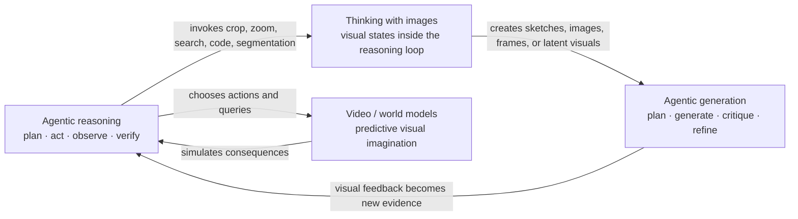

# Awesome MLLM Agentic Reasoning, Thinking with Images, and Agentic Generation

> A curated, time-bounded reading list on multimodal agents that **reason with actions**, **use or create visual thoughts**, and **plan–generate–evaluate–refine visual content**.

**Coverage window:** 2025-07-14 to 2026-07-14 (inclusive, based on the first public arXiv version unless noted)  
**Last updated:** 2026-07-14 · **110 papers**

## Contents

- [Scope](#scope)
- [How the areas relate](#how-the-areas-relate)
- [Research threads at a glance](#research-threads-at-a-glance)
- [Tag legend](#tag-legend)
- [Paper timeline](#paper-timeline)
- [Selection notes](#selection-notes)
- [Contributing](#contributing)

## Scope

This list tracks three tightly connected research directions:

1. **MLLM agentic reasoning** — a multimodal model actively plans, searches, uses tools, gathers evidence, verifies, or acts in an environment as part of reasoning.
2. **Thinking with images** — visual information is an intermediate reasoning state rather than only a fixed input. The visual state may come from external tools, code-based manipulation, generated pixels/video, retrieval, or an internal visual latent.
3. **Agentic visual generation** — an agent plans, orchestrates, evaluates, repairs, or learns from feedback around image/video generation; this also includes video/world models used as an agent's simulator or imagination module.

The list excludes ordinary multimodal chain-of-thought, single-pass text-to-image/video generation, and papers where “multi-agent” only describes the generated scene rather than the generation or reasoning process.

## How the areas relate

An autonomy-oriented view of **thinking with images** is useful for reading the timeline:

`external visual tools → programmatic visual manipulation → generated visual thoughts → latent/internal visual thoughts`

## Research threads at a glance

These are representative paths through the timeline, not separate rankings:

- **Tool-integrated reasoning:** WebWatcher → DeepEyesV2 → VISTA-R1 → Vision-DeepResearch → OpenSearch-VL → AXPO / MetaForge → Visual-Seeker.
- **Computer use and embodied action:** CoAct-1 → OpenCUA → ComputerRL → UI-TARS-2 → UltraCUA → Kimi K2.5; ThinkAct → PhysicalAgent → VLA-Thinker → AgentVLN → VLAs-as-Tools.
- **Thinking-with-images autonomy:** SIFThinker / Simple o3 → Thyme / CodePlot-CoT → MathCanvas / V-Thinker → CoVT / Monet → LanteRn / DeepLatent → Beyond the Eye.
- **Agentic image generation:** Talk2Image / Maestro → ImAgent / MIRA → GenAgent → GEMS / Gen-Searcher → SCOPE / Generation Navigator / InterleaveThinker → Qwen-Image-Agent / CanvasAgent.
- **Agentic video and world models:** MAViS → VISTA → Hollywood Town / CoAgent → SPIRAL → Agentic Video Generation → ViMax / VideoAgent.

## Tag legend

| Tag | Meaning |
|---|---|
| `AR` | General MLLM agentic reasoning |
| `TOOL` | External visual tool use or active perception |
| `SEARCH` | Multimodal search, retrieval, or evidence gathering |
| `ACT` | Embodied, GUI, or environment action |
| `TWI-E` | Thinking with externally obtained/edited images |
| `TWI-P` | Programmatic or symbolic visual manipulation |
| `TWI-G` | Generated image/video used as a thought |
| `TWI-L` | Latent or internally controlled visual thought |
| `AG-I` | Agentic image generation or editing |
| `AG-V` | Agentic video generation or production |
| `WM` | Video/world model used for prediction or planning |
| `TRAIN` | Training, reinforcement learning, or process supervision |
| `BENCH` | Benchmark, evaluation, survey, or diagnostic study |

## Paper timeline

Papers are ordered by **first public release date (newest first)**. Cross-tags expose category overlap without duplicating an entry.

<!-- PAPER_TIMELINE_START -->

### 2026-07

| Date | Paper and resources | Tags | Why it matters |
|---|---|---|---|
| 2026-07-13 | [Beyond the Eye: Efficient Multimodal Reasoning via Self-Regulated Implicit Visual Tools](https://arxiv.org/abs/2607.11106) | **AR · TOOL · TWI-E · TRAIN** | Internalizes visual tools and learns when an explicit call is worth its cost. |
| 2026-07-07 | [Segmentation before Answering: Pixel Grounding for MLLM Visual Reasoning](https://arxiv.org/abs/2607.05798) | **AR · TOOL · TWI-E** | Uses mask-level grounding and targeted visual inspection before answering. |
| 2026-07-06 | [CanvasAgent: Enabling Complex Image Creation and Editing via Visual Tool Orchestration](https://arxiv.org/abs/2607.05465) | **AG-I · AR · TOOL · TRAIN** | Learns 140K executable multi-tool creation trajectories and adapts decisions to the evolving canvas. |
| 2026-07-01 | [Retrieved Images as Visual Thought: Training-Free Multimodal In-Context Learning for the Open-vs-Closed Gap](https://arxiv.org/abs/2607.00606) | **TWI-E · SEARCH** | Treats retrieved examples as external visual thoughts in a training-free reasoning loop. |

### 2026-06

| Date | Paper and resources | Tags | Why it matters |
|---|---|---|---|
| 2026-06-30 | [SimpleSearch-VL: A Simple Recipe for Multimodal Agentic Deep Search](https://arxiv.org/abs/2606.31504) | **AR · SEARCH · TOOL · TRAIN** | Combines efficient rollouts with explicit verification of textual and visual evidence. |
| 2026-06-25 | [Qwen-Image-Agent: Bridging the Context Gap in Real-World Image Generation](https://arxiv.org/abs/2606.26907) | **AG-I · AR · SEARCH** | Unifies planning, reasoning, search, memory, and feedback to ground underspecified generation requests. |
| 2026-06-23 | [IV-CoT: Implicit Visual Chain-of-Thought for Structure-Aware Text-to-Image Generation](https://arxiv.org/abs/2606.24849) | **TWI-L · AG-I** | Separates implicit structural planning from semantic rendering inside one T2I forward pass. |
| 2026-06-22 | [VideoAgent: All-in-One Framework for Video Understanding and Editing](https://arxiv.org/abs/2606.23327) · [Code](https://github.com/HKUDS/VideoAgent) | **AG-V · AR · TOOL** | Plans shots and optimizes a graph of more than thirty specialized editing agents. |
| 2026-06-17 | [Bridging Creative Intent and Visual Quality: Creator-Driven Recurrent Video Generation with Agentic Feedback Loops](https://arxiv.org/abs/2606.18591) | **AG-V · AR** | Uses persona-conditioned MLLM critics and a refiner agent in a human-directed recurrent loop. |
| 2026-06-15 | [Gen-VCoT: Generative Visual Chain-of-Thought Reasoning via Diffusion-Based RGB Intermediate Representations](https://arxiv.org/abs/2606.16783) | **TWI-G · TRAIN** | Routes through interpretable RGB thoughts such as segmentation and depth before solving. |
| 2026-06-13 | [Visual-Seeker: Towards Visual-Native Multimodal Agentic Search via Active Visual Reasoning](https://arxiv.org/abs/2606.15231) · [Code](https://github.com/ZhengboZhang/Visual-Seeker) | **AR · SEARCH · TOOL · TWI-E** | Actively focuses on fine-grained cues while accumulating visual evidence during search. |
| 2026-06-11 | [InterleaveThinker: Reinforcing Agentic Interleaved Generation](https://arxiv.org/abs/2606.13679) · [Code](https://github.com/zhengdian1/InterleaveThinker) · [Project](https://zhengdian1.github.io/InterleaveThinker-proj/) | **AG-I · TWI-G · TRAIN** | A planner proposes text–image sequences while a critic repairs instructions and triggers step-level regeneration. |
| 2026-06-07 | [Thinking Without Images: Internalizing Visual Manipulation with On-Policy Self-Distillation](https://arxiv.org/abs/2606.08719) | **TWI-L · TRAIN** | Distills privileged crop/zoom evidence into internal “where to look” imagination trajectories. |
| 2026-06-02 | [ViMax: Agentic Video Generation](https://arxiv.org/abs/2606.07649) | **AG-V · AR** | Coordinates narrative, consistency, and VLM monitoring agents for long-form video generation. |
| 2026-06-02 | [MemoGen: Can Past Experience Improve Future Text-to-Image Generation?](https://arxiv.org/abs/2606.03243) | **AG-I · AR** | Reuses successful and failed generation experience through retrieval, evaluation, and memory. |
| 2026-06-01 | [MetaForge: A Self-Evolving Multimodal Agent that Retrieves, Adapts, and Forges Tools On Demand](https://arxiv.org/abs/2606.01801) | **AR · TOOL · TRAIN** | Moves beyond a static toolbox by forging, adapting, recycling, and learning to reuse skills. |

### 2026-05

| Date | Paper and resources | Tags | Why it matters |
|---|---|---|---|
| 2026-05-30 | [DeepLatent: Think with Images via Parallel Latent Visual Reasoning](https://arxiv.org/abs/2606.00562) | **TWI-L · TRAIN** | Generates two-dimensional latent visual states in parallel and optimizes them with continuous-space RL. |
| 2026-05-28 | [GenClaw: Code-Driven Agentic Image Generation](https://arxiv.org/abs/2605.30248) | **AG-I · TWI-P · TOOL** | Follows conceptualize–sketch–color, using executable SVG/HTML/3D code as a controllable canvas. |
| 2026-05-27 | [Agent Explorative Policy Optimization for Multimodal Agentic Reasoning](https://arxiv.org/abs/2605.28774) · [Project](https://byungkwanlee.github.io/AXPO-page/) | **AR · TOOL · TRAIN** | Targets the thinking–acting gap by resampling failed tool calls under fixed reasoning prefixes. |
| 2026-05-26 | [How and What to Imagine? Visual Thinking in Unified Multimodal Models for Cross-View Spatial Reasoning](https://arxiv.org/abs/2605.27310) | **TWI-G · TRAIN** | Forces answers to depend on model-generated views and compares alternative imagination strategies. |
| 2026-05-20 | [GenEvolve: Self-Evolving Image Generation Agents via Tool-Orchestrated Visual Experience Distillation](https://arxiv.org/abs/2605.21605) · [Code](https://github.com/MeiGen-AI/GenEvolve) · [Project](https://ephemeral182.github.io/GenEvolve/) | **AG-I · AR · TOOL** | Distills contrasts between strong and weak tool trajectories into reusable visual experience. |
| 2026-05-19 | [Semantic-Enriched Latent Visual Reasoning](https://arxiv.org/abs/2605.19342) | **TWI-L · TRAIN** | Adds attribute supervision and multi-query RL to make region-centric visual latents semantically stable. |
| 2026-05-18 | [Generation Navigator: A State-Aware Agentic Framework for Image Generation](https://arxiv.org/abs/2605.17969) | **AG-I · AR · TRAIN** | Learns a state-conditioned next-action policy with trajectory rewards for quality, retention, and efficiency. |
| 2026-05-14 | [From Plans to Pixels: Learning to Plan and Orchestrate for Open-Ended Image Editing](https://arxiv.org/abs/2605.15181) | **AG-I · AR · TOOL · TRAIN** | Trains a planner and tool orchestrator from successful atomic editing trajectories and VLM outcome rewards. |
| 2026-05-14 | [Unlocking Complex Visual Generation via Closed-Loop Verified Reasoning](https://arxiv.org/abs/2605.14876) | **AG-I · TWI-G · TRAIN** | Uses stepwise visual verification and trajectory-level credit assignment for closed-loop generation. |
| 2026-05-14 | [Breaking Dual Bottlenecks: Evolving Unified Multimodal Models into Self-Adaptive Interleaved Visual Reasoners](https://arxiv.org/abs/2605.14709) · [Code](https://github.com/WeChatCV/Interleaved_Visual_Reasoner) | **AG-I · TWI-G · TRAIN** | Learns to switch among direct generation, reflection, and multi-step visual planning. |
| 2026-05-13 | [Towards Long-horizon Embodied Agents with Tool-Aligned Vision-Language-Action Models](https://arxiv.org/abs/2605.13119) | **AR · ACT · TOOL · TRAIN** | A high-level VLM plans and recovers while specialized VLA tools execute and report progress. |
| 2026-05-12 | [UniVLR: Unifying Text and Vision in Visual Latent Reasoning for Multimodal LLMs](https://arxiv.org/abs/2605.11856) | **TWI-L · TRAIN** | Compresses text traces and auxiliary renderings into a shared latent visual workspace. |
| 2026-05-08 | [SCOPE: Structured Decomposition and Conditional Skill Orchestration for Complex Image Generation](https://arxiv.org/abs/2605.08043) · [Code](https://github.com/nopnor/SCOPE) · [Project](https://nopnor.github.io/SCOPE/) | **AG-I · AR · TOOL** | Evolves a semantic specification and uses verifier-attributed failures to select repair skills. |
| 2026-05-06 | [OpenSearch-VL: An Open Recipe for Frontier Multimodal Search Agents](https://arxiv.org/abs/2605.05185) · [Code](https://github.com/shawn0728/OpenSearch-VL) | **AR · SEARCH · TOOL · TRAIN** | Open-sources the data, tool environment, and failure-aware RL recipe for multimodal search. |
| 2026-05-02 | [Action Agent: Agentic Video Generation Meets Flow-Constrained Diffusion](https://arxiv.org/abs/2605.01477) | **AG-V · WM · ACT** | Iteratively generates and validates goal videos, then converts them into robot navigation controls. |

### 2026-04

| Date | Paper and resources | Tags | Why it matters |
|---|---|---|---|
| 2026-04-26 | [CineAGI: Character-Consistent Movie Creation through LLM-Orchestrated Multi-Modal Generation and Cross-Scene Integration](https://arxiv.org/abs/2604.23579) | **AG-V · AR** | Orchestrates narrative blueprints, character consistency, cross-scene integration, and audiovisual synchronization. |
| 2026-04-23 | [S1-VL: Scientific Multimodal Reasoning Model with Thinking-with-Images](https://arxiv.org/abs/2604.21409) | **AR · TWI-P · TOOL** | Writes and executes image-processing code in a sandbox to obtain scientific visual evidence. |
| 2026-04-14 | [Towards Long-horizon Agentic Multimodal Search](https://arxiv.org/abs/2604.12890) · [Code](https://github.com/RUCAIBox/LMM-Searcher) | **AR · SEARCH · TOOL · TWI-E** | Stores visual assets by identifier and fetches them on demand across search traces up to one hundred turns. |
| 2026-04-11 | [Agentic Video Generation: From Text to Executable Event Graphs via Tool-Constrained LLM Planning](https://arxiv.org/abs/2604.10383) | **AG-V · AR · TWI-P** | Builds validated event graphs with director, scene-builder, and relation agents before deterministic rendering. |
| 2026-04-08 | [Walk the Talk: Bridging the Reasoning-Action Gap for Thinking with Images via Multimodal Agentic Policy Optimization](https://arxiv.org/abs/2604.06777) | **AR · TOOL · TWI-E · TRAIN** | Aligns tool observations with reasoning advantages so visual actions become useful rather than decorative. |

### 2026-03

| Date | Paper and resources | Tags | Why it matters |
|---|---|---|---|
| 2026-03-31 | [Unify-Agent: A Unified Multimodal Agent for World-Grounded Image Synthesis](https://arxiv.org/abs/2603.29620) | **AG-I · AR · SEARCH** | Searches multimodal evidence, produces a grounded recaption, and then synthesizes the requested image. |
| 2026-03-30 | [Gen-Searcher: Reinforcing Agentic Search for Image Generation](https://arxiv.org/abs/2603.28767) · [Code](https://github.com/tulerfeng/Gen-Searcher) · [Project](https://gen-searcher.vercel.app/) | **AG-I · SEARCH · TRAIN** | Learns multi-hop web/image search and generation with text- and image-level rewards. |
| 2026-03-30 | [GEMS: Agent-Native Multimodal Generation with Memory and Skills](https://arxiv.org/abs/2603.28088) · [Code](https://github.com/lcqysl/GEMS) · [Project](https://gems-gen.github.io/) | **AG-I · AR · TOOL** | Combines a structured agent loop, trajectory memory, and on-demand generation skills. |
| 2026-03-26 | [LanteRn: Latent Visual Structured Reasoning](https://arxiv.org/abs/2603.25629) | **TWI-L · TRAIN** | Interleaves language with compact continuous visual thoughts aligned to task utility. |
| 2026-03-18 | [AgentVLN: Towards Agentic Vision-and-Language Navigation](https://arxiv.org/abs/2603.17670) · [Code](https://github.com/Allenxinn/AgentVLN) | **AR · ACT · TOOL · TWI-E** | Uses a VLM brain, a skill library, active exploration, and self-correction for navigation. |
| 2026-03-15 | [VLA-Thinker: Boosting Vision-Language-Action Models through Thinking-with-Image Reasoning](https://arxiv.org/abs/2603.14523) · [Project](https://cywang735.github.io/VLA-Thinker/) | **AR · ACT · TWI-E · TRAIN** | Models “look again” as a callable reasoning action and optimizes the full reasoning–action trajectory. |
| 2026-03-09 | [SPIRAL: Self-Evolving Action-Conditioned Video Generation via Reflective Planning Agents](https://arxiv.org/abs/2603.08403) | **AG-V · WM · ACT · TRAIN** | A planning agent decomposes actions while a video critic and long-horizon memory guide iterative world-model generation. |
| 2026-03-02 | [Generative Visual Chain-of-Thought for Image Editing](https://arxiv.org/abs/2603.01893) · [Project](https://pris-cv.github.io/GVCoT/) | **TWI-G · AG-I · TRAIN** | Generates native spatial visual cues before applying an edit in one jointly optimized model. |
| 2026-03-01 | [MM-DeepResearch: A Simple and Effective Multimodal Agentic Search Baseline](https://arxiv.org/abs/2603.01050) · [Code](https://github.com/HJYao00/MM-DeepResearch) | **AR · SEARCH · TOOL · TRAIN** | Creates tool-use trajectories with experts and tree search, then applies agentic RL offline. |

### 2026-02

| Date | Paper and resources | Tags | Why it matters |
|---|---|---|---|
| 2026-02-28 | [RAISE: Requirement-Adaptive Evolutionary Refinement for Training-Free Text-to-Image Alignment](https://arxiv.org/abs/2603.00483) · [Code](https://github.com/LiyaoJiang1998/RAISE) | **AG-I · AR** | Discovers requirements, evolves candidates with multiple repair actions, and stops when its checklist is satisfied. |
| 2026-02-27 | [Thinking with Images as Continuous Actions: Numerical Visual Chain-of-Thought](https://arxiv.org/abs/2602.23959) · [Code](https://github.com/kesenzhao/NV-CoT) | **TWI-L · AR · TRAIN** | Treats coordinates as continuous actions and directly optimizes precise visual grounding. |
| 2026-02-26 | [PhotoAgent: Agentic Photo Editing with Exploratory Visual Aesthetic Planning](https://arxiv.org/abs/2602.22809) · [Code](https://github.com/mdyao/PhotoAgent) · [Project](https://mdyao.github.io/PhotoAgent/) | **AG-I · AR · TOOL** | Searches an aesthetic edit tree with memory and iterative visual feedback. |
| 2026-02-24 | [PyVision-RL: Forging Open Agentic Vision Models via RL](https://arxiv.org/abs/2602.20739) · [Code](https://github.com/agents-x-project/PyVision-RL) | **AR · TOOL · TWI-E · TRAIN** | Preserves multi-turn tool interaction and supports on-demand video frame inspection. |
| 2026-02-13 | [Reliable Thinking with Images](https://arxiv.org/abs/2602.12916) | **TWI-E · TRAIN · BENCH** | Filters and votes over noisy visual thoughts to improve reliability. |
| 2026-02-12 | [IMAGAgent: Orchestrating Multi-Turn Image Editing via Constraint-Aware Planning and Reflection](https://arxiv.org/abs/2603.29602) · [Code](https://github.com/hackermmzz/IMAGAgent) | **AG-I · AR · TOOL** | Decomposes constraints, orchestrates heterogeneous editors, aggregates multiple critics, retries, and retains the best state. |
| 2026-02-11 | [Chatting with Images for Introspective Visual Thinking](https://arxiv.org/abs/2602.11073) | **TWI-L · TRAIN** | Uses language-guided feature modulation and multi-region re-encoding instead of pixel tools. |
| 2026-02-09 | [What, Whether and How? Unveiling Process Reward Models for Thinking with Images Reasoning](https://arxiv.org/abs/2602.08346) | **TWI-E · TRAIN · BENCH** | Studies process rewards over annotated visual-tool trajectories and seven error types. |
| 2026-02-09 | [Agent Banana: High-Fidelity Image Editing with Agentic Thinking and Tooling](https://arxiv.org/abs/2602.09084) · [Project](https://agent-banana.github.io/) | **AG-I · AR** | Uses a planner–executor hierarchy, folded long-context memory, and image-layer decomposition. |
| 2026-02-05 | [M3: High-fidelity Text-to-Image Generation via Multi-Modal, Multi-Agent and Multi-Round Visual Reasoning](https://arxiv.org/abs/2602.06166) | **AG-I · AR** | Planner, checker, refiner, editor, and verifier agents repair constraints over multiple rounds. |
| 2026-02-02 | [Kimi K2.5: Visual Agentic Intelligence](https://arxiv.org/abs/2602.02276) · [Code](https://github.com/MoonshotAI/Kimi-K2.5) · [Blog](https://www.kimi.com/blog/kimi-k2-5) | **AR · ACT · TOOL · TRAIN** | A native multimodal agent model spanning visual tool use, computer use, and parallel sub-agent orchestration. |
| 2026-02-02 | [Mind-Brush: Integrating Agentic Cognitive Search and Reasoning into Image Generation](https://arxiv.org/abs/2602.01756) | **AG-I · SEARCH · AR** | Researches multimodal evidence before generating images with implicit or knowledge-heavy constraints. |

### 2026-01

| Date | Paper and resources | Tags | Why it matters |
|---|---|---|---|
| 2026-01-29 | [Vision-DeepResearch: Incentivizing DeepResearch Capability in Multimodal Large Language Models](https://arxiv.org/abs/2601.22060) · [Code](https://github.com/Osilly/Vision-DeepResearch) | **AR · SEARCH · TOOL · TRAIN** | Supports long-horizon, multi-entity, and multi-scale visual/text retrieval inside an MLLM. |
| 2026-01-28 | [Shape of Thought: Progressive Object Assembly via Visual Chain-of-Thought](https://arxiv.org/abs/2601.21081) · [Code](https://github.com/yuhuo03/Shape-of-Thought) | **TWI-G · AG-I · TRAIN** | Interleaves textual plans with progressively rendered object-assembly states. |
| 2026-01-26 | [GenAgent: Scaling Text-to-Image Generation via Agentic Multimodal Reasoning](https://arxiv.org/abs/2601.18543) | **AG-I · AR · TOOL · TRAIN** | Learns reason–invoke–judge–reflect loops around interchangeable image generators. |
| 2026-01-25 | [The Script is All You Need: An Agentic Framework for Long-Horizon Dialogue-to-Cinematic Video Generation](https://arxiv.org/abs/2601.17737) · [Code](https://github.com/Tencent/digitalhuman/tree/main/ScriptAgent) | **AG-V · AR** | Splits long-form production across scripter, director, and critic agents. |
| 2026-01-21 | [Iterative Refinement Improves Compositional Image Generation](https://arxiv.org/abs/2601.15286) · [Code](https://github.com/shantanuj/Iterative-Image-Gen) · [Project](https://iterative-img-gen.github.io/) | **AG-I · AR** | A VLM critic, editor, and verifier iteratively repair unmet compositional constraints. |
| 2026-01-14 | [Beyond Accuracy: Evaluating Grounded Visual Evidence in Thinking with Images](https://arxiv.org/abs/2601.11633) · [Code](https://github.com/Xuchen-Li/ViEBench) | **TWI-E · BENCH** | Evaluates whether visual intermediate evidence is grounded, not just whether answers are correct. |
| 2026-01-05 | [Agentic Retoucher for Text-To-Image Generation](https://arxiv.org/abs/2601.02046) | **AG-I · AR · TOOL** | Uses specialized agents to locate, diagnose, and locally repair image defects. |

### 2025-12

| Date | Paper and resources | Tags | Why it matters |
|---|---|---|---|
| 2025-12-30 | [SenseNova-MARS: Empowering Multimodal Agentic Reasoning and Search via Reinforcement Learning](https://arxiv.org/abs/2512.24330) · [Code](https://github.com/OpenSenseNova/SenseNova-MARS) | **AR · SEARCH · TOOL · TWI-E · TRAIN** | Dynamically interleaves image search, text search, cropping, and reasoning. |
| 2025-12-27 | [CoAgent: Collaborative Planning and Consistency Agent for Coherent Video Generation](https://arxiv.org/abs/2512.22536) | **AG-V · AR** | Plans storyboards, maintains entity memory, verifies intermediate shots, and selectively regenerates failures. |
| 2025-12-23 | [CRAFT: Continuous Reasoning and Agentic Feedback Tuning for Multimodal Text-to-Image Generation](https://arxiv.org/abs/2512.20362) | **AG-I · AR** | Decomposes constraints, verifies outputs with a VLM, repairs failures, and stops explicitly. |
| 2025-12-19 | [Deep But Reliable: Advancing Multi-turn Reasoning for Thinking with Images](https://arxiv.org/abs/2512.17306) | **AR · TOOL · TWI-E · TRAIN** | Trains reflective, self-correcting multi-turn visual-tool behavior with redundancy penalties. |
| 2025-12-09 | [Thinking with Images via Self-Calling Agent](https://arxiv.org/abs/2512.08511) · [Code](https://github.com/YWenxi/think-with-images-through-self-calling) | **AR · TWI-E** | Decomposes a task into calls to parameter-shared virtual sub-agents. |
| 2025-12-03 | [Thinking with Programming Vision: Towards a Unified View for Thinking with Images](https://arxiv.org/abs/2512.03746) · [Code](https://github.com/ByteDance-BandAI/CodeVision) | **AR · TWI-P · TOOL** | Uses code as a universal visual-tool interface with composition and runtime error recovery. |
| 2025-12-02 | [Skywork-R1V4: Toward Agentic Multimodal Intelligence through Interleaved Thinking with Images and DeepResearch](https://arxiv.org/abs/2512.02395) · [Code](https://github.com/SkyworkAI/Skywork-R1V) | **AR · SEARCH · TOOL · TWI-E** | Unifies image operations and web research in long, planning-consistent tool trajectories. |

### 2025-11

| Date | Paper and resources | Tags | Why it matters |
|---|---|---|---|
| 2025-11-28 | [JarvisEvo: Towards a Self-Evolving Photo Editing Agent with Synergistic Editor-Evaluator Optimization](https://arxiv.org/abs/2511.23002) · [Code](https://github.com/LYL1015/JarvisEvo) · [Project](https://jarvisevo.vercel.app/) | **AG-I · AR · TOOL** | Co-evolves editor and evaluator through tool selection, critique, reflection, and interleaved reasoning. |
| 2025-11-26 | [Monet: Reasoning in Latent Visual Space Beyond Images and Language](https://arxiv.org/abs/2511.21395) · [Code](https://github.com/NOVAglow646/Monet) | **TWI-L · TRAIN** | Treats continuous embeddings as visual thoughts and directly optimizes the latent policy. |
| 2025-11-26 | [MIRA: Multimodal Iterative Reasoning Agent for Image Editing](https://arxiv.org/abs/2511.21087) | **AG-I · AR · TOOL · TRAIN** | Learns atomic editing loops whose next action is conditioned on visual feedback. |
| 2025-11-25 | [Agent0-VL: Exploring Self-Evolving Agent for Tool-Integrated Vision-Language Reasoning](https://arxiv.org/abs/2511.19900) · [Code](https://github.com/aiming-lab/Agent0) | **AR · TOOL · TWI-E · TRAIN** | Unifies solver and verifier roles for tool-grounded self-evaluation, repair, and evolution. |
| 2025-11-24 | [Chain-of-Visual-Thought: Teaching VLMs to See and Think Better with Continuous Visual Tokens](https://arxiv.org/abs/2511.19418) · [Code](https://github.com/Wakals/CoVT) · [Project](https://wakalsprojectpage.github.io/covt-website/) | **TWI-L · TRAIN** | Distills depth, edge, and segmentation experts into a short sequence of continuous visual tokens. |
| 2025-11-24 | [Scaling Agentic Reinforcement Learning for Tool-Integrated Reasoning in VLMs](https://arxiv.org/abs/2511.19773) · [Code](https://github.com/Lucanyc/VISTA-Gym) | **AR · TOOL · TWI-E · TRAIN** | Introduces an executable visual-tool gym and trains VISTA-R1 with multi-turn agentic RL. |
| 2025-11-19 | [Octopus: Agentic Multimodal Reasoning with Six-Capability Orchestration](https://arxiv.org/abs/2511.15351) | **AR · TOOL · TWI-E · TWI-G** | Dynamically selects among direct reasoning, visual tools, programming, and visual imagination. |
| 2025-11-14 | [ImAgent: A Unified Multimodal Agent Framework for Test-Time Scalable Image Generation](https://arxiv.org/abs/2511.11483) | **AG-I · AR · TWI-G** | Lets one model choose among reasoning, generation, and self-evaluation actions at test time. |
| 2025-11-07 | [DeepEyesV2: Toward Agentic Multimodal Model](https://arxiv.org/abs/2511.05271) · [Code](https://github.com/Visual-Agent/DeepEyesV2) | **AR · SEARCH · TOOL · TRAIN** | Learns to combine code execution and web search inside a unified reasoning loop. |
| 2025-11-06 | [Thinking with Video: Video Generation as a Promising Multimodal Reasoning Paradigm](https://arxiv.org/abs/2511.04570) · [Code](https://github.com/tongjingqi/Thinking-with-Video) | **TWI-G · AG-V · BENCH** | Frames generated video and frame sequences as dynamic reasoning media. |
| 2025-11-06 | [V-Thinker: Interactive Thinking with Images](https://arxiv.org/abs/2511.04460) · [Code](https://github.com/We-Math/V-Thinker) | **AR · TOOL · TWI-E · TRAIN** | Uses a data-evolution flywheel and progressive RL for long interactive visual reasoning. |
| 2025-11-03 | [TIR-Bench: A Comprehensive Benchmark for Agentic Thinking-with-Images Reasoning](https://arxiv.org/abs/2511.01833) | **AR · TOOL · TWI-E · BENCH** | Tests thirteen categories that require novel image-tool operations. |

### 2025-10

| Date | Paper and resources | Tags | Why it matters |
|---|---|---|---|
| 2025-10-30 | [ThinkMorph: Emergent Properties in Multimodal Interleaved Chain-of-Thought Reasoning](https://arxiv.org/abs/2510.27492) · [Project](https://thinkmorph.github.io/) | **TWI-E · TWI-G · TRAIN** | Shows progressive image manipulation, adaptive modality switching, and multimodal test-time scaling. |
| 2025-10-26 | [Open Multimodal Retrieval-Augmented Factual Image Generation](https://arxiv.org/abs/2510.22521) · [Project](https://tyangjn.github.io/orig.github.io/) | **AG-I · SEARCH · AR** | Iteratively plans text/image queries, filters evidence, checks sufficiency, and produces a generation-ready prompt. |
| 2025-10-25 | [Hollywood Town: Long-Video Generation via Cross-Modal Multi-Agent Orchestration](https://arxiv.org/abs/2510.22431) | **AG-V · AR** | Uses hierarchical graph orchestration, group discussion, bounded retries, and reflection. |
| 2025-10-20 | [UltraCUA: A Foundation Model for Computer Use Agents with Hybrid Action](https://arxiv.org/abs/2510.17790) | **AR · ACT · TOOL · TRAIN** | Learns when to switch between low-level GUI control and high-level programmatic tools. |
| 2025-10-17 | [VISTA: A Test-Time Self-Improving Video Generation Agent](https://arxiv.org/abs/2510.15831) · [Project](https://g-vista.github.io/) | **AG-V · AR** | Plans, generates, tournament-selects, critiques, and rewrites prompts across video iterations. |
| 2025-10-16 | [MathCanvas: Intrinsic Visual Chain-of-Thought for Multimodal Mathematical Reasoning](https://arxiv.org/abs/2510.14958) · [Code](https://github.com/shiwk24/MathCanvas) · [Project](https://mathcanvas.github.io/) | **TWI-G · TRAIN · BENCH** | Strategically generates and edits intermediate diagrams inside a unified model. |
| 2025-10-13 | [CodePlot-CoT: Mathematical Visual Reasoning by Thinking with Code-Driven Images](https://arxiv.org/abs/2510.11718) · [Code](https://github.com/HKU-MMLab/Math-VR-CodePlot-CoT) | **TWI-P · TOOL · TRAIN** | Writes executable plotting code and feeds the rendering back as a visual thought. |
| 2025-10-06 | [VChain: Chain-of-Visual-Thought for Reasoning in Video Generation](https://arxiv.org/abs/2510.05094) · [Project](https://eyeline-labs.github.io/VChain/) | **TWI-G · AG-V** | Generates sparse consequence snapshots as a visual plan for video generation. |

### 2025-09

| Date | Paper and resources | Tags | Why it matters |
|---|---|---|---|
| 2025-09-30 | [DeepSketcher: Internalizing Visual Manipulation for Multimodal Reasoning](https://arxiv.org/abs/2509.25866) | **TWI-L · TRAIN** | Produces native visual thoughts in embedding space without repeated external rendering. |
| 2025-09-25 | [DeFacto: Counterfactual Thinking with Images for Enforcing Evidence-Grounded and Faithful Reasoning](https://arxiv.org/abs/2509.20912) | **TWI-E · TRAIN** | Trains answer consistency against relevant regions and counterfactual image edits. |
| 2025-09-17 | [PhysicalAgent: Towards General Cognitive Robotics with Foundation World Models](https://arxiv.org/abs/2509.13903) | **AG-V · WM · ACT · TWI-G** | Generates candidate trajectory videos, executes them, and replans after failure. |
| 2025-09-12 | [Maestro: Self-Improving Text-to-Image Generation via Agent Orchestration](https://arxiv.org/abs/2509.10704) | **AG-I · AR** | Orchestrates specialized critics, a verifier, and a judge for iterative prompt evolution and candidate selection. |
| 2025-09-09 | [Mini-o3: Scaling Up Reasoning Patterns and Interaction Turns for Visual Search](https://arxiv.org/abs/2509.07969) · [Code](https://github.com/Mini-o3/Mini-o3) · [Project](https://mini-o3.github.io/) | **AR · TOOL · TWI-E · TRAIN** | Scales visual search to dozens of turns with explicit exploration, backtracking, and goal retention. |
| 2025-09-08 | [Interleaving Reasoning for Better Text-to-Image Generation](https://arxiv.org/abs/2509.06945) · [Code](https://github.com/Osilly/Interleaving-Reasoning-Generation) | **AG-I · TWI-G · TRAIN** | Alternates text thought, initial generation, reflection, and image refinement. |
| 2025-09-02 | [UI-TARS-2 Technical Report: Advancing GUI Agent with Multi-Turn Reinforcement Learning](https://arxiv.org/abs/2509.02544) · [Code](https://github.com/bytedance/UI-TARS) | **AR · ACT · TOOL · TRAIN** | Unifies perception, reasoning, action, memory, and hybrid GUI/terminal interaction with multi-turn RL. |

### 2025-08

| Date | Paper and resources | Tags | Why it matters |
|---|---|---|---|
| 2025-08-24 | [An LLM-LVLM Driven Agent for Iterative and Fine-Grained Image Editing](https://arxiv.org/abs/2508.17435) | **AG-I · AR · TOOL** | RefineEdit-Agent combines LVLM feedback with LLM planning and tool selection. |
| 2025-08-19 | [ComputerRL: Scaling End-to-End Online Reinforcement Learning for Computer Use Agents](https://arxiv.org/abs/2508.14040) · [Code](https://github.com/THUDM/ComputerRL) | **AR · ACT · TOOL · TRAIN** | Scales online desktop RL and alternates RL/SFT to prevent policy-entropy collapse. |
| 2025-08-16 | [Simple o3: Towards Interleaved Vision-Language Reasoning](https://arxiv.org/abs/2508.12109) | **AR · TOOL · TWI-E** | Encodes crop, zoom, and observation reuse inside interleaved observe–reason–act traces. |
| 2025-08-15 | [Thyme: Think Beyond Images](https://arxiv.org/abs/2508.11630) · [Code](https://github.com/yfzhang114/Thyme) · [Project](https://thyme-vl.github.io/) | **AR · TWI-P · TOOL** | Autonomously writes and runs visual/computational code and reasons from sandbox feedback. |
| 2025-08-12 | [OpenCUA: Open Foundations for Computer-Use Agents](https://arxiv.org/abs/2508.09123) · [Code](https://github.com/xlang-ai/OpenCUA) · [Project](https://opencua.xlang.ai/) | **AR · ACT · TOOL · TRAIN** | Builds end-to-end computer agents from reflective, long-horizon visual state–action trajectories. |
| 2025-08-11 | [MAViS: A Multi-Agent Framework for Long-Sequence Video Storytelling](https://arxiv.org/abs/2508.08487) | **AG-V · AR** | Coordinates script, shot, character, keyframe, animation, and audio agents with staged review. |
| 2025-08-09 | [Talk2Image: A Multi-Agent System for Multi-Turn Image Generation and Editing](https://arxiv.org/abs/2508.06916) | **AG-I · AR** | Decomposes intent and iteratively evaluates and revises generated images from multiple viewpoints. |
| 2025-08-08 | [SIFThinker: Spatially-Aware Image Focus for Visual Reasoning](https://arxiv.org/abs/2508.06259) · [Code](https://github.com/bytedance/SIFThinker) | **AR · TOOL · TWI-E · TRAIN** | Learns to propose, inspect, and correct spatial focus regions during reasoning. |
| 2025-08-07 | [WebWatcher: Breaking New Frontier of Vision-Language Deep Research Agent](https://arxiv.org/abs/2508.05748) | **AR · SEARCH · TOOL · TRAIN** | Uses synthetic multimodal trajectories and RL to bootstrap autonomous visual deep research. |
| 2025-08-05 | [CoAct-1: Computer-using Multi-Agent System with Coding Actions](https://arxiv.org/abs/2508.03923) · [Code](https://github.com/SalesforceAIResearch/CoAct) | **AR · ACT · TOOL** | An orchestrator delegates subtasks between a visual GUI operator and a code programmer. |

### 2025-07

| Date | Paper and resources | Tags | Why it matters |
|---|---|---|---|
| 2025-07-22 | [ThinkAct: Vision-Language-Action Reasoning via Reinforced Visual Latent Planning](https://arxiv.org/abs/2507.16815) · [Project](https://jasper0314-huang.github.io/thinkact-vla/) | **AR · ACT · TWI-L · TRAIN** | Learns a visually rewarded embodied plan, compresses it into latents, and uses it to drive action. |
| 2025-07-22 | [Zebra-CoT: A Dataset for Interleaved Vision Language Reasoning](https://arxiv.org/abs/2507.16746) · [Data](https://huggingface.co/datasets/multimodal-reasoning-lab/Zebra-CoT) | **TWI-G · TRAIN** | Provides 182K interleaved text–image reasoning trajectories across science, space, robotics, and games. |

<!-- PAPER_TIMELINE_END -->

## Selection notes

- Dates refer to the first public arXiv version (`v1`), not the latest revision date.
- A paper must make agency or visual intermediate states part of the method, training objective, or evaluation target—not merely mention agents or multimodal reasoning.
- Application papers are included only when they introduce a reusable agentic/visual-reasoning mechanism.
- The list is curated rather than claimed to be mathematically exhaustive. Please open an issue or pull request for a missing paper that meets the scope and date window.

## Contributing

Please include the title, first-public date, paper link, optional project/code link, a one-sentence contribution summary, and the relevant tags. Keep entries sorted by date and avoid links to secondary paper aggregators when a primary source is available.
